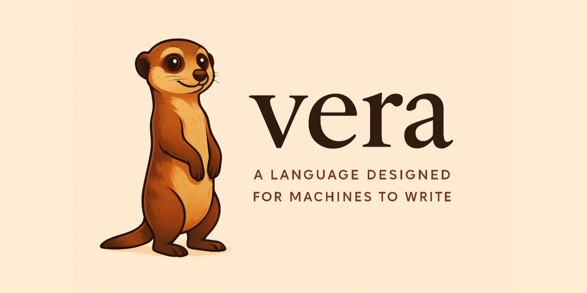

# Vera

[](https://veralang.dev)

**Vera** (v-EER-a) is a programming language designed for large language models (LLMs) to write, not humans.

The name comes from the Latin *veritas* (truth). In Vera, verification is a first-class citizen, not an afterthought.

## Why?

Programming languages have always co-evolved with their users. Assembly emerged from hardware constraints. C emerged from operating system needs. Python emerged from productivity needs. If models become the primary authors of software, it is consistent for languages to adapt to that.

The evidence suggests the biggest problem models face isn't syntax — it's **coherence over scale**. Models struggle with maintaining invariants across a codebase, understanding the ripple effects of changes, and reasoning about state over time. They're pattern matchers optimising for local plausibility, not architects holding the entire system in mind.

Vera addresses this by making everything explicit and verifiable. The model doesn't need to be right — it needs to be **checkable**.

## Design Principles

1. **Checkability over correctness.** Code that can be mechanically checked. When wrong, the compiler provides a natural language explanation of the error with a concrete fix — an instruction, not a status report.
2. **Explicitness over convenience.** All state changes declared. All effects typed. All function contracts mandatory. No implicit behaviour.
3. **One canonical form.** Every construct has exactly one textual representation. No style choices.
4. **Structural references over names.** Bindings referenced by type and positional index (`@T.n`), not arbitrary names.
5. **Contracts as the source of truth.** Every function declares what it requires and guarantees. The compiler verifies statically where possible.
6. **Constrained expressiveness.** Fewer valid programs means fewer opportunities for the model to be wrong.

## Key Features

- **No variable names** — typed De Bruijn indices (`@T.n`) replace traditional variable names
- **Full contracts** — mandatory preconditions, postconditions, invariants, and effect declarations on all functions
- **Algebraic effects** — declared, typed, and handled explicitly; pure by default
- **Refinement types** — types that express constraints like "a list of positive integers of length n"
- **Three-tier verification** — static verification via Z3, guided verification with hints, runtime fallback
- **Diagnostics as instructions** — every error message is a natural language explanation with a concrete fix, designed for LLM consumption
- **Compiles to WebAssembly** — portable, sandboxed execution

## What Vera Looks Like

### Hello World — effects and contracts

Every function declares what it requires, what it guarantees, and what effects it performs. Even a one-liner has a full contract. Effects are declared before use, and effect operations use qualified calls (`IO.print`). `effects(<IO>)` tells the compiler (and the model) that this function interacts with the outside world.

```vera
effect IO {
  op print(String -> Unit);
}

fn main(@Unit -> @Unit)
  requires(true)
  ensures(true)
  effects(<IO>)
{
  IO.print("Hello, World!")
}
```

### Pure functions — postconditions the compiler can verify

There are no variable names. `@Int.0` refers to the most recent `Int` binding — a typed positional index, like De Bruijn indices but namespaced by type. The `ensures` clause is a machine-checkable promise: the result is non-negative and equals the absolute value of the input. The compiler verifies this via SMT solver.

```vera
fn absolute_value(@Int -> @Nat)
  requires(true)
  ensures(@Nat.result >= 0)
  ensures(@Nat.result == @Int.0 || @Nat.result == -@Int.0)
  effects(pure)
{
  if @Int.0 >= 0 then {
    @Int.0
  } else {
    -@Int.0
  }
}
```

### Preconditions — rejecting bad inputs at compile time

`requires(@Int.1 != 0)` means this function cannot be called with a zero divisor. The compiler checks every call site to prove the precondition holds. If it cannot prove it, the code does not compile. Division by zero is not a runtime error — it is a type error.

```vera
fn safe_divide(@Int, @Int -> @Int)
  requires(@Int.1 != 0)
  ensures(@Int.result == @Int.0 / @Int.1)
  effects(pure)
{
  @Int.0 / @Int.1
}
```

### Algebraic effects — explicit state, no hidden mutation

Vera is pure by default. State changes must be declared as effects. `effects(<State<Int>>)` says this function reads and writes an integer. The `ensures` clause specifies exactly how the state changes: the new value equals the old value plus one. Handlers (not shown) provide the actual state implementation — an in-memory cell in production, a mock in tests.

```vera
fn increment(@Unit -> @Unit)
  requires(true)
  ensures(new(State<Int>) == old(State<Int>) + 1)
  effects(<State<Int>>)
{
  let @Int = get(());
  put(@Int.0 + 1);
  ()
}
```

## What Errors Look Like

Traditional compilers produce diagnostics for humans: `expected token '{'`. Vera produces **instructions for the model that wrote the code**.

Every error includes what went wrong, why, how to fix it with a concrete code example, and a spec reference. The compiler's output is designed to be fed directly back to the model as corrective context.

```
Error in main.vera at line 12, column 1:

    fn add(@Int, @Int -> @Int)
    ^

  Function "add" is missing its contract block. Every function in Vera
  must declare requires(), ensures(), and effects() clauses between the
  signature and the body.

  Add a contract block after the signature:

    fn add(@Int, @Int -> @Int)
      requires(true)
      ensures(@Int.result == @Int.0 + @Int.1)
      effects(pure)
    {
      ...
    }

  See: Chapter 5, Section 5.1 "Function Structure"
```

This principle applies at every stage: parse errors, type errors, effect mismatches, verification failures, and contract violations all produce natural language explanations with actionable fixes.

## Project Status

Vera is in **active development**. The language specification, parser, AST, type checker, contract verifier, and WASM code generator are functional. Programs compile to WebAssembly and execute via wasmtime.

| Component | Status |
|-----------|--------|
| Language specification (Chapters 0-7, 10-11) | Draft |
| Language specification (Chapters 8-9, 12) | Not started |
| Parser (Lark LALR(1)) | Working |
| AST (typed syntax tree) | Working |
| Type checker | Working |
| Contract verifier (Z3) | Working |
| WASM code generation | Working |
| Runtime contract insertion | Working |

## Roadmap

Development follows an **interleaved spiral** — each phase adds a complete compiler layer with tests, docs, and working examples before moving to the next.

| Phase | Version | Layer | Status |
|-------|---------|-------|--------|
| C1 | v0.0.1–0.0.3 | **Parser** — Lark LALR(1) grammar, LLM diagnostics, 13 examples | Done |
| C2 | v0.0.4 | **AST** — typed syntax tree, Lark→AST transformer | Done |
| C3 | v0.0.5 | **Type checker** — decidable type checking, slot resolution, effect tracking | Done |
| C4 | v0.0.8 | **Contract verifier** — Z3 integration, refinement types, counterexamples | Done |
| C5 | v0.0.9 | **WASM codegen** — compile to WebAssembly, `vera compile` / `vera run` | Done |
| C6 | v0.0.10–0.0.23 | **Codegen completeness** — ADTs, match, closures, effects, generics in WASM | **In progress** (C6a–C6j done) |
| C7 | — | **Module system** — cross-file imports, public/private visibility | Planned |
| C8 | v0.1.0 | **End-to-end** — all examples compile and run, spec complete, polish | Planned |

### What's next: C6 — Codegen Completeness (v0.0.10–v0.0.23)

C6 extends WASM compilation to all language constructs, working through the dependency graph from simplest to most complex. All 14 examples now compile.

**Independent tasks (no dependencies on each other):**

| Sub-phase | Scope | Closes | Unlocks |
|-----------|-------|--------|---------|
| ~~C6a~~ | ~~Float64 — `f64` literals, arithmetic, comparisons~~ | ~~[#25](https://github.com/aallan/vera/issues/25)~~ | ~~Done (v0.0.10, [#35](https://github.com/aallan/vera/pull/35))~~ |
| ~~C6b~~ | ~~Callee preconditions — verify `requires()` at call sites~~ | ~~[#19](https://github.com/aallan/vera/issues/19)~~ | ~~Done (v0.0.11, [#36](https://github.com/aallan/vera/pull/36))~~ |
| ~~C6c~~ | ~~Match exhaustiveness — verify all constructors covered~~ | ~~[#18](https://github.com/aallan/vera/issues/18)~~ | ~~Done (v0.0.12, [#37](https://github.com/aallan/vera/pull/37))~~ |
| ~~C6d~~ | ~~State\<T\> operations — get/put as host imports~~ | — | ~~Done (v0.0.13, [#38](https://github.com/aallan/vera/pull/38))~~ |

**Allocator and data types (sequential chain):**

| Sub-phase | Scope | Closes | Unlocks |
|-----------|-------|--------|---------|
| ~~C6e~~ | ~~Bump allocator — heap allocation for tagged values~~ | — | ~~Done (v0.0.14, [#39](https://github.com/aallan/vera/pull/39))~~ |
| ~~C6f~~ | ~~ADT constructors — heap-allocated tagged unions~~ | — | ~~Done (v0.0.15, [#40](https://github.com/aallan/vera/pull/40))~~ |
| ~~C6g~~ | ~~Match expressions — tag dispatch, field extraction~~ | ~~[#26](https://github.com/aallan/vera/issues/26)~~ | ~~Done (v0.0.16, [#41](https://github.com/aallan/vera/pull/41))~~ |
| ~~C6i~~ | ~~Generics — monomorphization of `forall<T>` functions~~ | ~~[#29](https://github.com/aallan/vera/issues/29)~~ | ~~Done (v0.0.17, [#42](https://github.com/aallan/vera/pull/42))~~ |

**Higher-order and effects:**

| Sub-phase | Scope | Closes | Unlocks |
|-----------|-------|--------|---------|
| ~~C6h~~ | ~~Closures — closure conversion, `call_indirect`~~ | ~~[#27](https://github.com/aallan/vera/issues/27)~~ | ~~Done (v0.0.18)~~ |
| ~~C6j~~ | ~~Effect handlers — handle/resume compilation~~ | ~~[#28](https://github.com/aallan/vera/issues/28)~~ | ~~Done (v0.0.19)~~ |

**Collections, runtime, and documentation:**

| Sub-phase | Scope | Closes | Unlocks |
|-----------|-------|--------|---------|
| ~~C6k~~ | ~~Byte + arrays — linear memory arrays with bounds~~ | ~~[#30](https://github.com/aallan/vera/issues/30)~~ | ~~Done (v0.0.21)~~ |
| ~~C6l~~ | ~~Quantifiers — forall/exists as runtime loops~~ | ~~—~~ | ~~Done (v0.0.22)~~ |
| C6m | Refinement returns + stdlib utilities | — | refinement_types.vera |
| C6n | Spec chapters 9 (Standard library) and 12 (Runtime) | — | — |

### Specification chapters

The language specification grows alongside the compiler. Chapters 0–7 and 10 are drafted. The remaining chapters will be written with their corresponding compiler phases:

| Chapter | Topic | Written with |
|---------|-------|-------------|
| 8 | Modules and imports | C7 |
| 9 | Standard library | C6n |
| 11 | Compilation model | C5 ✓ |
| 12 | Runtime and execution | C6n |

## Getting Started

### Prerequisites

- Python 3.11+
- Git

The install step pulls in several dependencies via pip — [Lark](https://github.com/lark-parser/lark) (parser generator), [Z3](https://github.com/Z3Prover/z3) (SMT solver for contract verification), and [wasmtime](https://wasmtime.dev/) (WASM runtime for compilation and execution). These all install into the virtual environment and don't require separate system packages.

### Installation

```bash
git clone https://github.com/aallan/vera.git
cd vera
python -m venv .venv
source .venv/bin/activate
pip install -e ".[dev]"
```

### Check a program

```bash
vera check examples/absolute_value.vera
```
```
OK: examples/absolute_value.vera
```

`vera check` parses the file, builds the AST, and runs the type checker. `vera typecheck` is an explicit alias for the same command.

### Verify contracts

```bash
vera verify examples/safe_divide.vera
```
```
OK: examples/safe_divide.vera
Verification: 2 verified (Tier 1)
```

`vera verify` runs the type checker and then verifies contracts using Z3. Tier 1 contracts (decidable arithmetic, comparisons, Boolean logic) are proved automatically. Contracts that Z3 cannot decide are reported as Tier 3 (runtime checks) with a warning.

### Compile a program

```bash
vera compile examples/hello_world.vera
```
```
Compiled: examples/hello_world.wasm (1 function exported)
```

`vera compile` runs the full pipeline (parse → typecheck → verify → compile) and writes a `.wasm` binary. Add `--wat` to print the human-readable WAT text instead:

```bash
vera compile --wat examples/hello_world.vera
```

### Run a program

```bash
vera run examples/hello_world.vera
```
```
Hello, World!
```

`vera run` compiles and executes the program. By default it calls `main`. Use `--fn` to call a different function, and pass arguments after `--`:

```bash
vera run examples/factorial.vera --fn factorial -- 5
```
```
120
```

### Parse a program

```bash
vera parse examples/safe_divide.vera
```

This prints the parse tree, useful for debugging syntax issues.

### Inspect the AST

```bash
vera ast examples/factorial.vera
```

This prints the typed abstract syntax tree. Add `--json` for JSON output:

```bash
vera ast --json examples/factorial.vera
```

### Run the tests

```bash
pytest tests/ -v
```

### Development setup

For contributors, install pre-commit hooks to catch issues before they reach CI:

```bash
pre-commit install
```

This runs mypy, pytest, trailing whitespace checks, and validates all examples on every commit.

### Write a program

Create a file `hello.vera`:

```vera
fn double(@Int -> @Int)
  requires(true)
  ensures(@Int.result == @Int.0 * 2)
  effects(pure)
{
  @Int.0 * 2
}
```

Then check it:

```bash
vera check hello.vera
```

See `examples/` for more programs, and the [language specification](spec/) for the full language reference.

## For Agents

Vera ships with three files for LLM agents:

- [`SKILLS.md`](SKILLS.md) — Complete language reference for agents writing Vera code. Covers syntax, slot references, contracts, effects, common mistakes, and working examples.
- [`AGENTS.md`](AGENTS.md) — Instructions for any agent system (Copilot, Cursor, Windsurf, custom). Covers both writing Vera code and working on the compiler.
- [`CLAUDE.md`](CLAUDE.md) — Project orientation for Claude Code. Key commands, layout, workflows, and invariants.

### Giving Your Agent the Vera Skill

#### Claude Code

If you're working in this repo, Claude Code discovers `SKILLS.md` and `CLAUDE.md` automatically. For other projects, install the skill manually:

```bash
mkdir -p ~/.claude/skills/vera-language
cp /path/to/vera/SKILLS.md ~/.claude/skills/vera-language/SKILL.md
```

The skill is now available across all your Claude Code projects. Claude will read it automatically when you ask it to write Vera code.

#### Claude.ai

1. Create a folder called `vera-language` containing a single file named `Skill.md` (copy `SKILLS.md` into this folder and rename it to `Skill.md`)
2. Compress the folder into a ZIP file — the structure should be `vera-language.zip → vera-language/ → Skill.md`
3. In Claude.ai, go to **Settings > Capabilities > Skills** and upload the ZIP file
4. The skill is now available in your conversations — Claude will use it automatically when you ask it to write Vera code

#### Claude API

```python
from anthropic.lib import files_from_dir

client = anthropic.Anthropic()

skill = client.beta.skills.create(
    display_title="Vera Language",
    files=[("SKILL.md", open("SKILLS.md", "rb"))],
    betas=["skills-2025-10-02"],
)

# Use in a message
response = client.beta.messages.create(
    model="claude-sonnet-4-6",
    max_tokens=4096,
    betas=["code-execution-2025-08-25", "skills-2025-10-02"],
    container={"skills": [{"type": "custom", "skill_id": skill.id, "version": "latest"}]},
    tools=[{"type": "code_execution_20250825", "name": "code_execution"}],
    messages=[{"role": "user", "content": "Write a Vera function that..."}],
)
```

#### Other Models

Point the model at `SKILLS.md` by including it in the system prompt, as a file attachment, or as a retrieval document. The file is self-contained and works with any model that can read markdown.

### Agent Quickstart

If you are an LLM agent, read [`SKILLS.md`](SKILLS.md) for the full language reference. Here is the minimal workflow:

Install (if not already available):

```bash
git clone https://github.com/aallan/vera.git && cd vera
python -m venv .venv && source .venv/bin/activate && pip install -e .
```

Write a `.vera` file, then check, verify, and run it:

```bash
vera check your_file.vera              # type-check
vera verify your_file.vera             # type-check + verify contracts
vera compile your_file.vera            # compile to .wasm binary
vera run your_file.vera                # compile + execute
vera run your_file.vera --fn f -- 42   # call function f with argument 42
vera verify --json your_file.vera      # verify with JSON diagnostics
```

If the check or verification fails, the error message tells you exactly what went wrong and how to fix it. Feed the error back into your context and correct the code. Use `--json` for machine-readable output that includes structured diagnostics with location, rationale, and fix suggestions.

**Essential rules:**
1. Every function needs `requires()`, `ensures()`, and `effects()` between the signature and body
2. Use `@Type.index` to reference bindings — `@Int.0` is the most recent `Int`, `@Int.1` is the one before that
3. Declare all effects — `effects(pure)` for pure functions, `effects(<IO>)` for IO, etc.
4. Recursive functions need a `decreases()` clause
5. Match expressions must be exhaustive

## Project Structure

```
vera/
├── SKILLS.md                      # Language reference for LLM agents
├── AGENTS.md                      # Instructions for any AI agent system
├── CLAUDE.md                      # Project orientation for Claude Code
├── spec/                          # Language specification
│   ├── 00-introduction.md         # Design goals and philosophy
│   ├── 01-lexical-structure.md    # Tokens, operators, formatting rules
│   ├── 02-types.md                # Type system with refinement types
│   ├── 03-slot-references.md      # The @T.n reference system
│   ├── 04-expressions.md          # Expressions and statements
│   ├── 05-functions.md            # Function declarations and contracts
│   ├── 06-contracts.md            # Verification system
│   ├── 07-effects.md              # Algebraic effect system
│   ├── 10-grammar.md              # Formal EBNF grammar
│   └── 11-compilation.md          # Compilation model and WASM target
├── vera/                          # Reference compiler (Python)
│   ├── grammar.lark               # Lark LALR(1) grammar
│   ├── parser.py                  # Parser module
│   ├── ast.py                     # Typed AST node definitions
│   ├── transform.py               # Lark parse tree → AST transformer
│   ├── types.py                   # Internal type representation
│   ├── environment.py             # Type environment and slot resolution
│   ├── checker.py                 # Type checker
│   ├── smt.py                     # Z3 SMT translation layer
│   ├── verifier.py                # Contract verifier
│   ├── wasm.py                    # WASM translation layer
│   ├── codegen.py                 # Code generation orchestrator
│   ├── errors.py                  # LLM-oriented diagnostics
│   └── cli.py                     # Command-line interface
├── examples/                      # 14 example Vera programs
├── tests/                         # Test suite (660 tests)
├── scripts/                       # CI and validation scripts
│   ├── check_examples.py          # Verify all .vera examples
│   ├── check_spec_examples.py     # Verify spec code blocks parse
│   ├── check_readme_examples.py   # Verify README code blocks parse
│   └── check_version_sync.py      # Verify version consistency
└── runtime/                       # WASM runtime support (future)
```

For compiler architecture, pipeline internals, design patterns, and how to extend the compiler, see [`vera/README.md`](vera/README.md).

## Technical Decisions

| Decision | Choice | Rationale |
|----------|--------|-----------|
| Representation | Text with rigid syntax | One canonical form, no parsing ambiguity |
| References | `@T.n` typed De Bruijn indices | Eliminates naming coherence errors |
| Contracts | Mandatory on all functions | Programs must be checkable |
| Effects | Algebraic, row-polymorphic | All state and side effects explicit |
| Verification | Z3 via SMT-LIB | Industry standard, decidable fragment |
| Memory | Garbage collected | Models focus on logic, not memory |
| Target | WebAssembly | Portable, sandboxed, no ambient capabilities |
| Compiler | Python reference impl | Correctness over performance — see [architecture docs](vera/README.md) |
| Evaluation | Strict (call-by-value) | Simpler for models to reason about |
| Diagnostics | Natural language with fix examples | Compiler output is the model's feedback loop |

## Prior Art

Vera draws on ideas from:

- [Eiffel](https://www.eiffel.org/) — Design by Contract (the originator of `require`/`ensure`)
- [Dafny](https://dafny.org/) — full functional verification with contracts
- [F*](https://fstar-lang.org/) — refinement types, algebraic effects, and SMT verification
- [Koka](https://koka-lang.github.io/koka/doc/book.html) — row-polymorphic algebraic effects
- [Liquid Haskell](https://ucsd-progsys.github.io/liquidhaskell/) — refinement types via SMT
- [Idris](https://www.idris-lang.org/) — totality checking and termination proofs
- [SPARK/Ada](https://www.adacore.com/about-spark) — contract-based industrial verification
- [bruijn](https://bruijn.marvinborner.de/) — De Bruijn indices as surface syntax

## Contributing

See [CONTRIBUTING.md](CONTRIBUTING.md) for guidelines on how to contribute to Vera. For compiler internals — pipeline architecture, module map, design patterns, and how to extend the compiler — see [vera/README.md](vera/README.md).


## Changelog

See [CHANGELOG.md](CHANGELOG.md) for a history of changes.

## Licence

Vera is licensed under the [MIT License](LICENSE).

Copyright &copy; 2026 Alasdair Allan

Permission is hereby granted, free of charge, to any person obtaining a copy of this software and associated documentation files (the "Software"), to deal in the Software without restriction, including without limitation the rights to use, copy, modify, merge, publish, distribute, sublicense, and/or sell copies of the Software, and to permit persons to whom the Software is furnished to do so, subject to the following conditions:

The above copyright notice and this permission notice shall be included in all copies or substantial portions of the Software.

THE SOFTWARE IS PROVIDED "AS IS", WITHOUT WARRANTY OF ANY KIND, EXPRESS OR IMPLIED, INCLUDING BUT NOT LIMITED TO THE WARRANTIES OF MERCHANTABILITY, FITNESS FOR A PARTICULAR PURPOSE AND NONINFRINGEMENT. IN NO EVENT SHALL THE AUTHORS OR COPYRIGHT HOLDERS BE LIABLE FOR ANY CLAIM, DAMAGES OR OTHER LIABILITY, WHETHER IN AN ACTION OF CONTRACT, TORT OR OTHERWISE, ARISING FROM, OUT OF OR IN CONNECTION WITH THE SOFTWARE OR THE USE OR OTHER DEALINGS IN THE SOFTWARE.
