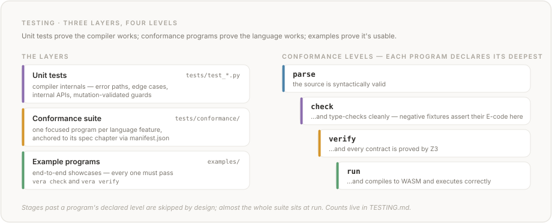

# Testing

This is the single source of truth for Vera's testing infrastructure, coverage data, and test conventions.

## Overview

<!-- render_status:begin status -->
| Metric | Value |
|--------|-------|
| **Tests** | 31,617 collected from 249 test files, which hold 259,812 lines |
| **Conformance programs** | 256 in `tests/conformance/manifest.json`: 0 at `parse`, 60 at `check`, 20 at `verify`, 176 at `run`; 48 of them negative fixtures (`expected_error`) |
| **Example programs** | 43 in `examples/` |
| **Corpus programs** | 306 `.vera` files under `examples/` and `tests/conformance/`, recursively |
| **Built-in functions** | 164, as `vera builtins` lists them |
| **Effects** | 10, as `vera effects` lists them |
| **Spec chapters** | 14 in `spec/` |
| **Pre-commit hooks** | 29 in `.pre-commit-config.yaml`: 27 at commit, 2 at push |
| **CI jobs** | 12 in `.github/workflows/ci.yml`; the `test` job's matrix has 13 cells |
| **Gate scripts** | 23 `scripts/check_*.py` |

Written by `scripts/render_status.py` from the tree.  The tests are counted by a collection, `pytest --collect-only -o addopts= --matrix=full`, which includes the stress tests and every class-instrument cell, not by a run, so a run's passed, skipped and xfailed split is not recorded here.
<!-- render_status:end status -->

This block, the [test file table](#test-files) and the [skipped tests](#skipped-tests) are written by `scripts/render_status.py` from the tree, each between a pair of `render_status` markers.  The release PR runs it, and `python scripts/check_doc_counts.py --release` fails the release when a block is not what the script writes now.  Between releases the blocks may lag the tree, and a pull request leaves them alone.  The one other place these counts are stated is the landing page's status paragraph, until its renderer lands ([ROADMAP.md](ROADMAP.md), Stage 22).

| Measure | Where it is |
|---------|-------------|
| **Compiler code coverage** | 95% Python, 87% JavaScript (CI minimum: 80%); see [Compiler Code Coverage](#compiler-code-coverage) |
| **Documentation code blocks** | `check_doc_examples.py` prints each gated document's Vera blocks by stage and category on every run; see [Documentation example pipeline](#documentation-example-pipeline) |
| **Contract verification** | the tiers `vera verify --json` reports over the examples; see [Contract Verification Coverage](#contract-verification-coverage) |
| **CI matrix** | the platforms and Python versions [README § Supported platforms](README.md#supported-platforms) lists, plus browser parity (Node.js 22) and the wheel-availability preflight; see [CI Pipeline](#ci-pipeline) |

## Running Tests

All commands assume the virtual environment is active (`source .venv/bin/activate`).

```bash
# Test suite
pytest tests/ -v                                     # the suite, each class-instrument matrix sampled
pytest tests/ -v --matrix=full                       # every cell of every matrix, as the coverage job and the nightly run do
VERA_MATRIX_CHANGED=vera/narrowing.py pytest tests/  # the sample, bar every cell of the matrices that module decides
pytest tests/test_codegen_expressions.py             # single file
pytest tests/test_codegen_expressions.py::TestArithmetic  # single class
pytest tests/test_conformance.py -v                  # conformance suite only
pytest tests/ --cov=vera --cov-report=term-missing --matrix=full  # with coverage

# JavaScript coverage (browser runtime)
VERA_JS_COVERAGE=1 pytest tests/test_browser.py -v  # V8 coverage via c8

# GC-rooting diagnostic (forces $gc_collect on every alloc, see ENVIRONMENT.md)
VERA_EAGER_GC=1 pytest tests/test_codegen_closures.py::TestClosureReturnShadowPushBalance -v

# Host-binding diagnostic (re-raises a host callback's own exception, see ENVIRONMENT.md).
# The suite sets and unsets VERA_DEBUG_HOST_ERRORS itself, so run it without a prefix:
pytest tests/test_runtime_traps.py::TestHostErrorDebugKnob1302 -v

# Type checking
mypy vera/                                           # strict mode

# Validation scripts
python scripts/check_conformance.py                  # the conformance suite (every program in manifest.json)
python scripts/check_examples.py                     # every example program
python scripts/check_doc_examples.py                 # every agent-facing doc's Vera blocks: parse + check + verify + vera:run
python scripts/check_wheel_availability.py           # pre-flight: every runtime dep has wheels for all supported platforms (#691 backstop)
python scripts/render_status.py                      # the release PR: rewrite this file's generated status
```

## Test Files

One row per test file: its tests as a full collection counts them (the stress tests and every class-instrument cell included), its lines, and the first paragraph of its module docstring, which is where a test file says what it covers.  The table is generated (see [Overview](#overview)), so a pull request that adds or changes a test file writes the file's docstring and leaves the table alone.

<!-- render_status:begin test-files -->
| File | Tests | Lines | What it covers |
|------|------:|------:|----------------|
| `test_adt_eq_reject_928.py` | 23 | 447 | Regression tests for #928 — ``==`` / ``!=`` / ``eq`` on a non-``Eq``-derivable type is a *silent wrong result*, the severest failure class (the equality sibling of #921). |
| `test_adt_float64_eq_871.py` | 9 | 306 | Regression tests for #871 — ADT equality with Float64 fields must model the runtime's per-field ``f64.eq``, not Z3's structural datatype ``=``. |
| `test_adt_membership_scope_1253.py` | 5 | 335 | #1253: codegen's ADT membership is the module's, not the whole program's. |
| `test_adt_ord_reject_921.py` | 40 | 676 | Regression tests for #921 — ``compare`` / ordering on a user ADT is a *silent wrong result*, the severest failure class. |
| `test_alias_application_refinement_base_1237.py` | 11 | 398 | A parameterised alias APPLICATION substitutes its arguments (#1237). |
| `test_ambiguous_import_refusal_1304.py` | 40 | 1,216 | #1304: two imports supplying one bare name are refused, in every namespace. |
| `test_array_map_slot_closure_1056.py` | 10 | 227 | Regression tests for #1056 — a fn-typed slot handed to ``array_map`` / ``array_mapi`` as the closure argument. |
| `test_ast.py` | 138 | 1,147 | Tests for the Vera AST layer (vera.ast + vera.transform). |
| `test_binder_position_generator.py` | 223 | 908 | The class instrument: every binder position, every refinement kind. |
| `test_binder_positions.py` | 45 | 455 | The binder-position registry is held to the AST, and to the guard table. |
| `test_boundary_guard_correctness_1466.py` | 991 | 2,327 | The class instrument: every guarded position, every WASM representation. |
| `test_browser.py` | 426 | 5,325 | Parity tests: Python/wasmtime vs Node.js/JS-runtime. |
| `test_build_site.py` | 54 | 858 | Tests for the site-asset tooling: scripts/build_site.py and scripts/check_site_assets.py. |
| `test_builtin_typevar_collision_970.py` | 61 | 811 | Regression tests for #970 — a user ``forall<T>`` var colliding *by name* with a built-in generic's internal type-variable name. |
| `test_byte_literal_joins_1212.py` | 25 | 759 | #1212: a `@Byte` literal inside a value-position join lowers at i32. |
| `test_cache_dependency_closure_1441.py` | 38 | 1,331 | #1441 — the warm session's cache key must cover what a proof actually reads. |
| `test_callee_contract_scope_1220_1225_1226.py` | 40 | 1,444 | A callee's contract is READ in the callee's own module (#1220, #1225, #1226). |
| `test_check_changelog_updated.py` | 68 | 712 | Tests for scripts/check_changelog_updated.py. |
| `test_check_corpus_differential.py` | 57 | 971 | Tests for scripts/check_corpus_differential.py — the burndown instrument that compiles the corpus at two revisions and reports which programs moved. |
| `test_check_doc_counts.py` | 51 | 626 | scripts/check_doc_counts.py, the documentation's release-time checks. |
| `test_check_doc_examples.py` | 202 | 1,671 | Tests for scripts/check_doc_examples.py — the documentation example gate (#1481). |
| `test_check_editor_grammars.py` | 20 | 249 | Tests for the editor-grammar drift gate (scripts/check_editor_grammars.py). |
| `test_check_examples_readme.py` | 15 | 190 | Tests for scripts/check_examples_readme.py's Demonstrates-column gate. |
| `test_check_examples_run.py` | 79 | 1,313 | Tests for scripts/check_examples_run.py — the harness gate that RUNS the examples. |
| `test_check_explicit_encoding.py` | 54 | 254 | Unit tests for `scripts/check_explicit_encoding.py` (#645). |
| `test_check_implies_compile.py` | 1,528 | 3,876 | A program `vera check` accepts is a program code generation builds. |
| `test_check_limitations_sync.py` | 30 | 577 | Tests for scripts/check_limitations_sync.py section extraction. |
| `test_check_walker_coverage_597.py` | 15 | 310 | Unit tests for `scripts/check_walker_coverage.py` (#597). |
| `test_checker_apply_fn.py` | 18 | 455 | Tests for the ``apply_fn`` checker special form (#854). |
| `test_checker_builtins_collections.py` | 97 | 848 | Tests for the Vera type checker — builtins_collections (Map/Set/Decimal/Json/Html/Http/Inference builtin type-checking). |
| `test_checker_builtins_strings.py` | 122 | 947 | Tests for the Vera type checker — builtins_strings (string/numeric/conversion/float/regex/markdown builtin type-checking). |
| `test_checker_effects.py` | 90 | 1,475 | Tests for the Vera type checker — effects (effect declarations, abilities, effect subtyping, async, handler typing). |
| `test_checker_errors.py` | 74 | 1,238 | Tests for the Vera type checker — errors (error codes, resolution diagnostics, contracts, error accumulation). |
| `test_checker_functions.py` | 86 | 1,112 | Tests for the Vera type checker — functions (function signatures, slot references, calls, control flow, where-blocks, IO, interpolation). |
| `test_checker_int_nat.py` | 8 | 153 | Regression tests for #755 — mixed ``Int <op> Nat`` arithmetic must type as ``Int``, not ``Nat``. |
| `test_checker_modules.py` | 242 | 2,642 | Tests for the Vera type checker — modules (module calls, cross-module typing, visibility, builtin redefinition). |
| `test_checker_patterns.py` | 59 | 940 | Tests for the Vera type checker — patterns (pattern matching, exhaustiveness, match-arm typing, bidirectional inference, typed holes). |
| `test_checker_types.py` | 249 | 3,835 | Tests for the Vera type checker — types (primitive types, ADTs, generics, constructors, arrays, tuples, refinement, literal ranges). |
| `test_clause_binder_guard_1445.py` | 19 | 495 | The handler-clause binder is obligated and guarded (#1445, #1448). |
| `test_cli.py` | 273 | 4,643 | Tests for vera.cli — command-line interface. |
| `test_clone_body_declaring_module_1241_1243.py` | 5 | 344 | #1241 + #1243: an imported clone's body calls its OWN module's functions. |
| `test_clone_decreases_1569.py` | 362 | 762 | A generic's ``decreases`` keeps its verdict whoever verifies it (#1569). |
| `test_closure_boundary_widths_1255_1256_1269.py` | 52 | 987 | Widths and pointer-ness at a closure/effect boundary: #1255, #1256, #1269. |
| `test_closure_lift_boundaries_1234_1235_1245.py` | 18 | 757 | Closure lifting at refinement boundaries: #1234, #1245, #1235. |
| `test_codegen_alias_adt_name_width_1309.py` | 112 | 417 | #1309 — a `type` alias whose name is also a registered ADT name. |
| `test_codegen_alias_of_adt_eq_show_1085.py` | 49 | 1,140 | Tests for #1085 / #1086 / #1087 — the alias-of-ADT / forall-Eq / bare-Future dispatch cluster (siblings of the #1076/#1077 ground-spelling family). |
| `test_codegen_alias_typeargs_eq_1076.py` | 34 | 499 | Tests for #1076 / #1077 / #1078 — the Eq-dispatch ground-spelling cluster. |
| `test_codegen_arrays.py` | 242 | 4,467 | Tests for vera.codegen — arrays (Byte type, array literals/bounds/length/range/concat, compound arrays, array utilities). |
| `test_codegen_calls.py` | 32 | 1,402 | Tests for vera.codegen — calls (statement-position unit calls, tail-call optimization, pair-typed closure params and captures). |
| `test_codegen_closures.py` | 63 | 2,024 | Tests for vera.codegen — Closures. |
| `test_codegen_collections.py` | 69 | 1,151 | Tests for vera.codegen — collections (Map and Set collections, wrapper-handle bit-31 tagging). |
| `test_codegen_contracts.py` | 33 | 601 | Tests for vera.codegen — Runtime contract insertion. |
| `test_codegen_coverage.py` | 5 | 244 | Tests for vera.codegen — Coverage gap tests. |
| `test_codegen_data_types.py` | 93 | 1,864 | Tests for vera.codegen — data_types (ADT metadata/constructors, match expressions, tuples, ADT string fields, generic-mono regressions). |
| `test_codegen_decimal.py` | 57 | 779 | Tests for vera.codegen — decimal (Decimal collection and monomorphization). |
| `test_codegen_decreases_guard.py` | 24 | 859 | Tests for vera.codegen — the runtime `decreases` termination guard (#1172). |
| `test_codegen_effects.py` | 117 | 2,671 | Tests for vera.codegen — effects (State/Exn/effect handlers, async futures, Random, expression-bodied handlers). |
| `test_codegen_erased_alias_typeargs_1070.py` | 15 | 398 | Tests for #1070 — non-literal erases-to-Unit type ARGUMENTS. |
| `test_codegen_expressions.py` | 89 | 787 | Tests for vera.codegen — expressions (literals, slot refs, arithmetic, comparison, boolean logic, control flow, function calls, pipe). |
| `test_codegen_gc_alloc.py` | 39 | 910 | Tests for vera.codegen — gc_alloc (layout helpers, bump allocator, GC core, shadow-stack overflow, multi-page grow, worklist overflow). |
| `test_codegen_gc_mark_base_1382.py` | 33 | 493 | Tests for vera.codegen — the GC mark store may only target object bases (#1382). |
| `test_codegen_gc_reclamation.py` | 21 | 706 | Tests for vera.codegen — gc_reclamation (transient Map/Set/Decimal reclamation, bucket occupancy, host-handle reclamation). |
| `test_codegen_gc_rooting.py` | 38 | 1,560 | Tests for vera.codegen — gc_rooting (opaque-handle and host-walker GC-rooting hygiene). |
| `test_codegen_host_effects.py` | 71 | 1,136 | Tests for vera.codegen — host_effects (Html/Http/Inference host effects, provider dispatch, postcondition host-import propagation). |
| `test_codegen_infrastructure.py` | 24 | 455 | Tests for vera.codegen — infrastructure (module assembly, execute error paths, unsupported-construct skips, builtin shadowing, typed holes, E602 reasons, example round-trips). |
| `test_codegen_interpolation.py` | 35 | 1,321 | Tests for vera.codegen — interpolation (string interpolation and the E615 loud inference-fallthrough channel). |
| `test_codegen_invariant_e699.py` | 5 | 266 | Regression test for the CodegenInvariantError -> [E699] contract (#657). |
| `test_codegen_io.py` | 42 | 821 | Tests for vera.codegen — io (IO operations and the host-imported Markdown/Regex builtins). |
| `test_codegen_json.py` | 116 | 1,112 | Tests for vera.codegen — json (Json collection and typed accessors). |
| `test_codegen_match_literal_arms.py` | 28 | 371 | A literal match arm compares at the SCRUTINEE's representation. |
| `test_codegen_match_shadow_scope_1322.py` | 24 | 608 | #1322 — a `match` cost GC shadow roots for the whole FRAME. |
| `test_codegen_modules.py` | 186 | 3,840 | Tests for vera.codegen — Cross-module codegen. |
| `test_codegen_monomorphize.py` | 258 | 5,104 | Tests for vera.codegen — Monomorphization of generic (forall<T>) functions. |
| `test_codegen_nat_guards.py` | 61 | 1,485 | Tests for vera.codegen — nat_guards (@Nat subtraction-underflow and binding-site narrowing runtime guards). |
| `test_codegen_nested_nullary_ctor_994.py` | 7 | 229 | Regression: nested payload-less constructor in a forall ``==``/``!=`` (#994 F2). |
| `test_codegen_numeric.py` | 86 | 1,104 | Tests for vera.codegen — numeric (math builtins, numeric type conversions, Float64 predicates and constants). |
| `test_codegen_orphan_call_indirect_1185.py` | 9 | 433 | Tests for #1185 — an orphan ``call_indirect`` never reaches the output. |
| `test_codegen_pair_scrutinee_1305.py` | 32 | 720 | #1305 — a `match` whose SCRUTINEE has the (ptr, len) pair representation. |
| `test_codegen_refinements.py` | 72 | 1,208 | Tests for vera.codegen — refinements (assert/assume, forall/exists quantifiers, refinement type aliases and runtime guards). |
| `test_codegen_root_lifetime_1371.py` | 122 | 1,332 | #1371 — GC shadow roots lived for the FRAME, not for their value. |
| `test_codegen_skip_propagation_1100.py` | 8 | 325 | Tests for #1100 — a codegen skip propagates to (transitive) callers. |
| `test_codegen_string_builtins.py` | 153 | 1,341 | Tests for vera.codegen — string_builtins (parse/encode builtins (parse_*, base64, url), search/transform builtins, to-string conversions). |
| `test_codegen_strings.py` | 113 | 1,266 | Tests for vera.codegen — strings (string literals + IO bindings, WAT escaping, signatures, format, core string ops, char classification, string utilities). |
| `test_codegen_structural_eq.py` | 58 | 1,371 | Tests for #773 — structural (not scalar-rep-based) Eq auto-derivation. |
| `test_codegen_translator_fixes.py` | 27 | 528 | Tests for vera.codegen — translator_fixes (WASM call-translator regression fixes (#475): slice/charcode clamps, url/base64/parse edge cases). |
| `test_codegen_typeparam_unit_wildcard_1060.py` | 31 | 959 | Tests for #1060 — wildcard over a type-parameter field instantiated to Unit. |
| `test_codegen_where_helper_mangling_991.py` | 13 | 553 | #991: duplicate ``where``-helper names crash WAT assembly on the non-generic path (``duplicate func identifier``) — and pre-#978 a colliding grandchild was silently dropped, binding its call to a same-named top-level function. |
| `test_codegen_zero_size_fields_1043.py` | 22 | 463 | Tests for #1043 — registered constructor layouts erase zero-size fields. |
| `test_composite_postcondition_eq_912.py` | 16 | 492 | Regression tests for #912 — a composite (ADT / Option / Tuple) equality in ``ensures`` position must lower its RUNTIME check to STRUCTURAL equality, so a postcondition ``vera verify`` proves at Tier 1 does not spuriously TRAP at run. |
| `test_conformance.py` | 1,280 | 154 | Conformance test suite — spec-anchored feature validation. |
| `test_construction_guards_1426.py` | 44 | 1,571 | Construction-position refinement guards (#1426). |
| `test_constructor_field_target.py` | 8 | 243 | A constructor argument's instantiated field type is on the record. |
| `test_contract_predicate_degradation_922.py` | 9 | 250 | Regression tests for #922 — a non-Eq composite ``==`` / ``hash`` / ``show`` in a CONTRACT-PREDICATE position must degrade to a clean diagnostic (E613 for a non-derivable ``==``, E602 for an unsupported ``hash`` / ``show``), NEVER escape as an uncaught Python traceback at compile. |
| `test_cross_namespace_ctor_1436.py` | 440 | 2,458 | #1436 — a constructor name is resolved in the namespace that uses it. |
| `test_data_namespace_contention_1312.py` | 26 | 980 | #1312 / #1317 — the data-collision rails, asked about LAYOUTS. |
| `test_db_effect.py` | 9 | 136 | Tests for the ``<DB>`` effect (#229) — contract-verified SQL via host imports. |
| `test_db_marshalling.py` | 35 | 235 | Round-trip tests for the ``<DB>`` marshalling helpers (#229, S2). |
| `test_db_runtime.py` | 21 | 301 | Tests for the ``<DB>`` host binding (#229, S3) — ``vera/runtime/db.py``. |
| `test_diagnostic_fields.py` | 98 | 1,618 | Unit tests for `scripts/check_diagnostic_fields.py` (#682). |
| `test_disclosure_taint_follows_value_1406.py` | 112 | 2,292 | #1406 / #1407 — a disclosed fact's taint follows the VALUE, not the syntax. |
| `test_distrust_corpus.py` | 223 | 249 | `vera test --distrust` over the corpus: a Tier-1 proof must survive a run. |
| `test_doc_annotations.py` | 95 | 1,067 | Tests for scripts/doc_annotations.py — inline fence markers (#538, #1481). |
| `test_doc_builtin_shadowing.py` | 11 | 183 | Tests for scripts/check_doc_builtin_shadowing.py (#819). |
| `test_dropped_entry_1183_1186.py` | 21 | 561 | #1183 + #1186 — a dropped entry function must never be silently replaced. |
| `test_duplicate_names_1433.py` | 150 | 1,692 | #1433: a namespace holds one declaration of each name (spec §8.5.5). |
| `test_effect_op_determinism.py` | 9 | 504 | #1215: bare effect-op resolution is deterministic and source-ordered. |
| `test_element_facts_statable_1430.py` | 75 | 1,988 | #1430 — the nested-refinement goal is STATABLE for carriers the structural walk cannot decompose. |
| `test_emitted_checks_1479.py` | 48 | 592 | The per-module record of emitted runtime checks (#1479). |
| `test_eq_contract_874.py` | 13 | 430 | Regression tests for #874 — the ``eq`` / ``compare`` ability operations in contract position (``requires`` / ``ensures``) must lower to their canonical operator form, so a contract that ``vera check`` accepts also *compiles*, *runs*, and *verifies at Tier 1*. |
| `test_errors.py` | 66 | 705 | Error message tests — verify LLM-oriented diagnostic quality. |
| `test_evaluated_position_obligations_1480.py` | 1,579 | 4,592 | Every runtime check the compiled program performs has an obligation (#1480). |
| `test_examples_ephemeris.py` | 12 | 390 | Pins for `examples/ephemeris.vera` — the tree's only floating-point program. |
| `test_execute_characterization.py` | 24 | 511 | Characterization harness for ``execute()`` — the #421 decomposition gate. |
| `test_exn_throw_payload_1268.py` | 42 | 1,066 | ``throw``'s payload is obligated AND guarded like every other narrowing site (#1268). |
| `test_family_naming.py` | 66 | 1,612 | The State/Exn cell FAMILY is the cell the checker typed (#1209). |
| `test_field_layout_one_source_1466.py` | 7 | 245 | One layout table, proved behaviourally: widen it and every walk follows. |
| `test_float64_builtins_807.py` | 81 | 491 | #807 — Tier-1 Z3 modeling for the modelable Float64 builtins deferred from #797: `float_clamp`, `int_to_float`, `float_to_int`. |
| `test_float64_fp.py` | 10 | 260 | Regression tests for #797 — @Float64 contracts via Z3's FloatingPoint sort. |
| `test_formatter.py` | 554 | 3,638 | Tests for vera.formatter — canonical code formatter. |
| `test_gate_placement.py` | 83 | 1,203 | Where each gate runs: the fast ones at commit time, every one in CI. |
| `test_gc_shadow_bounds_860.py` | 9 | 255 | #860 — the four sibling shadow-stack bounds, made slot-complete. |
| `test_generic_under_generic_callees_1223.py` | 8 | 298 | #1223: a generic `where`-helper under a GENERIC parent instantiates its own generic callees. |
| `test_generic_where_helper_990.py` | 10 | 339 | #990: a ``forall<T>`` where-helper under a NON-generic parent never gets monomorphized — check and verify are green, but compile emits a dangling call. |
| `test_git_hermetic.py` | 3 | 121 | The suite never acts on a repository it inherits (PR #1484). |
| `test_grammar_alignment.py` | 91 | 753 | Tests for the grammar rule-name drift gate (scripts/check_grammar_alignment.py). |
| `test_guard_completeness.py` | 75 | 2,405 | Guard completeness — the sites the verifier OBLIGATES and codegen must runtime-check (#765, #757, #1036, #754, #1222). |
| `test_handle_exn_divergent_result_1276.py` | 10 | 391 | #1276: a ``handle[Exn]`` whose clause body AND handled body both diverge must still emit a block WASM accepts in a result-expecting context. |
| `test_handler_op_ownership_1284.py` | 15 | 419 | #1284: whose declaration a bare ``get``/``put`` call site denotes. |
| `test_handler_signature_1442.py` | 26 | 517 | #1442 — ``validate_handler`` must read the handler's VERA types. |
| `test_hetero_widen_tailcall.py` | 21 | 391 | Verifier<->codegen desync tests for the #820 heterogeneous per-arm @Nat->@Int widen guard: three fixes found by review on PR #986. |
| `test_html.py` | 4 | 168 | Tests for docs/index.html code samples — parse, check, and verify. |
| `test_import_visibility_entry_point_1244.py` | 6 | 269 | #1244: one program, one verdict — whatever file `vera check` was given. |
| `test_imported_trap_source_map_1189.py` | 8 | 342 | #1189 — an imported function's trap frame must name ITS module's file. |
| `test_infer_vera_type_join_1286.py` | 26 | 577 | #1286: the Vera-level type namers must join over `if` / `match`, not read one branch. |
| `test_inference_response_shapes_1333.py` | 164 | 2,131 | #1333 — `Inference.complete` must parse provider responses by SHAPE, not by position. |
| `test_int_overflow.py` | 6 | 143 | Regression tests for #798 — @Int/@Nat arithmetic overflow obligations. |
| `test_int_overflow_codegen.py` | 62 | 737 | Runtime overflow-trap codegen tests for #798 (Stage 3). |
| `test_int_overflow_differential.py` | 261 | 398 | Verifier<->codegen classification differential for #798 (Stage 3, RISK 6/7). |
| `test_int_widening_codegen.py` | 52 | 542 | Runtime @Nat -> @Int widening-trap codegen tests for #813 (stage 3). |
| `test_int_widening_differential.py` | 28 | 346 | Verifier<->codegen behavioural differential for #813 @Nat -> @Int widening. |
| `test_interpolation_resolved_type_1347.py` | 33 | 201 | #1347 — interpolation decides on the RESOLVED type, not the spelling. |
| `test_introspect.py` | 39 | 221 | Tests for ``vera.introspect`` — the registry payloads behind ``vera builtins/effects/errors --json`` (#539). |
| `test_json_accept_domain_1306_1308.py` | 97 | 720 | ``json_parse``'s accept domain (#1306, #1308). |
| `test_lexical_fn_scope_1299.py` | 56 | 1,554 | #1299: codegen's bare-call ownership table must be the CALL SITE's scope. |
| `test_literal_typing_from_context_1541_1565.py` | 3,374 | 1,578 | An integer literal takes its type from its context (#1541, #1565). |
| `test_lsp.py` | 329 | 5,456 | Tests for vera/lsp/ — transport skeleton + coordinate layer (#222 Phase C). |
| `test_markdown.py` | 94 | 610 | Unit tests for the Python Markdown parser and renderer (§9.7.3). |
| `test_matrix_sample.py` | 71 | 682 | The `matrix` marker's sample (tests/matrix_sample.py). |
| `test_module_environment_1493.py` | 128 | 850 | A module is compiled in ITS OWN namespace, imports included (#1493, #1275). |
| `test_module_generic_collision_1281.py` | 24 | 956 | #1281: E608 must not refuse two modules' PROVABLY DISTINCT generics. |
| `test_module_generic_namespace_1274.py` | 24 | 1,015 | #1274: a module generic that does not own the importer's bare name must be reached under its module-qualified ``mod$<path>$name`` identity. |
| `test_module_shadowed_generic_effect_op_1310.py` | 4 | 410 | #1310: a qualified-only (shadowed) module generic's instantiation discovery had no effect-operation registry at all, unlike the unshadowed discovery walk #1207 already fixed. |
| `test_mono_effect_op_naming_1207.py` | 9 | 341 | #1207: mono discovery and the WASM call-rewrite name ONE clone. |
| `test_monomorphize_differential.py` | 63 | 2,217 | #732 differential soundness test for per-monomorphization verification. |
| `test_mutual_recursive_sorts_881.py` | 15 | 317 | Regression tests for #881 — mutually-recursive ``data`` declarations must not crash ``vera verify`` with a raw ``RecursionError`` during Z3 sort construction. |
| `test_name_resolution_spine_1316.py` | 233 | 2,130 | #1316 / #1321 / #1331 — ONE name-resolution spine, asked in the DECLARING namespace. |
| `test_named_traps_1479.py` | 386 | 1,920 | Every runtime trap names its cause (#1479). |
| `test_naming_env_provenance_1208.py` | 45 | 2,111 | Every consumer renders against the env the CHECKER rendered under (#1208). |
| `test_nat_bind_construction_soundness_1332.py` | 42 | 755 | #1332: a `@Nat` tuple-component narrowing at CONSTRUCTION is obligated, never assumed. |
| `test_nat_int_widening.py` | 36 | 622 | Regression tests for #813 — @Nat -> @Int widening coercion obligations. |
| `test_nat_narrowing_return_differential.py` | 136 | 2,965 | Verifier<->codegen behavioural differential for #758 — the @Int -> @Nat narrowing obligation at the RETURN position. |
| `test_nested_container_guards.py` | 3,487 | 359 | A component type reaches a NESTED container literal (R-1412 F3, PR #1606). |
| `test_nested_ctor_sort_1360.py` | 30 | 681 | #1360: a `Tuple` nested inside a constructor translates, and `--json` always envelopes. |
| `test_nested_handler_clause_ops.py` | 28 | 1,025 | #1211: a clause body's bare op belongs to the ENCLOSING context. |
| `test_new_state_family_1285.py` | 13 | 387 | #1285: which cell ``new(State<T>)`` reads under a multi-``State`` row. |
| `test_nightly_stress_workflow.py` | 5 | 318 | Contract test for #1328: the nightly stress workflow's marker selection must actually collect every ``@pytest.mark.stress`` test, not just whichever file the invocation happens to name. |
| `test_nonregular_data_rejected_1429.py` | 44 | 789 | #1429 — a non-regularly recursive `data` declaration is refused at CHECK. |
| `test_obligations.py` | 785 | 1,923 | Tests for vera/obligations/ — reified obligations + warm session (#222 Phase A). |
| `test_one_classifier_1503.py` | 1,116 | 3,543 | #1503 — every guard and every obligation reads ONE classifier. |
| `test_overflow_fails_closed_1417.py` | 5 | 255 | An unclassified operand pair emits the overflow guard (#1417). |
| `test_parse_error_instructions_1348_1349.py` | 15 | 176 | #1349 / #1348 — the parser's fallback, brought up to the project's bar. |
| `test_parser.py` | 178 | 1,481 | Parser tests — verify that valid Vera programs parse without error. |
| `test_pattern_scrutinee_agreement_1315_1320.py` | 63 | 584 | #1315 / #1320 — a pattern must be able to match the scrutinee's type. |
| `test_per_owner_adt_identity_1317.py` | 62 | 2,309 | #1317 / #187 (data half) — per-owner ADT identity. |
| `test_phantom_generic_instances_1271.py` | 14 | 358 | #1271: discovery inside a still-generic scope must not instantiate a callee at an ENCLOSING scope's type VARIABLE. |
| `test_pipe_desugar.py` | 695 | 1,497 | A pipe is the call it stands for. |
| `test_prelude.py` | 29 | 585 | Tests for vera.prelude — standard prelude injection. |
| `test_prelude_adt_namespace_1277.py` | 61 | 1,041 | #1277: a module's ADT name must not evict the prelude's from other scopes. |
| `test_prelude_decl_stamp_1287.py` | 4 | 240 | #1287: the prelude's declaration block is a fact about the prelude. |
| `test_prelude_diagnostics.py` | 8 | 271 | Tests for #851 — prelude combinator skip-warnings (E602/E604). |
| `test_prelude_named_imports_1559.py` | 66 | 343 | #1559 — an imported data type named like a prelude type. |
| `test_readme.py` | 2 | 79 | Tests for README.md code samples — the parse stage of every Vera block. |
| `test_reconciliation.py` | 478 | 1,425 | The verifier's runtime-guard claims reconciled with the checks code generation emits (the audit's T2a): :mod:`vera.reconcile`, ``vera verify --reconcile`` and the corpus gate ``scripts/check_reconciliation.py``. |
| `test_refinement_binder_convergence_1208.py` | 16 | 459 | Codegen's refinement guard and :mod:`vera.naming` share ONE derivation. |
| `test_refinement_chain_convergence.py` | 63 | 398 | The two refinement-chain oracles answer the same question. |
| `test_release.py` | 64 | 821 | Release-policy tests for ``scripts/release.py`` (#481). |
| `test_render_status.py` | 41 | 658 | scripts/render_status.py, which writes TESTING.md's generated status. |
| `test_reserved_container_names_1547.py` | 61 | 217 | #1547 — the built-in container names are reserved (E158). |
| `test_resolver.py` | 20 | 602 | Tests for vera.resolver — module resolution. |
| `test_runtime_traps.py` | 99 | 3,290 | Runtime trap categorisation + stdout-on-trap preservation. |
| `test_self_qualified_calls_1558.py` | 259 | 1,667 | #1558 — a module's qualified call to its own function. |
| `test_serve.py` | 8 | 189 | End-to-end tests for the #305 ``vera serve`` driver. |
| `test_single_source_type_names.py` | 53 | 1,281 | #1327 / #1357 / #1365 / #1366: one source for an expression's type. |
| `test_slot_naming.py` | 56 | 810 | Rule table for :mod:`vera.naming` — the ONE slot/family naming renderer. |
| `test_slot_naming_blast_radius.py` | 15 | 337 | The measured blast radius of the #1208 slot-naming core flip. |
| `test_slot_naming_differential.py` | 6 | 912 | Differential gate: the CHECKER must render what :mod:`vera.naming` renders. |
| `test_soundness_392.py` | 36 | 584 | Regression tests for the #392 smt.py / verifier soundness audit. |
| `test_sql_provenance_309.py` | 79 | 780 | Tests for the SQL literal-provenance checker (#309) — SQL injection as a compile-time error. |
| `test_state_clause_semantics.py` | 27 | 696 | #976 option C: ``handle[State<T>]`` clause bodies EXECUTE with intrinsic-hybrid semantics. |
| `test_state_exn_registration.py` | 30 | 1,298 | #1210: State/Exn host-import registration must cover the whole handler. |
| `test_stress.py` | 16 | 553 | Scale-dependent regression tests (#596). |
| `test_string_length_soundness.py` | 15 | 278 | Regression tests for #802 — string_length code-point vs UTF-8 byte mismatch. |
| `test_termination_rule.py` | 788 | 1,877 | Every recursive function proves it terminates or says it may not (#1492). |
| `test_tester.py` | 17 | 445 | Tests for vera.tester — contract-driven test engine. |
| `test_tester_artifacts.py` | 1 | 89 | `vera test` must thread the #747/#820 checker artifacts into BOTH the verifier and codegen (FIX 2, PR #986 review). |
| `test_tester_coverage.py` | 49 | 1,402 | Tests for vera.tester — Coverage gap tests. |
| `test_tester_distrust.py` | 177 | 2,409 | `vera test --distrust`: execute the functions the verifier proved. |
| `test_types.py` | 82 | 443 | Unit tests for vera.types — type operations. |
| `test_uninferred_type_arg_e622.py` | 20 | 819 | #1327/#1366: a type argument the walker cannot name must FAIL CLOSED [E622]. |
| `test_unresolved_names_1489.py` | 57 | 602 | Every type and effect name resolves, or check refuses it (#1489, #1506). |
| `test_value_type_dispatch_1534_1539.py` | 86 | 507 | Show and hash dispatch on the VALUE's type, not on the compiling namespace's reading of its name (#1534, #1539). |
| `test_verifier_adt_decreases.py` | 22 | 941 | Tests for vera.verifier — adt_decreases (match/ADT verification, decreases measures, mutual recursion). |
| `test_verifier_assert_subpattern_facts.py` | 51 | 2,639 | One derivation of what a `match` arm means, read by every walk (#1403). |
| `test_verifier_budget.py` | 36 | 310 | The configurable Z3 budget (#1350). |
| `test_verifier_call_arg_payload_1410.py` | 51 | 2,117 | Stream V3 — a call ARGUMENT establishes its parameter's nested refinements. |
| `test_verifier_calls_modules.py` | 82 | 2,263 | Tests for vera.verifier — calls_modules (call-site preconditions, pipe operator, cross-module contracts). |
| `test_verifier_contracts.py` | 96 | 913 | Tests for vera.verifier — contracts (example corpus, trivial/ensures/if-else/let/multi contracts, counterexamples, tier classification, arithmetic, summaries, diverge, edge cases, string-length/predicate verification). |
| `test_verifier_coverage.py` | 92 | 1,651 | Additional coverage tests for vera/smt.py and vera/verifier.py. |
| `test_verifier_cross_module_disclosure.py` | 38 | 1,735 | Stream V — #1363's demotion has to cross a module boundary (#1399). |
| `test_verifier_fresh_scope.py` | 46 | 1,130 | Tests for vera.verifier — fresh-scope obligation walking (#779, #985). |
| `test_verifier_mutation_gates_smt.py` | 52 | 1,317 | Tests for vera.verifier — mutation_gates_smt (#387 mutation-hardening: verifier gates and SMT translation). |
| `test_verifier_mutation_obligations.py` | 38 | 891 | Tests for vera.verifier — mutation_obligations (#387 mutation-hardening: obligation-record completeness and projection helpers). |
| `test_verifier_nat_obligations.py` | 82 | 1,745 | Tests for vera.verifier — nat_obligations (@Nat subtraction-underflow (#520) and binding-site narrowing (#552) obligations). |
| `test_verifier_nested_ctor_sort_918.py` | 14 | 441 | Regression: same-ADT self-nested constructor sort selection (#918). |
| `test_verifier_nullary_ctor_sort_994.py` | 11 | 228 | Regression: bare nullary-constructor sort selection in ``==``/``!=`` (#994 F1). |
| `test_verifier_premise_consistency_1451.py` | 203 | 3,514 | A function's premise set is checked for satisfiability before it is trusted (#1451). |
| `test_verifier_primitive_ops.py` | 39 | 662 | Tests for vera.verifier — primitive_ops (division/modulo-by-zero (E526) and array index-bounds (E527) obligations (#680)). |
| `test_verifier_refined_sort_derivation.py` | 9 | 509 | One sort for a refined payload, wherever a term is rebuilt (#1421). |
| `test_verifier_refinement_chain_1434.py` | 15 | 684 | A refinement over a refinement means the conjunction of its predicates (#1434). |
| `test_verifier_refinements.py` | 92 | 2,493 | Tests for vera.verifier — refinements (refined param sorts, refinement-predicate translation and verification (#746)). |
| `test_verifier_shadow_audits.py` | 71 | 1,400 | Tests for vera.verifier — shadow_audits (per-monomorphization verification (#732) and the #680 shadow/projection audit battery). |
| `test_verifier_sort_name_collision_884.py` | 5 | 203 | Regression: injective Z3 datatype sort names (#884). |
| `test_verifier_truth_consult_status.py` | 35 | 1,312 | Stream B — the verifier consults the statuses it computes. |
| `test_verifier_where_helper_scope_991.py` | 5 | 235 | #991 (verifier facet): the verifier resolved a bare call to a ``where``-helper through the flat, last-wins ``env.functions`` lookup, so in a diamond shape — two sibling helpers each carrying a nested helper of the SAME name but a DIFFERENT postcondition — it assumed the WRONG helper's ``ensures`` at the call site and reported a false E500 against a correct program. |
| `test_version.py` | 5 | 80 | `vera.__version__` is the version `pyproject.toml` states, read once. |
| `test_walker_defensive_branches_597.py` | 34 | 855 | Synthetic-AST tests for the defensive `isinstance` branches added by #597 to compiler walker functions. |
| `test_warning_severity_1513.py` | 80 | 1,219 | #1513 — a check-stage warning is one whose program compiles and runs. |
| `test_wasi_target.py` | 279 | 2,210 | Tests for the WASI Preview 2 component emitter (#237). |
| `test_wasm.py` | 29 | 502 | Unit tests for vera.wasm — WASM translation layer. |
| `test_wasm_coverage.py` | 226 | 3,987 | Tests for vera.wasm — Coverage gap tests. |
| `test_where_helper_call_boundary_1455.py` | 36 | 677 | #1455 — a call boundary obligates its argument wherever the callee is declared. |
| `test_where_helper_scope_1307.py` | 30 | 704 | #1307 — a `where`-helper is local to its parent, on the checker's table too. |
| `test_widen_trap_kind_1438.py` | 4 | 165 | The `@Nat` -> `@Int` widening guard names itself (#1438). |
| `test_xmod_ability_ops_992.py` | 5 | 156 | #992: imported function bodies never got the ability-op rewrite. |
| `test_xmod_artifact_collection.py` | 5 | 208 | Opt-in collection of ``CheckArtifacts.module_artifacts`` (PR #997 review). |
| `test_xmod_generic_widen_gap.py` | 15 | 419 | Cross-module differential for #998: imported GENERIC bodies keep the #820 widen guard at every monomorphized instantiation. |
| `test_xmod_span_collision.py` | 4 | 160 | Cross-module span-collision false-guard (PROBE 5, PR #986 review). |
| `test_xmod_where_helper_import_991.py` | 3 | 190 | #991 round 4 (PR #1013 review): a non-generic where-helper's name must no longer suppress a same-named IMPORT's bare emission. |
| `test_xmod_widening_differential.py` | 18 | 298 | Cross-module verifier<->codegen differential for #987 @Nat -> @Int widening. |
<!-- render_status:end test-files -->

## Conformance Suite

The conformance suite is a collection of small, focused programs in `tests/conformance/` that systematically validate every language feature against the spec. Most programs are self-contained; the module-focused Chapter 8 cases use `import` statements where needed, and `ch07_cross_module_contracts.vera` still depends on `ch07_cross_module_contracts_lib.vera`. Each program tests one feature or a small group of related features.

Simon Willison [argues](https://simonwillison.net/tags/conformance-suites/) that conformance suites are a "huge unlock" for language projects — they transform development from trust-based to verification-based. The conformance suite serves as the definitive specification artifact that any implementation (or agent) can validate against.

### Three-layer testing model

Vera has three distinct test layers, each serving a different purpose:



| Layer | Location | Purpose | What it tests |
|-------|----------|---------|---------------|
| **Unit tests** | `tests/test_*.py` | Test compiler internals | Error paths, edge cases, internal APIs |
| **Conformance suite** | `tests/conformance/` | Spec-anchored feature validation | Every language feature, one program per feature |
| **Example programs** | `examples/` | Showcase programs and demos | End-to-end usage, documentation |

Unit tests verify that the compiler works correctly. Conformance programs verify that the *language* works correctly. Examples demonstrate how to use the language. All three run in CI on every pull request, and again in the run the push event a merged pull request produces on `main`; a commit runs the test files it stages and the fast gates (see [Pre-commit Hooks](#pre-commit-hooks)).

### Test levels

Each conformance program declares the deepest pipeline stage it must pass:

| Level | What it validates |
|-------|-------------------|
| `parse` | Source text is syntactically valid |
| `check` | Parses and type-checks cleanly |
| `verify` | Type-checks and all contracts verified by Z3 |
| `run` | Compiles to WASM and executes correctly |

Most programs are at the `run` level: they compile and execute, producing correct results.  A program stops at an earlier level when it cannot go further.  A library module has no `main` of its own, so it is pinned at the deepest level it reaches: `verify` when it carries contracts to prove, `check` otherwise.  A program with typed holes type-checks but never compiles.  A feature can need what CI does not have: `ch09_http` makes outbound HTTP requests and `ch09_inference` needs a provider key.  And a **negative fixture** must fail: the negative fixtures are the entries with `expected_error` in `tests/conformance/manifest.json`, each declared at `check` and required to fail with that diagnostic code at the stage `expected_error_stage` names — `check` by default, or `compile` for a diagnostic the checker accepts and code generation refuses, where the harness also asserts that the program type-checks cleanly first.  The [status block](#overview) counts the programs at each level and the negative fixtures.

### Skipped tests

A conformance program skips every stage past its declared level: a `check`-level program skips `verify` and `run`, and a `verify`-level one skips `run`.  The table below is generated at release by calling each stage method of `tests/test_conformance.py` on each manifest entry, so it is the suite's own decision rather than a restatement of that rule, and the message is the one pytest reports.  The suite's other skips are platform- or tool-gated and documented beside the tests that declare them.

<!-- render_status:begin skipped-tests -->
The suite skips 140 conformance-stage tests:

| Test | Program | Declared level | Message | What the program is |
|------|---------|----------------|---------|---------------------|
| `test_verify[ch02_alias_cycle_rejected]` | `ch02_alias_cycle_rejected.vera` | `check` | check-only | A cyclic type alias is rejected at check; negative: `expected_error: E132` |
| `test_run[ch02_alias_cycle_rejected]` | `ch02_alias_cycle_rejected.vera` | `check` | check-only | A cyclic type alias is rejected at check; negative: `expected_error: E132` |
| `test_verify[ch02_generic_over_unit_rejected]` | `ch02_generic_over_unit_rejected.vera` | `check` | check-only | Instantiating a generic at the zero-size Unit type is a checker error (#900); negative: `expected_error: E206` |
| `test_run[ch02_generic_over_unit_rejected]` | `ch02_generic_over_unit_rejected.vera` | `check` | check-only | Instantiating a generic at the zero-size Unit type is a checker error (#900); negative: `expected_error: E206` |
| `test_verify[ch02_map_unit_value_rejected]` | `ch02_map_unit_value_rejected.vera` | `check` | check-only | A Map with a zero-size value type is a checker error (#1075); negative: `expected_error: E135` |
| `test_run[ch02_map_unit_value_rejected]` | `ch02_map_unit_value_rejected.vera` | `check` | check-only | A Map with a zero-size value type is a checker error (#1075); negative: `expected_error: E135` |
| `test_verify[ch02_nonregular_data_rejected]` | `ch02_nonregular_data_rejected.vera` | `check` | check-only | A data declaration may not recurse non-regularly; negative: `expected_error: E129` |
| `test_run[ch02_nonregular_data_rejected]` | `ch02_nonregular_data_rejected.vera` | `check` | check-only | A data declaration may not recurse non-regularly; negative: `expected_error: E129` |
| `test_run[ch03_slot_let_chains]` | `ch03_slot_let_chains.vera` | `verify` | verify-only | Deep let-chain slot indexing |
| `test_run[ch03_slot_noncommutative]` | `ch03_slot_noncommutative.vera` | `verify` | verify-only | Non-commutative slot indexing |
| `test_verify[ch03_typed_holes]` | `ch03_typed_holes.vera` | `check` | check-only | Typed holes |
| `test_run[ch03_typed_holes]` | `ch03_typed_holes.vera` | `check` | check-only | Typed holes |
| `test_verify[ch04_let_unit_rejected]` | `ch04_let_unit_rejected.vera` | `check` | check-only | A let binding of the zero-size type Unit is a checker error (#1006); negative: `expected_error: E183` |
| `test_run[ch04_let_unit_rejected]` | `ch04_let_unit_rejected.vera` | `check` | check-only | A let binding of the zero-size type Unit is a checker error (#1006); negative: `expected_error: E183` |
| `test_run[ch04_nested_option_ctor]` | `ch04_nested_option_ctor.vera` | `verify` | verify-only | Nested same-ADT constructor sort selection (#918) |
| `test_verify[ch04_pattern_ctor_over_container_rejected]` | `ch04_pattern_ctor_over_container_rejected.vera` | `check` | check-only | A constructor pattern over a scrutinee whose type declares no such constructor is a checker error (#1315); negative: `expected_error: E314` |
| `test_run[ch04_pattern_ctor_over_container_rejected]` | `ch04_pattern_ctor_over_container_rejected.vera` | `check` | check-only | A constructor pattern over a scrutinee whose type declares no such constructor is a checker error (#1315); negative: `expected_error: E314` |
| `test_verify[ch04_pattern_literal_type_rejected]` | `ch04_pattern_literal_type_rejected.vera` | `check` | check-only | A literal pattern whose type is not the scrutinee's is a checker error (#1320); negative: `expected_error: E314` |
| `test_run[ch04_pattern_literal_type_rejected]` | `ch04_pattern_literal_type_rejected.vera` | `check` | check-only | A literal pattern whose type is not the scrutinee's is a checker error (#1320); negative: `expected_error: E314` |
| `test_run[ch04_primitive_obligations]` | `ch04_primitive_obligations.vera` | `verify` | verify-only | Primitive operation safety obligations (#680) |
| `test_verify[ch05_apply_fn_arity]` | `ch05_apply_fn_arity.vera` | `check` | check-only | apply_fn arity is checked (#854); negative: `expected_error: E201` |
| `test_run[ch05_apply_fn_arity]` | `ch05_apply_fn_arity.vera` | `check` | check-only | apply_fn arity is checked (#854); negative: `expected_error: E201` |
| `test_run[ch05_apply_fn_typing]` | `ch05_apply_fn_typing.vera` | `verify` | verify-only | apply_fn typing as a checker special form (#854) |
| `test_verify[ch05_decreases_float_rejected]` | `ch05_decreases_float_rejected.vera` | `check` | check-only | A Float64 decreases measure has no well-founded ordering and is a checker error (#1172); negative: `expected_error: E127` |
| `test_run[ch05_decreases_float_rejected]` | `ch05_decreases_float_rejected.vera` | `check` | check-only | A Float64 decreases measure has no well-founded ordering and is a checker error (#1172); negative: `expected_error: E127` |
| `test_verify[ch05_reserved_contextual_keyword_fn_rejected]` | `ch05_reserved_contextual_keyword_fn_rejected.vera` | `check` | check-only | A function named after a contextual grammar keyword is a checker error (#1296); negative: `expected_error: E153` |
| `test_run[ch05_reserved_contextual_keyword_fn_rejected]` | `ch05_reserved_contextual_keyword_fn_rejected.vera` | `check` | check-only | A function named after a contextual grammar keyword is a checker error (#1296); negative: `expected_error: E153` |
| `test_verify[ch05_reserved_fn_name_rejected]` | `ch05_reserved_fn_name_rejected.vera` | `check` | check-only | A function named after a reserved contract state form is a checker error (#1181); negative: `expected_error: E153` |
| `test_run[ch05_reserved_fn_name_rejected]` | `ch05_reserved_fn_name_rejected.vera` | `check` | check-only | A function named after a reserved contract state form is a checker error (#1181); negative: `expected_error: E153` |
| `test_verify[ch05_reserved_keyword_fn_rejected]` | `ch05_reserved_keyword_fn_rejected.vera` | `check` | check-only | A function named after a grammar keyword is a checker error (#1187); negative: `expected_error: E153` |
| `test_run[ch05_reserved_keyword_fn_rejected]` | `ch05_reserved_keyword_fn_rejected.vera` | `check` | check-only | A function named after a grammar keyword is a checker error (#1187); negative: `expected_error: E153` |
| `test_verify[ch05_reserved_resume_fn_rejected]` | `ch05_reserved_resume_fn_rejected.vera` | `check` | check-only | A function named after the handler-clause resume operator is a checker error; negative: `expected_error: E153` |
| `test_run[ch05_reserved_resume_fn_rejected]` | `ch05_reserved_resume_fn_rejected.vera` | `check` | check-only | A function named after the handler-clause resume operator is a checker error; negative: `expected_error: E153` |
| `test_verify[ch05_where_helper_duplicate_rejected]` | `ch05_where_helper_duplicate_rejected.vera` | `check` | check-only | Two `where` helpers of one name in one block are a checker error (#1433); negative: `expected_error: E184` |
| `test_run[ch05_where_helper_duplicate_rejected]` | `ch05_where_helper_duplicate_rejected.vera` | `check` | check-only | Two `where` helpers of one name in one block are a checker error (#1433); negative: `expected_error: E184` |
| `test_verify[ch05_where_helper_outer_slot_rejected]` | `ch05_where_helper_outer_slot_rejected.vera` | `check` | check-only | Reading the outer function's parameter slot in a where-helper body is a checker error (#969); negative: `expected_error: E130` |
| `test_run[ch05_where_helper_outer_slot_rejected]` | `ch05_where_helper_outer_slot_rejected.vera` | `check` | check-only | Reading the outer function's parameter slot in a where-helper body is a checker error (#969); negative: `expected_error: E130` |
| `test_verify[ch05_where_helper_sibling_call_rejected]` | `ch05_where_helper_sibling_call_rejected.vera` | `check` | check-only | A bare call to another declaration's where-helper is a checker error (#1307); negative: `expected_error: E178` |
| `test_run[ch05_where_helper_sibling_call_rejected]` | `ch05_where_helper_sibling_call_rejected.vera` | `check` | check-only | A bare call to another declaration's where-helper is a checker error (#1307); negative: `expected_error: E178` |
| `test_run[ch06_adt_sort_disambiguation]` | `ch06_adt_sort_disambiguation.vera` | `verify` | verify-only | ADT sort disambiguation (generic vs flat-ADT name collision) |
| `test_verify[ch06_quantifier_array_domain_rejected]` | `ch06_quantifier_array_domain_rejected.vera` | `check` | check-only | An array-typed quantifier domain is a check-time E128 (#1204); negative: `expected_error: E128` |
| `test_run[ch06_quantifier_array_domain_rejected]` | `ch06_quantifier_array_domain_rejected.vera` | `check` | check-only | An array-typed quantifier domain is a check-time E128 (#1204); negative: `expected_error: E128` |
| `test_verify[ch07_bare_effect_op_rejected]` | `ch07_bare_effect_op_rejected.vera` | `check` | check-only | Bare (unqualified) effect-op call the WASM backend cannot route is a checker error; negative: `expected_error: E217` |
| `test_run[ch07_bare_effect_op_rejected]` | `ch07_bare_effect_op_rejected.vera` | `check` | check-only | Bare (unqualified) effect-op call the WASM backend cannot route is a checker error; negative: `expected_error: E217` |
| `test_run[ch07_cross_module_contracts]` | `ch07_cross_module_contracts.vera` | `verify` | verify-only | Cross-module contract verification |
| `test_verify[ch07_cross_module_contracts_lib]` | `ch07_cross_module_contracts_lib.vera` | `check` | check-only | Cross-module contract library |
| `test_run[ch07_cross_module_contracts_lib]` | `ch07_cross_module_contracts_lib.vera` | `check` | check-only | Cross-module contract library |
| `test_verify[ch07_handler_state_body_scope_rejected]` | `ch07_handler_state_body_scope_rejected.vera` | `check` | check-only | Reading handler state as a slot in the handled body is a checker error (#973); negative: `expected_error: E130` |
| `test_run[ch07_handler_state_body_scope_rejected]` | `ch07_handler_state_body_scope_rejected.vera` | `check` | check-only | Reading handler state as a slot in the handled body is a checker error (#973); negative: `expected_error: E130` |
| `test_verify[ch07_handler_state_type_mismatch_rejected]` | `ch07_handler_state_type_mismatch_rejected.vera` | `check` | check-only | Handler state diverging from the State<T> cell type is a checker error; negative: `expected_error: E336` |
| `test_run[ch07_handler_state_type_mismatch_rejected]` | `ch07_handler_state_type_mismatch_rejected.vera` | `check` | check-only | Handler state diverging from the State<T> cell type is a checker error; negative: `expected_error: E336` |
| `test_run[ch07_invisible_import_op_name_lib]` | `ch07_invisible_import_op_name_lib.vera` | `verify` | verify-only | Module with a private helper named like an effect op |
| `test_run[ch07_io_read_char]` | `ch07_io_read_char.vera` | `verify` | verify-only | IO.read_char operation (#618) |
| `test_run[ch07_io_sleep]` | `ch07_io_sleep.vera` | `verify` | verify-only | IO.sleep operation (#463) |
| `test_verify[ch07_old_outside_ensures_rejected]` | `ch07_old_outside_ensures_rejected.vera` | `check` | check-only | old() outside an ensures clause is rejected (#1173); negative: `expected_error: E174` |
| `test_run[ch07_old_outside_ensures_rejected]` | `ch07_old_outside_ensures_rejected.vera` | `check` | check-only | old() outside an ensures clause is rejected (#1173); negative: `expected_error: E174` |
| `test_run[ch07_random_effect]` | `ch07_random_effect.vera` | `verify` | verify-only | Random effect (#465) |
| `test_verify[ch07_state_unit_op_param_read_rejected]` | `ch07_state_unit_op_param_read_rejected.vera` | `check` | check-only | Reading a get clause's @Unit op parameter is a checker error (#1005); negative: `expected_error: E182` |
| `test_run[ch07_state_unit_op_param_read_rejected]` | `ch07_state_unit_op_param_read_rejected.vera` | `check` | check-only | Reading a get clause's @Unit op parameter is a checker error (#1005); negative: `expected_error: E182` |
| `test_verify[ch08_ambiguous_import_adt_lib_bool]` | `ch08_ambiguous_import_adt_lib_bool.vera` | `check` | check-only | The sibling dependency exporting that same data name |
| `test_run[ch08_ambiguous_import_adt_lib_bool]` | `ch08_ambiguous_import_adt_lib_bool.vera` | `check` | check-only | The sibling dependency exporting that same data name |
| `test_verify[ch08_ambiguous_import_adt_lib_int]` | `ch08_ambiguous_import_adt_lib_int.vera` | `check` | check-only | Dependency exporting a data name a sibling also exports |
| `test_run[ch08_ambiguous_import_adt_lib_int]` | `ch08_ambiguous_import_adt_lib_int.vera` | `check` | check-only | Dependency exporting a data name a sibling also exports |
| `test_verify[ch08_ambiguous_import_adt_rejected]` | `ch08_ambiguous_import_adt_rejected.vera` | `check` | check-only | Two imports supplying one bare data name are refused; negative: `expected_error: E156` |
| `test_run[ch08_ambiguous_import_adt_rejected]` | `ch08_ambiguous_import_adt_rejected.vera` | `check` | check-only | Two imports supplying one bare data name are refused; negative: `expected_error: E156` |
| `test_verify[ch08_ambiguous_import_adt_swapped_rejected]` | `ch08_ambiguous_import_adt_swapped_rejected.vera` | `check` | check-only | The same data refusal with the imports written the other way; negative: `expected_error: E156` |
| `test_run[ch08_ambiguous_import_adt_swapped_rejected]` | `ch08_ambiguous_import_adt_swapped_rejected.vera` | `check` | check-only | The same data refusal with the imports written the other way; negative: `expected_error: E156` |
| `test_verify[ch08_ambiguous_import_lib_bool]` | `ch08_ambiguous_import_lib_bool.vera` | `check` | check-only | The sibling dependency exporting that same name |
| `test_run[ch08_ambiguous_import_lib_bool]` | `ch08_ambiguous_import_lib_bool.vera` | `check` | check-only | The sibling dependency exporting that same name |
| `test_verify[ch08_ambiguous_import_lib_int]` | `ch08_ambiguous_import_lib_int.vera` | `check` | check-only | Dependency exporting a name a sibling also exports |
| `test_run[ch08_ambiguous_import_lib_int]` | `ch08_ambiguous_import_lib_int.vera` | `check` | check-only | Dependency exporting a name a sibling also exports |
| `test_verify[ch08_ambiguous_import_rejected]` | `ch08_ambiguous_import_rejected.vera` | `check` | check-only | Two imports supplying one bare name are refused; negative: `expected_error: E155` |
| `test_run[ch08_ambiguous_import_rejected]` | `ch08_ambiguous_import_rejected.vera` | `check` | check-only | Two imports supplying one bare name are refused; negative: `expected_error: E155` |
| `test_verify[ch08_ambiguous_import_swapped_rejected]` | `ch08_ambiguous_import_swapped_rejected.vera` | `check` | check-only | The same refusal with the imports written the other way; negative: `expected_error: E155` |
| `test_run[ch08_ambiguous_import_swapped_rejected]` | `ch08_ambiguous_import_swapped_rejected.vera` | `check` | check-only | The same refusal with the imports written the other way; negative: `expected_error: E155` |
| `test_verify[ch08_builtin_adt_redefinition_rejected]` | `ch08_builtin_adt_redefinition_rejected.vera` | `check` | check-only | A data type may not redefine a special-cased built-in ADT; negative: `expected_error: E158` |
| `test_run[ch08_builtin_adt_redefinition_rejected]` | `ch08_builtin_adt_redefinition_rejected.vera` | `check` | check-only | A data type may not redefine a special-cased built-in ADT; negative: `expected_error: E158` |
| `test_verify[ch08_builtin_container_redefinition_rejected]` | `ch08_builtin_container_redefinition_rejected.vera` | `check` | check-only | A data type may not take a built-in container's name; negative: `expected_error: E158` |
| `test_run[ch08_builtin_container_redefinition_rejected]` | `ch08_builtin_container_redefinition_rejected.vera` | `check` | check-only | A data type may not take a built-in container's name; negative: `expected_error: E158` |
| `test_verify[ch08_builtin_ctor_redefinition_rejected]` | `ch08_builtin_ctor_redefinition_rejected.vera` | `check` | check-only | A constructor may not take a special-cased built-in ADT name; negative: `expected_error: E158` |
| `test_run[ch08_builtin_ctor_redefinition_rejected]` | `ch08_builtin_ctor_redefinition_rejected.vera` | `check` | check-only | A constructor may not take a special-cased built-in ADT name; negative: `expected_error: E158` |
| `test_verify[ch08_builtin_tuple_redefinition_rejected]` | `ch08_builtin_tuple_redefinition_rejected.vera` | `check` | check-only | A data type may not redefine the built-in Tuple carrier; negative: `expected_error: E158` |
| `test_run[ch08_builtin_tuple_redefinition_rejected]` | `ch08_builtin_tuple_redefinition_rejected.vera` | `check` | check-only | A data type may not redefine the built-in Tuple carrier; negative: `expected_error: E158` |
| `test_verify[ch08_circular_import]` | `ch08_circular_import.vera` | `check` | check-only | Circular import detection; negative: `expected_error: E011` |
| `test_run[ch08_circular_import]` | `ch08_circular_import.vera` | `check` | check-only | Circular import detection; negative: `expected_error: E011` |
| `test_verify[ch08_cross_module_generic_lib]` | `ch08_cross_module_generic_lib.vera` | `check` | check-only | Cross-module generic library |
| `test_run[ch08_cross_module_generic_lib]` | `ch08_cross_module_generic_lib.vera` | `check` | check-only | Cross-module generic library |
| `test_verify[ch08_module_generic_diamond_base]` | `ch08_module_generic_diamond_base.vera` | `check` | check-only | Shared base of the same-named-generic diamond |
| `test_run[ch08_module_generic_diamond_base]` | `ch08_module_generic_diamond_base.vera` | `check` | check-only | Shared base of the same-named-generic diamond |
| `test_run[ch08_module_generic_diamond_mid1]` | `ch08_module_generic_diamond_mid1.vera` | `verify` | verify-only | Private generic shadowing an imported same-named one |
| `test_run[ch08_module_generic_diamond_mid2]` | `ch08_module_generic_diamond_mid2.vera` | `verify` | verify-only | Bare call to a dependency's public generic |
| `test_verify[ch08_module_prelude_adt_contention_rejected]` | `ch08_module_prelude_adt_contention_rejected.vera` | `check` | check-only | A module data type contending with a prelude one is a codegen error (#1277); negative: `expected_error: E621` at `compile` |
| `test_run[ch08_module_prelude_adt_contention_rejected]` | `ch08_module_prelude_adt_contention_rejected.vera` | `check` | check-only | A module data type contending with a prelude one is a codegen error (#1277); negative: `expected_error: E621` at `compile` |
| `test_verify[ch08_reserved_vera_prefix_ability_rejected]` | `ch08_reserved_vera_prefix_ability_rejected.vera` | `check` | check-only | An ability name in the prelude's reserved Vera namespace is a checker error (#1260); negative: `expected_error: E154` |
| `test_run[ch08_reserved_vera_prefix_ability_rejected]` | `ch08_reserved_vera_prefix_ability_rejected.vera` | `check` | check-only | An ability name in the prelude's reserved Vera namespace is a checker error (#1260); negative: `expected_error: E154` |
| `test_verify[ch08_reserved_vera_prefix_binder_rejected]` | `ch08_reserved_vera_prefix_binder_rejected.vera` | `check` | check-only | A type parameter bound in the prelude's reserved Vera namespace is a checker error (#1221 review); negative: `expected_error: E154` |
| `test_run[ch08_reserved_vera_prefix_binder_rejected]` | `ch08_reserved_vera_prefix_binder_rejected.vera` | `check` | check-only | A type parameter bound in the prelude's reserved Vera namespace is a checker error (#1221 review); negative: `expected_error: E154` |
| `test_verify[ch08_reserved_vera_prefix_constructor_rejected]` | `ch08_reserved_vera_prefix_constructor_rejected.vera` | `check` | check-only | A constructor name in the prelude's reserved Vera namespace is a checker error (#1260); negative: `expected_error: E154` |
| `test_run[ch08_reserved_vera_prefix_constructor_rejected]` | `ch08_reserved_vera_prefix_constructor_rejected.vera` | `check` | check-only | A constructor name in the prelude's reserved Vera namespace is a checker error (#1260); negative: `expected_error: E154` |
| `test_verify[ch08_reserved_vera_prefix_effect_rejected]` | `ch08_reserved_vera_prefix_effect_rejected.vera` | `check` | check-only | An effect name in the prelude's reserved Vera namespace is a checker error (#1260); negative: `expected_error: E154` |
| `test_run[ch08_reserved_vera_prefix_effect_rejected]` | `ch08_reserved_vera_prefix_effect_rejected.vera` | `check` | check-only | An effect name in the prelude's reserved Vera namespace is a checker error (#1260); negative: `expected_error: E154` |
| `test_verify[ch08_reserved_vera_prefix_reference_rejected]` | `ch08_reserved_vera_prefix_reference_rejected.vera` | `check` | check-only | A type reference into the prelude's reserved Vera namespace is a checker error (#1221); negative: `expected_error: E154` |
| `test_run[ch08_reserved_vera_prefix_reference_rejected]` | `ch08_reserved_vera_prefix_reference_rejected.vera` | `check` | check-only | A type reference into the prelude's reserved Vera namespace is a checker error (#1221); negative: `expected_error: E154` |
| `test_verify[ch08_reserved_vera_prefix_rejected]` | `ch08_reserved_vera_prefix_rejected.vera` | `check` | check-only | A type name in the prelude's reserved Vera namespace is a checker error (#1184 review); negative: `expected_error: E154` |
| `test_run[ch08_reserved_vera_prefix_rejected]` | `ch08_reserved_vera_prefix_rejected.vera` | `check` | check-only | A type name in the prelude's reserved Vera namespace is a checker error (#1184 review); negative: `expected_error: E154` |
| `test_verify[ch08_sibling_ctor_collision_rejected]` | `ch08_sibling_ctor_collision_rejected.vera` | `check` | check-only | Two data declarations in one namespace may not share a constructor name; negative: `expected_error: E159` |
| `test_run[ch08_sibling_ctor_collision_rejected]` | `ch08_sibling_ctor_collision_rejected.vera` | `check` | check-only | Two data declarations in one namespace may not share a constructor name; negative: `expected_error: E159` |
| `test_run[ch08_state_alias_module_table_lib]` | `ch08_state_alias_module_table_lib.vera` | `verify` | verify-only | Same-name alias library (Count = Nat) |
| `test_run[ch08_state_alias_per_module_lib]` | `ch08_state_alias_per_module_lib.vera` | `verify` | verify-only | Per-module alias table library (private Hid<T> = T) |
| `test_verify[ch08_transitive_module_import_base]` | `ch08_transitive_module_import_base.vera` | `check` | check-only | Transitive import chain — base module |
| `test_run[ch08_transitive_module_import_base]` | `ch08_transitive_module_import_base.vera` | `check` | check-only | Transitive import chain — base module |
| `test_run[ch08_transitive_module_import_mid]` | `ch08_transitive_module_import_mid.vera` | `verify` | verify-only | Transitive import chain — middle module |
| `test_verify[ch08_visibility_private]` | `ch08_visibility_private.vera` | `check` | check-only | Private declarations are not importable; negative: `expected_error: E150` |
| `test_run[ch08_visibility_private]` | `ch08_visibility_private.vera` | `check` | check-only | Private declarations are not importable; negative: `expected_error: E150` |
| `test_verify[ch08_xmod_widen_lib]` | `ch08_xmod_widen_lib.vera` | `check` | check-only | Cross-module @Nat -> @Int widening library |
| `test_run[ch08_xmod_widen_lib]` | `ch08_xmod_widen_lib.vera` | `check` | check-only | Cross-module @Nat -> @Int widening library |
| `test_verify[ch09_builtin_effect_redefinition_rejected]` | `ch09_builtin_effect_redefinition_rejected.vera` | `check` | check-only | Redeclaring a built-in effect is a checker error; negative: `expected_error: E152` |
| `test_run[ch09_builtin_effect_redefinition_rejected]` | `ch09_builtin_effect_redefinition_rejected.vera` | `check` | check-only | Redeclaring a built-in effect is a checker error; negative: `expected_error: E152` |
| `test_verify[ch09_builtin_redefinition]` | `ch09_builtin_redefinition.vera` | `check` | check-only | Redefining a built-in is a checker error; negative: `expected_error: E151` |
| `test_run[ch09_builtin_redefinition]` | `ch09_builtin_redefinition.vera` | `check` | check-only | Redefining a built-in is a checker error; negative: `expected_error: E151` |
| `test_verify[ch09_eq_non_derivable_rejected]` | `ch09_eq_non_derivable_rejected.vera` | `check` | check-only | == / Eq on a non-Eq-derivable type is a checker error; negative: `expected_error: E243` |
| `test_run[ch09_eq_non_derivable_rejected]` | `ch09_eq_non_derivable_rejected.vera` | `check` | check-only | == / Eq on a non-Eq-derivable type is a checker error; negative: `expected_error: E243` |
| `test_verify[ch09_http]` | `ch09_http.vera` | `check` | check-only | Http effect (get, post, composition with Json) |
| `test_run[ch09_http]` | `ch09_http.vera` | `check` | check-only | Http effect (get, post, composition with Json) |
| `test_run[ch09_http_server]` | `ch09_http_server.vera` | `verify` | verify-only | HttpServer effect (Request/Response handling, State composition) |
| `test_verify[ch09_inference]` | `ch09_inference.vera` | `check` | check-only | Inference effect (complete, Result return type, composition with IO) |
| `test_run[ch09_inference]` | `ch09_inference.vera` | `check` | check-only | Inference effect (complete, Result return type, composition with IO) |
| `test_run[ch09_invisible_import_ability_op_lib]` | `ch09_invisible_import_ability_op_lib.vera` | `verify` | verify-only | Module with a private helper named after an ability op |
| `test_run[ch09_math_builtins]` | `ch09_math_builtins.vera` | `verify` | verify-only | Math built-ins: log, trig, constants, utilities (#467) |
| `test_run[ch09_nested_helper_family_op_name_lib]` | `ch09_nested_helper_family_op_name_lib.vera` | `verify` | verify-only | Module with a private op-named helper, for the family shape |
| `test_verify[ch09_ord_adt_rejected]` | `ch09_ord_adt_rejected.vera` | `check` | check-only | compare / Ord on a user ADT is a checker error; negative: `expected_error: E242` |
| `test_run[ch09_ord_adt_rejected]` | `ch09_ord_adt_rejected.vera` | `check` | check-only | compare / Ord on a user ADT is a checker error; negative: `expected_error: E242` |
| `test_verify[ch09_sql_injection_rejected]` | `ch09_sql_injection_rejected.vera` | `check` | check-only | Non-literal SQL argument is a checker error (SQL injection prevention); negative: `expected_error: E207` |
| `test_run[ch09_sql_injection_rejected]` | `ch09_sql_injection_rejected.vera` | `check` | check-only | Non-literal SQL argument is a checker error (SQL injection prevention); negative: `expected_error: E207` |
| `test_verify[ch09_sql_numbered_placeholder_rejected]` | `ch09_sql_numbered_placeholder_rejected.vera` | `check` | check-only | Numbered/named SQL placeholder is a checker error (anonymous ? only); negative: `expected_error: E209` |
| `test_run[ch09_sql_numbered_placeholder_rejected]` | `ch09_sql_numbered_placeholder_rejected.vera` | `check` | check-only | Numbered/named SQL placeholder is a checker error (anonymous ? only); negative: `expected_error: E209` |
| `test_verify[ch09_sql_placeholder_let_mismatch_rejected]` | `ch09_sql_placeholder_let_mismatch_rejected.vera` | `check` | check-only | SQL placeholder / parameter count mismatch through a let binding is a checker error; negative: `expected_error: E208` |
| `test_run[ch09_sql_placeholder_let_mismatch_rejected]` | `ch09_sql_placeholder_let_mismatch_rejected.vera` | `check` | check-only | SQL placeholder / parameter count mismatch through a let binding is a checker error; negative: `expected_error: E208` |
| `test_verify[ch09_sql_placeholder_mismatch_rejected]` | `ch09_sql_placeholder_mismatch_rejected.vera` | `check` | check-only | SQL placeholder / parameter count mismatch is a checker error; negative: `expected_error: E208` |
| `test_run[ch09_sql_placeholder_mismatch_rejected]` | `ch09_sql_placeholder_mismatch_rejected.vera` | `check` | check-only | SQL placeholder / parameter count mismatch is a checker error; negative: `expected_error: E208` |
<!-- render_status:end skipped-tests -->

To run the environment-gated programs locally: set `VERA_ANTHROPIC_API_KEY` (or another provider key) and ensure outbound HTTP is available, then `vera run tests/conformance/ch09_http.vera` / `vera run tests/conformance/ch09_inference.vera`.

### Directory structure

```
tests/conformance/
├── manifest.json              # Machine-readable test metadata
├── ch01_int_literals.vera     # Chapter 1: Integer literals
├── ch01_float_literals.vera   # Chapter 1: Float64 literals
├── ch01_string_escapes.vera   # Chapter 1: String escape sequences
├── ...                        # one program per feature, organized by spec chapter
├── ch07_state_handler.vera    # Chapter 7: State<T> effect handler
├── ch07_exn_handler.vera      # Chapter 7: Exn<E> effect handler
├── ch09_numeric_builtins.vera # Chapter 9: Numeric built-in functions
├── ch09_type_conversions.vera # Chapter 9: Numeric type conversions
├── ch09_markdown.vera         # Chapter 9: Markdown standard library
├── ch09_regex.vera            # Chapter 9: Regular expression matching
├── ch09_decimal.vera          # Chapter 9: Decimal type operations
├── ch09_json.vera             # Chapter 9: JSON standard library
├── ch09_http.vera             # Chapter 9: Http effect (check level)
└── ch09_float_predicates.vera # Chapter 9: Float64 predicates and constants
```

### Manifest

`manifest.json` maps each program to its spec chapter, test level, and feature tags:

```json
{
  "id": "ch04_arithmetic",
  "file": "ch04_arithmetic.vera",
  "chapter": 4,
  "title": "Arithmetic operators",
  "level": "run",
  "spec_ref": "Section 4.1",
  "expected_stdout": "15\n",
  "expected_exit": 0,
  "features": ["add", "sub", "mul", "div", "mod", "unary_neg"]
}
```

The manifest is the machine-readable feature inventory — agents can query it to find which features exist and where they are tested.

A run-level entry also declares what its run does, and the run stage holds the program to it: `expected_exit` is the exit status of `vera run <file>`, and `expected_stdout` is everything the run writes to stdout, exactly, as a JSON string (`"15\n"` above, because `vera run` prints a returned value and ends its output with a newline).  An exit status of 0 is not a pass on its own: a program that prints the wrong value, or nothing, exits 0 too, and so does a self-checking `main` that returns its failure code, which `vera run` prints rather than exits with.  A program whose output is not a function of its source carries `"nondeterministic_stdout": "<reason>"` in place of `expected_stdout`, as `ch07_io_time_stderr` does because it prints the wall clock; the reason is required, never a bare flag, and the exit status is still compared.  No entry carries both, and no entry below the run level carries any of the three, which `test_every_run_level_entry_declares_its_run` enforces.  `scripts/conformance_golden.py` holds the rule, and `tests/test_conformance.py` and `scripts/check_conformance.py` both use it, so the two cannot disagree.  The run reads an empty stdin and gets the inherited environment less the variables that change what a program does (`VERA_DB_URL` and the provider keys, the list `scripts/check_examples_run.py` keeps); `VERA_EAGER_GC` passes through, so the eager-GC lane holds every program to the same output.  Stdout is compared as bytes, each newline as the platform's line separator, which is what the CLI's text-mode stdout writes, and a run that does not exit within its budget (`RUN_TIMEOUT_SECONDS`) is stopped and fails, naming the program, rather than stalling the job.  A value is pinned from what the program prints today only once it has been checked against the program's source, since a wrong output pinned is a wrong output enforced.

### Running the conformance suite

```bash
# Via pytest (parametrized: five stages for each manifest entry)
pytest tests/test_conformance.py -v

# Via standalone script (used in CI)
python scripts/check_conformance.py
```

The pytest runner (`test_conformance.py`) parametrizes over every manifest entry and runs five checks per program: parse, check, verify, run, and format idempotency.

### Adding a conformance test

1. Write a `.vera` program in `tests/conformance/` following the naming convention `chNN_feature_name.vera`
2. Include a header comment indicating the spec chapter and what the program tests
3. Ensure the program has a `main` function (for `run`-level tests)
4. Format it: `vera fmt --write tests/conformance/your_file.vera`
5. Add an entry to `manifest.json` with the appropriate level and feature tags; a `run`-level entry also gets `expected_stdout`, what `vera run` prints, checked against the program rather than copied unread, and `expected_exit`, or a `nondeterministic_stdout` reason in place of `expected_stdout` (see [Manifest](#manifest))
6. Run `python scripts/check_conformance.py` to validate

When implementing a new language feature, the conformance program should be written *first* — this is test-driven development against the spec.

## Compiler Code Coverage

Coverage by module, measured by `pytest --cov=vera`:

| Module | Stmts | Miss | Coverage |
|--------|------:|-----:|---------:|
| `wasm/` | 11,130 | 566 | 95% |
| `codegen/` | 3,605 | 239 | 93% |
| `checker/` | 1,223 | 68 | 94% |
| `lsp/` | 492 | 52 | 89% |
| `obligations/` | 188 | 1 | 99% |
| `browser/` | 21 | 0 | 100% |
| `verifier.py` | 702 | 31 | 96% |
| `transform.py` | 617 | 24 | 96% |
| `formatter.py` | 675 | 49 | 93% |
| `ast.py` | 462 | 17 | 96% |
| `smt.py` | 651 | 32 | 95% |
| `markdown.py` | 413 | 54 | 87% |
| `types.py` | 182 | 7 | 96% |
| `errors.py` | 129 | 1 | 99% |
| `environment.py` | 339 | 8 | 98% |
| `cli.py` | 583 | 29 | 95% |
| `parser.py` | 45 | 0 | 100% |
| `resolver.py` | 68 | 2 | 97% |
| `slots.py` | 41 | 5 | 88% |
| `skip.py` | 12 | 3 | 75% |
| `tester.py` | 389 | 3 | 99% |
| `prelude.py` | 188 | 9 | 95% |
| `registration.py` | 18 | 0 | 100% |
| `__init__.py` | 2 | 0 | 100% |
| **Total** | **22,174** | **1,200** | **95%** |

The lowest-coverage files of any size are `vera/lsp/server.py` at 64% (pygls feature-registration glue, exercised end-to-end by editors rather than by unit tests) and `wasm/inference.py` at 80% (deep type-dispatch branches for specific builtin return types).

## Contract Verification Coverage

Vera's verifier classifies each contract into one of three tiers. **Tier 1** contracts are proved correct statically by Z3; the non-trivial runtime check is still emitted as a defensive backstop (code generation is tier-agnostic — see spec §11.8), so a Tier-1 proof means the guard provably never fires, not that it is absent. **Tier 3** contracts cannot be fully decided by the SMT solver, so their runtime check is the only line of defence. The verifier never rejects a valid program; it simply warns when a contract drops to Tier 3.

Across the example programs (live sums of `vera verify --json`; regenerate by summing the `verification` block over `examples/*.vera`):

These totals are measured at the DEFAULT per-query Z3 budget of 10,000 ms, with
`VERA_Z3_TIMEOUT_MS` unset and no `--timeout-ms` flag. The budget is part of the
measurement, not a detail of it: an obligation whose proof lands near it is Tier 1
on a fast host and Tier 3 on a slow one, so a re-derived total that disagrees with
the figures below should be checked against the budget before it is treated as
drift ([#1350](https://github.com/aallan/vera/issues/1350)).

| Metric | Value |
|--------|-------|
| **Tier 1 (static)** | 411 obligations — proved automatically by Z3 |
| **Tier 3 (runtime)** | 122 obligations — checked at runtime |
| **Total** | 533 obligations (77.1% static; the summary's `total` field equals `tier1_verified + tier3_runtime`, derived from the reified obligation stream) |

The Tier 3 population is dominated by a few built-in-heavy examples (`life.vera` 29, `maximum_syntax.vera` 11, `collections.vera` 10, `array_utilities.vera` 9, `nested_closures.vera` 7, `string_utilities.vera` 6), with a long tail of one to five per example across twenty more.  The recurring reasons: postconditions over collection/string/HTML built-in pipelines outside the decidable fragment, `decreases` metrics the fragment cannot express, `old`/`new` state modelling (not yet implemented), and generic type parameters without a Z3 sort.

The Tier 1 fragment covers: integer/boolean arithmetic, comparisons, if/else, let bindings, match expressions, ADT constructors, function calls (modular postcondition), `length`, and `decreases` clauses (self-recursive, mutual recursion via where-blocks, Nat and structural ADT measures).

## Language Feature Coverage

How Vera language features (by spec chapter) map to test files and example programs:

| Spec chapter | Feature | Test files | Conformance | Examples |
|-------------|---------|-----------|-------------|----------|
| Ch 1: Lexical | Literals (Int, Float64, Bool, Byte, String) | test_ast, test_codegen_* | ch01_int_literals, ch01_float_literals, ch01_bool_literals, ch01_byte_literals | most examples |
| Ch 1: Lexical | String escape sequences (`\n`, `\t`, `\\`, `\"`, `\r`, `\0`, `\u{XXXX}`) | test_ast, test_codegen_* | ch01_string_escapes | io_operations, file_io |
| Ch 1: Lexical | Comments | test_parser | ch01_comments | — |
| Ch 2: Types | Int, Nat, Bool, String, Float64, Byte, Unit | test_codegen_*, test_checker_* | ch02_builtin_types | most examples |
| Ch 2: Types | ADTs (algebraic data types), Option, Result | test_codegen_*, test_checker_* | ch02_adt_basic, ch02_adt_recursive, ch02_option_result | pattern_matching, list_ops |
| Ch 2: Types | Refinement types | test_codegen_*, test_verifier_* | ch02_refinement_types | refinement_types, safe_divide |
| Ch 2: Types | Generics (`forall<T>`) | test_codegen_monomorphize, test_checker_* | ch02_generics | generics |
| Ch 3: Slots | `@T.n` references, De Bruijn indexing | test_checker_*, test_codegen_* | ch03_slot_basic, ch03_slot_indexing, ch03_slot_result | every example |
| Ch 4: Expressions | Arithmetic, comparison, boolean, unary ops | test_codegen_*, test_checker_* | ch04_arithmetic, ch04_comparison, ch04_boolean_ops, ch04_int_overflow | factorial, absolute_value |
| Ch 4: Expressions | If/else, let, match, pipe operator | test_codegen_*, test_checker_* | ch04_if_else, ch04_let_binding, ch04_match_basic, ch04_match_nested, ch04_pipe_operator | pattern_matching |
| Ch 4: Expressions | String and array builtins | test_codegen_* | ch04_string_builtins, ch04_array_ops | string_ops |
| Ch 5: Functions | Declarations, recursion, mutual recursion | test_codegen_*, test_checker_* | ch05_basic_function, ch05_recursion, ch05_mutual_recursion | factorial, mutual_recursion |
| Ch 5: Functions | Closures, higher-order functions | test_codegen_closures | ch05_closures | closures |
| Ch 5: Functions | Visibility (`public`/`private`) | test_checker_* | ch05_visibility | modules |
| Ch 6: Contracts | Preconditions (`requires`) | test_codegen_contracts, test_verifier_* | ch06_requires | safe_divide |
| Ch 6: Contracts | Postconditions (`ensures`) | test_codegen_contracts, test_verifier_* | ch06_ensures | absolute_value |
| Ch 6: Contracts | Decreases clauses, assert/assume | test_verifier_*, test_codegen_* | ch06_decreases, ch06_assert_assume | factorial |
| Ch 6: Contracts | Quantifiers (forall, exists) | test_codegen_*, test_verifier_* | ch06_quantifiers | quantifiers |
| Ch 7: Effects | Pure, IO, State\<T\> | test_codegen_*, test_checker_* | ch07_pure, ch07_io, ch07_state_handler | hello_world, increment, io_operations, file_io |
| Ch 7: Effects | Effect handlers (State\<T\>, Exn\<E\>) | test_codegen_*, test_checker_* | ch07_state_handler, ch07_exn_handler | effect_handler |
| Ch 9: Stdlib | Numeric builtins (abs, min, max, floor, ceil, round, sqrt, pow) | test_codegen_*, test_checker_* | ch09_numeric_builtins | — |
| Ch 9: Stdlib | Type conversions (int_to_float, float_to_int, nat_to_int, int_to_nat, byte_to_int, int_to_byte) | test_codegen_*, test_checker_* | ch09_type_conversions | — |
| Ch 9: Stdlib | Float64 predicates (float_is_nan, float_is_infinite, nan, infinity) | test_codegen_*, test_checker_* | ch09_float_predicates | — |
| Ch 7: Effects | Effect subtyping (§7.8), call-site checking | test_types, test_checker_* | — | — |
| Ch 2: Types | Bidirectional type checking (local inference) | test_checker_* | — | — |
| Ch 4: Expressions | Nested constructor patterns in match | test_codegen_* | ch04_match_nested | pattern_matching |
| Ch 8: Modules | Imports, cross-module typing and codegen | test_codegen_modules, test_resolver | — | modules |
| Ch 11: Compilation | Cross-module name collision detection (E608/E609/E610) | test_codegen_modules | — | — |
| Ch 9: Stdlib | Markdown (md_parse, md_render, md_has_heading, md_has_code_block, md_extract_code_blocks) | test_codegen_*, test_markdown | ch09_markdown | markdown |
| Ch 9: Stdlib | Regex (regex_match, regex_find, regex_find_all, regex_replace) | test_codegen_*, test_checker_* | ch09_regex | regex |
| Ch 9: Stdlib | Map, Set, Decimal collections | test_codegen_*, test_checker_* | ch09_map, ch09_set, ch09_decimal, ch09_decimal_generics | collections |
| Ch 9: Stdlib | Json (json_parse, json_stringify, json_get, json_array_get, json_array_length, json_keys, json_has_field, json_type) | test_codegen_*, test_checker_* | ch09_json | json |
| Ch 9: Stdlib | Html (html_parse, html_to_string, html_query, html_text, html_attr) | test_codegen_*, test_checker_* | ch09_html | html |
| Ch 9: Stdlib | Http effect (Http.get, Http.post) | test_codegen_*, test_checker_* | ch09_http | http |
| Ch 9: Stdlib | Async/Future\<T\> effect (async, await, #841 concurrency) | test_checker_effects, test_codegen_effects | ch09_async | — |
| Ch 7: Effects | HttpServer marker effect, `vera serve` (§7.7.5, #305) | test_serve, test_checker_effects | ch09_http_server | http_server |
| Ch 11: Compilation | Contract-driven testing (Z3 input gen + WASM execution) | test_tester, test_tester_distrust, test_distrust_corpus, test_cli | — | safe_divide, factorial |
| Ch 12: Runtime | Browser runtime parity (JS host bindings match Python) | test_browser | — | — |
| Ch 13: WASI | WASI Preview 2 target (component emission, wasip2 host runner, dual-target differential); `--world server` wasi:http components (§13.7) | test_wasi_target | run-level suite via the dual-target differential | — |

## Test Helpers

Each test module defines its own module-level helper functions rather than sharing them through `conftest.py`, which carries only session-scoped fixtures — opt-in JS coverage, and the `VERA_Z3_TIMEOUT_MS` scrub that stops tier assertions inheriting an ambient solver budget, so the ones that do not name a budget of their own measure the default (#1350) — an explicit `timeout_ms=` outranks the environment and was never exposed — and one reporting hook, which sums the counts `test_distrust_corpus.py` records into a single session line.  The
three split suites are the exception: the `test_checker_*.py` files (split from
`test_checker.py`, #420) import their shared helpers from
`tests/checker_helpers.py`; the `test_codegen_*.py` feature files (split from
`test_codegen.py`, #419) import theirs — plus the `_IO_PRELUDE` /
`_INLINE_BUILTIN_NAMES` fixture constants — from `tests/codegen_helpers.py`; the two `json_parse` accept-domain batteries (#1306 / #1308) share their Vera probe program, its JSON-into-a-Vera-literal escaper, the `OK:` / `ERR:` output protocol and the two integer-overflow boundary constants through `tests/json_domain_helpers.py`, because a reference-host battery and a cross-host one only mean the same thing if they send `json_parse` the same bytes — one mutation of that escaper reddens both, which is the property a second copy would quietly lose;
and the `test_verifier_*.py` theme files (split from `test_verifier.py`, #839)
import theirs — plus the `EXAMPLES_DIR` / `ALL_EXAMPLES` corpus constants and
the `_MK` source template — from `tests/verifier_helpers.py`.

`tests/md_parse_corpus.py` and `tests/md_parse_bridge.mjs` are the two legs of
the #1301 `md_parse` parity gate, and are a pair for the same reason: the
Python module holds the corpus AND the canonical positional ADT encoding, and
the `.mjs` bridge — the browser leg, one Node process for the whole corpus —
reads that corpus as JSON and re-implements only the encoding.  A corpus
written twice would let the gate pass on two hosts that were never asked the
same question, and an encoding compared after re-parsing would stop being a
byte comparison, which is what makes it able to see plain-text run grouping.

`tests/guard_emitter_scan.py` is the one derivation of WHERE code generation
plants a guard, read by two rosters that would otherwise each keep a list:
`carriers.ELEMENT_GUARD_SITES` (#1430) and the boundary-guard roster in
`test_boundary_guard_correctness_1466.py` (#1466).  It ENUMERATES the
code-generation layer — `vera/codegen/*.py` and `vera/wasm/*.py` — rather
than naming files, with the files known to wire an emitter asserted to lie
inside that enumeration, and it matches an emitter's name on a WORD boundary
so a `functools.partial` wiring counts as a site.  It answers two more
questions beside it.  Which modules outside `vera/wasm/helpers.py` declare a
heap-field size or alignment table of their own — matched on the dict's
SHAPE, through the AST, so a rename, a requoting, a reordering or a
`dict(...)` call cannot hide one.  And where every guarded value's local
comes from: each guard emitter's value argument is traced back to the
assignments that produce it within the enclosing function, through a list it
is appended to, a comprehension that unpacks it, a keyword argument and the
emitter that is INSTALLED rather than called by name, so a pair bound on the
adjacency of two `alloc_local` calls — in any of the ways Python binds one to
a name, since an annotated assignment keeps its target in a different
field — or a route the walk cannot follow at all, is a finding rather than a
silence.  All three answers are read as data
by cells in the #1466 matrix; the module itself asserts nothing.

`tests/naming_helpers.py` holds one fixture constructor rather than a suite's
shared helpers: `alias_env_from_declarations(decls, base=None)` builds a
`vera.naming.AliasEnv` by walking a parsed program's declarations.  Every
production consumer builds its environment from a namespace it already holds
(the checker and the verifier from a live `TypeEnv`, codegen from its own flat
alias maps), so this walk lives test-side, where it cannot become a second
source of truth for declaration-index assignment.

`tests/module_fixture_helpers.py` cuts across all three suites: it builds the
`ResolvedModule` fixtures the multi-module tests need, and its two functions
are two different things rather than one with an option.  What separates them
is **parse provenance**, not whether a file survives the call — **neither
leaves one on disk, and neither `file_path` can be opened after it returns**.
`resolved_module(path, source)` writes the source to a real temporary file,
parses THAT via `parse_file`, and deletes it before returning: the module keeps
a program that came through the on-disk parse path, under a realistic absolute
path.  `fake_resolved_module(path, source)` parses in memory via `parse_to_ast`
and labels the module `/fake/<path>.vera` — cheaper, and correct wherever the
parse path does not matter; the label is conspicuously synthetic, so a path in
a failure message is recognisable as a fixture's.

Deleting is safe because nothing downstream reopens `file_path`: `compile()`
and the checker work off the parsed program and the in-memory `source` string
and keep the path only as a diagnostic label (PR #664 review).  A test that
needs a module file to EXIST while it runs must write one itself.
`TestModuleFixtureBuilders` in `test_checker_modules.py` pins all of that,
including a cross-module type-check against an already-deleted path.

Both are the canonical implementation of the tempfile, encoding and path rules
in [Test Fixture Conventions](#test-fixture-conventions) below — six files
carried their own copies before #1228, one of which leaked a temp file per
fixture, and a new multi-module test should import from here rather than write
a seventh.

```python
# test_checker_*.py pattern (helpers from tests/checker_helpers.py):
_check_ok(source)              # assert no type errors
_check_err(source, "match")    # assert at least one error matching substring

# test_verifier_*.py pattern (helpers from tests/verifier_helpers.py):
_verify_ok(source)             # assert no verification errors
_verify_err(source, "match")   # assert at least one verification error
_verify_warn(source, "match")  # assert at least one warning

# test_codegen_*.py pattern (helpers from tests/codegen_helpers.py):
_compile_ok(source)            # assert compilation succeeds
_run(source, fn, args)         # compile + execute, return result
_run_io(source, fn, args)      # compile + execute, return captured stdout
_run_trap(source, fn, args)    # compile + execute, assert WASM trap
```

`_compile()` — and therefore every helper built on it — asserts the #1185
invariant on the emitted WAT: a module that contains a `call_indirect` must
declare a function table.  This is a differential over the two sides that have
to agree (the instruction stream and the table section), so a future desync
fails wherever it is introduced rather than at the next `vera run`.
`test_codegen_closures.py` owns a local `_compile` and carries the same gate
explicitly, being the densest closure / `call_indirect` coverage in the suite.
Only that direction is universal: a table with no indirect call is inert and
happens legitimately when a lift succeeds but the sole carrier is dropped for
an unrelated reason.  Fixtures where the table's presence is itself under test
use `_assert_call_indirect_iff_table` for the biconditional.

## Round-Trip Testing

Every example program in `examples/` is carried through the front of the pipeline by parametrised tests that glob the directory, so a new `.vera` example joins them the moment it lands: parsing (`test_parser.py`), AST transformation (`test_ast.py`), type checking (`test_checker_functions.py`), contract verification (`test_verifier_contracts.py`), and canonical form (`test_formatter.py`).

The back of the pipeline — compilation and execution — is not covered by a directory glob, and is described in full below.

The formatter has **idempotency tests**: `format(format(x)) == format(x)` for all tested programs.

### Example execution coverage

An example that parses, type-checks, verifies and compiles can still trap the instant it runs. Six layers cover `examples/`, and only the last three execute anything:

| Layer | Mechanism | Reach |
|-------|-----------|-------|
| Check + verify | `scripts/check_examples.py` | all |
| Canonical form, parse, transform, check, verify | the directory-globbing parametrised tests above | all |
| Compilation to WASM | `scripts/check_e602_clean.py` — it exists to police `[E602]`/`[E604]` silent skips, but it compiles every example with `--json` and treats an `ok: false` envelope as a hard failure, so full compile coverage is real though incidental to the script's name | all |
| Execution under both runtimes | `tests/test_browser.py`, from two explicit lists — `EXAMPLES_WITH_MAIN` (compared on stdout) and `FUNCTION_CALL_EXAMPLES` (compared on return value) | the examples the two lists name |
| Execution with pinned output | dedicated tests, each asserting a specific value or rendering (see the table) | the examples the table names a pinning test for |
| Execution asserted trap-free | `scripts/check_examples_run.py` — the harness gate | every example without a skip property |

The gate is what makes the set closed. It enumerates `examples/*.vera` from disk and requires every name to be either run or matched to a documented skip property, so **an unclassified example fails the gate** and adding an example forces the author to classify it. The table below is cross-checked against the script's own tables on every run: a row that disagrees, a missing row, or a renamed example is an error.

What the gate asserts is *runs green*, deliberately not *prints what it used to*: output pinning stays in the dedicated tests, which is why `sqlitedb.vera`'s rendered city table and `inference_json.vera`'s score line are pinned there and only trap-freedom here.

Trap-freedom is two signals, not one — the discipline `check_examples.py` already applies, for the same reason. An exit code alone accepts two measured failures. Every spec names its entry point rather than relying on `vera run`'s first-export fallback, because a `main` that is privatised or renamed otherwise runs *some other function* at exit 0. And the three examples that reach outside the process — `sqlitedb.vera` for its committed fixture, `database.vera` for an in-memory database, `file_io.vera` for the filesystem — answer a failure by printing a message and completing normally, so each pins a substring only its success path prints. Deleting `examples/sqlitedb.sqlite` fails the gate on that sentinel rather than passing on the graceful in-memory arm.

| Example | Executed by | Harness gate |
|---------|-------------|--------------|
| `absolute_value.vera` | browser parity (return value); `test_codegen_infrastructure.py` pins three results | runs |
| `array_utilities.vera` | nothing, before the gate | runs |
| `async_futures.vera` | browser parity (stdout) | runs |
| `async_http_fanout.vera` | nothing | skip: network |
| `base64.vera` | browser parity (stdout) | runs |
| `closures.vera` | browser parity (return value); `test_codegen_closures.py` pins 15 and 105 | runs |
| `collections.vera` | nothing, before the gate | runs |
| `database.vera` | nothing, before the gate | runs |
| `effect_handler.vera` | browser parity (stdout + State round-trips); `test_codegen_effects.py` pins six results | runs |
| `ephemeris.vera` | `test_examples_ephemeris.py` pins the full stdout, both geocentric distances, agreement with ERFA to 30″, and the per-function tier statuses — the eccentricity binds verified, `wrap_deg` at Tier 1, the transcendentals exactly `tier3` at a low, the default and a generous budget, `kepler_solve`'s termination proved | runs |
| `factorial.vera` | browser parity (return value); `test_codegen_infrastructure.py` pins 120 | runs |
| `file_io.vera` | browser runtime only, where file IO is a documented `Err` stub; never run natively before the gate | runs |
| `fizzbuzz.vera` | nothing, before the gate | runs |
| `gc_pressure.vera` | browser parity (stdout) | runs |
| `generics.vera` | browser parity (return value); `test_codegen_monomorphize.py` compiles it without running it | runs |
| `hello_world.vera` | browser parity (stdout); `test_codegen_strings.py` pins the greeting | runs |
| `html.vera` | nothing, before the gate | runs |
| `http.vera` | nothing | skip: network |
| `http_server.vera` | `test_wasi_target.py` serves the emitted component under stock `wasmtime serve` and pins three request round-trips | skip: non-scalar-entry |
| `increment.vera` | browser parity (return value + State); `test_codegen_effects.py` | runs |
| `inference.vera` | nothing | skip: api-key |
| `inference_json.vera` | `test_codegen_host_effects.py` pins five score renderings and the bad-response arm against a mocked provider | skip: api-key |
| `io_operations.vera` | nothing | skip: stdin |
| `json.vera` | nothing, before the gate | runs |
| `life.vera` | nothing | skip: long-running |
| `list_ops.vera` | browser parity (return value); `test_codegen_monomorphize.py` pins 60 | runs |
| `markdown.vera` | browser parity (stdout) | runs |
| `maximum_syntax.vera` | nothing, before the gate | runs |
| `modules.vera` | nothing, before the gate | runs |
| `mutual_recursion.vera` | browser parity (return value); `test_codegen_infrastructure.py` pins three results | runs |
| `nested_closures.vera` | nothing, before the gate | runs |
| `pattern_matching.vera` | browser parity (return value) | runs |
| `quantifiers.vera` | browser parity (return value) | runs |
| `read_char.vera` | nothing | skip: stdin |
| `refinement_types.vera` | browser parity (return value) | runs |
| `regex.vera` | browser parity (stdout) | runs |
| `safe_divide.vera` | browser parity (return value + precondition failure); `test_codegen_infrastructure.py` pins the result and the trap | runs |
| `scoreboard.vera` | nothing, before the gate | runs |
| `sqlitedb.vera` | `test_db_runtime.py` pins the rendered city table against the committed fixture | runs |
| `string_ops.vera` | browser parity (stdout) | runs |
| `string_utilities.vera` | nothing, before the gate | runs |
| `url_encoding.vera` | browser parity (stdout) | runs |
| `url_parsing.vera` | browser parity (stdout) | runs |

Seventeen of those examples were executed by nothing at all before the gate. It runs eleven of them; the remaining six are the ones a property excludes. A twelfth example joins them natively — `file_io.vera`, which ran only under the browser runtime, where the file IO it demonstrates is a deliberate `Err` stub.

Each skip cites a property, and the gate prints the property and its reason on every run:

| Property | Examples | Why the harness cannot run it |
|----------|----------|-------------------------------|
| `network` | `async_http_fanout.vera`, `http.vera` | live outbound HTTP, so a run would depend on network reachability and a third party's uptime |
| `api-key` | `inference.vera`, `inference_json.vera` | with a provider key configured the gate would issue a real, billed request; without one it would only exercise the not-configured arm |
| `stdin` | `io_operations.vera`, `read_char.vera` | reads interactive input, so what runs is a property of the invoking terminal |
| `non-scalar-entry` | `http_server.vera` | no `main`, and `handle` takes a `Request` ADT that `vera run` cannot build from CLI arguments |
| `long-running` | `life.vera` | its only public entry point animates 300 generations at 100 ms a frame |

Skipping is for programs the harness structurally cannot drive. An example that *can* be driven and fails is a bug in the compiler or in the example, not a candidate for the skip table.

## Stress Tests

Scale-dependent regression tests live in `tests/test_stress.py` (#596).  These exercise Vera programs at sizes where historical bugs (#570 iterative-builder shadow-stack overflow at ~4000 elements, #515 GC self-fault under sustained allocation, #593 Conway's Life corruption at 12×30+) first manifested, plus 2-3x safety margin.

### The 9 initial test programs

Each test compiles a self-contained Vera program, executes it via the in-process API, and asserts on a SPECIFIC observable.  Iteration counts are tuned to the smallest scale where each bug class historically manifested.

Tests marked **[eager-GC]** also run under the `VERA_EAGER_GC=1` lane (see below).

**1. `test_array_map_over_10k_int_array`** **[eager-GC]** — `array_map` over a 10,000-element `Array<Int>`, each element incremented by 1.  Asserts `array_length` of the result == 10000.  Pre-#570 this class of program shadow-stack-overflowed at ~4,000 elements; 10K is a 2.5x safety margin.  Pins the iterative-builder fix and acts as an early-warning for any future regression in shadow-stack hygiene under `array_map`.

**2. `test_array_map_over_5k_nested_bool_array`** **[eager-GC]** — `array_map` over a 5,000-element `Array<Int>` producing a fresh `Array<Bool>` (`[true, false, true]`) per iteration.  Asserts the outer length == 5000.  Tests per-iteration allocation pressure where each closure call allocates and the result must remain rooted across the loop.  Pre-#570 + pre-#515 this class corrupted intermediate roots; the test pins the per-iteration alloc/root hygiene fix.

**3. `test_deep_tail_recursion_with_allocating_arg`** **[eager-GC]** — 1,000-deep tail recursion over `loop(@Int, @Int -> @Int)` where each iteration allocates a fresh `let @Array<Int> = [@Int.0, @Int.1]` before recursing.  Asserts the final accumulator == 2,000 (1,000 × `array_length([_, _])` = 1,000 × 2).  Tests the TCO / GC interaction (#549) — tail-call optimisation must not discard the shadow-stack roots that keep the allocating arg live.  The body allocates a genuine heap array each iteration (a string-pool literal would not trigger `needs_alloc`), so the eager-GC lane fires on every iteration.

**4. `test_conways_life_grid_alloc_and_count_alive_20x20`** **[eager-GC]** — synthetic regression covering #593 (Life corruption from gen 1+ at 12×30).  Bug is closed; this test pins the fix.  The program builds a 20×20 all-false `Array<Array<Bool>>` via nested `array_map`-of-`array_range`, then runs a single `count_alive` pass — an array-fold over array-fold that walks every cell.  Asserts the count == 0.  This is a **structural-shape** test, not a Life simulation: it does NOT run 100 generations (the original test name implied that; the rename in #669 corrects it).  The structural shape — 400-cell allocation, nested `array_fold` of `array_fold`, captured outer-binding references inside the inner closure — is what matters; the trivially-deterministic outcome (all-false → 0) makes the test fast and unambiguous while still exercising the code paths #593 hit.  (An earlier version of this entry also cited #595 — that was misattributed; #595 is a cleanup-path bug exercised by `TestHostSleepKeyboardInterrupt` in `test_runtime_traps.py`, not by this stress test.)

**5. `test_array_fold_100k_iterations`** — `array_fold` over an `array_range(0, 100000)` summing all values.  Asserts the result == 4,999,950,000 (the closed-form sum of 0..99999).  Tests the fold accumulator across many GC cycles.  Pre-#487 / #348 (worklist + multi-page grow) this class of program ran the heap into multi-page territory and tripped allocation-pressure bugs; the test pins the fixes.  The closed-form assertion catches any regression that silently short-circuits or skips iterations.  *Not in the eager-GC lane* — allocation-pressure target, not GC-rooting; 100K × forced-GC would inflate suite time without strengthening detection.

**6. `test_10k_string_allocations`** **[eager-GC]** — `array_fold` over `array_range(0, 10000)` where each iteration produces a fresh String via `let @String = "\(@Int.0)"` and accumulates `string_length`.  Asserts the total == 38,890 (10 × 1-digit + 90 × 2-digit + 900 × 3-digit + 9000 × 4-digit).  Pre-#573 (wrap-table compaction) and #575 / #576 (host-store reclamation) this class of program would leak handles or self-fault under sustained String allocation; the test pins the fixes.  The digit-count assertion is uniquely sensitive to any short-circuit because it varies non-linearly with iteration count.

**7. `test_state_handler_1k_ops`** **[eager-GC]** — 1,000 `State<Int>` get/put cycles within a single `handle[State<Int>](@Int = 0) { ... } in { ... }` scope, driven by a `count_up(@Int -> @Int)` helper that does `get(()); put(state + 1); count_up(n - 1)`.  Asserts the final state == 1000.  Pins the handler installation + resume continuation plumbing under sustained host-import call rate.  Pre-stage-11 / pre-#535 work, large State-handler programs accumulated captured-frame roots without bound.

**8. `test_10k_io_print_calls`** — 10,000 `IO.print("x\n")` calls in sequence via a `loop(@Int -> @Unit)` helper, with `tee_stdout=True` so the captured output buffer grows in lock-step.  Asserts the captured stdout contains exactly 10,000 `x` characters.  Exercises the `host_print` bridge at sustained rate; tests the in-process stdout-capture buffer's growth and the host-import call path under load.  The character-count assertion (rather than line-count) is robust to subtle buffering variations.  *Not in the eager-GC lane* — host-import target, not GC-rooting; the `host_print` bridge doesn't allocate Vera-heap data.

**9. `test_tco_with_allocation_1m_iterations`** **[eager-GC]** — 1,000,000-deep tail recursion over `loop(@Int, @Int -> @Int)` with a fresh `let @Array<Int> = [_, _]` per iteration.  Asserts the final accumulator == 2,000,000 (1M × 2).  The high-volume companion to #3.  1M plain `call`s would blow the WASM call stack at ~30K frames; the `return_call` + `$gc_sp` restore keeps shadow-stack usage flat, so 1M iterations complete in constant memory in ~190ms in both default and eager-GC modes.  A shadow-stack leak per iteration would trap the overflow guard around 1,300 iterations (16K shadow stack / ~12 bytes per leaked frame); completing all 1M proves the invariant.

### Eager-GC lane

Seven of the nine tests target GC-rooting bug classes (#570 / #515 / #549 / #573 / #593 / captured-frame State handlers).  Each of those runs under **two parameter modes**: default GC and `VERA_EAGER_GC=1`.  The `VERA_EAGER_GC` env var (read at compile time by `vera/codegen/assembly.py`) emits a `call $gc_collect` as the first instruction of the runtime's `$alloc` function, forcing a full GC pass on every allocation.

This converts latent missing-shadow-root bugs from "fires occasionally at scale" to "fires on the very next allocation," so a regression that would normally require thousands of iterations to surface will fail on the first or second iteration under eager GC.  The eager lane embeds this diagnostic capability as ongoing regression coverage.

The eager-GC lane is implemented via a `pytest.mark.parametrize("eager_gc", [False, True], ids=["default_gc", "eager_gc"])` decorator + a `monkeypatch` fixture that scopes the env var to the parametrised test instance.  The two non-parametrised tests — `test_array_fold_100k_iterations` (allocation-pressure target, not GC-rooting) and `test_10k_io_print_calls` (host-import target) — would inflate the suite under eager GC without strengthening detection of the relevant bug class.

### Configuration and behaviour

**Default behaviour**: stress tests are skipped from the per-PR pytest run via `addopts = "-m 'not stress'"` in `pyproject.toml`.  Local invocation:

```bash
pytest -m stress                    # all 26 marker-carrying instances: test_stress.py's 16 (9 logical tests, 7 with an eager-GC twin) + TestHostHandleReclamation573's 10
pytest tests/test_stress.py -m stress -v   # test_stress.py alone, verbose
pytest tests/test_stress.py::test_array_map_over_10k_int_array -m stress -v   # both modes of one test
pytest "tests/test_stress.py::test_array_map_over_10k_int_array[eager_gc]" -m stress -v   # one mode only
```

**CI integration**: `.github/workflows/nightly-stress.yml` runs them in three triggers:

1. **Nightly cron** (`0 6 * * *` UTC) — primary safety net, catches drift in a daily window so bisection cost stays small.  **Failures auto-file (or comment on) a tracking issue** with the `stress-regression` label so the regression is visible to anyone watching the issue feed.  See the failure-reporting subsection below.
2. **Path-filtered PRs** touching `vera/codegen/**`, `vera/wasm/**`, `vera/checker/**`, `tests/test_stress.py`, `tests/test_codegen_gc_reclamation.py`, or the workflow file itself — fail-fast for PRs that change code most likely to break stress invariants.  `vera/checker/**` is included because the AST shape it produces flows into codegen — a checker change that subtly alters the AST can break runtime invariants without touching `vera/codegen/` or `vera/wasm/`.  PR failures show on the PR's checks tab; no tracking issue is filed (the PR author already sees the failure).
3. **`workflow_dispatch`** — manual trigger from the Actions tab for local-suspicious commits.  Failures are visible to whoever triggered the run; no tracking issue is filed.

**Failure reporting (cron only)**: when the nightly cron fails, the workflow opens an issue titled "Nightly stress regression on main (tracking)" with the `stress-regression` label, including the commit SHA and the run URL.  If an open issue with that label already exists, the new failure posts a comment on it instead of filing a duplicate — so the issue persists across days of failures until a maintainer manually closes it.  The `stress-regression` label is auto-created on first failure.  This converts cron failures from "visible only to whoever opens the Actions tab" to "visible in the issue feed where Vera work is already triaged."  Implementation uses `actions/github-script@v9` with `issues: write` job-scoped permission.

**Budget**: the workflow's suite — every `stress`-marked test under `tests/` (`pytest -v -m stress tests/`): `test_stress.py`'s 16 instances and `TestHostHandleReclamation573`'s 10 in `test_codegen_gc_reclamation.py` — completes in well under the 5-minute target: `test_stress.py` measures **0.66s in-process** on a developer laptop (2026-05-13) for its 16 test instances (9 logical × eager-GC lane on 7 of them).  CI cold-start adds workflow setup time on top.  Iteration counts are tuned to the smallest scale where each bug class has historically manifested with ~2-3x safety margin, NOT maximised — the goal is reliable detection of the bug class, not benchmarking.  If this measured figure drifts more than ~2x in either direction, treat it as a signal: either iteration counts have grown without rationale (revisit per the "Adding a stress test" rule 2) or a runtime perf regression has landed.

**Assertion shape**: each test asserts on a SPECIFIC observable (e.g. `array_fold` returning the closed-form sum `4999950000`, `IO.print` producing exactly 10000 `x` characters), not just "completed without crashing".  This catches a future regression where the loop silently short-circuits or skips iterations.

### Adding a stress test

A new stress test should:

1. **Target a specific scale axis** (iteration count, allocation pressure, recursion depth, handler-op rate, etc.) and **name the bug class it guards against** in its docstring.  Reference the issue number(s).
2. **Pick the smallest scale that reliably manifested the bug class historically**, plus ~2-3x safety margin.  Don't maximise — bigger isn't better and inflates the suite.
3. **Assert on a SPECIFIC observable** with a closed-form or otherwise unambiguous expected value.  Avoid "no exception raised" — that passes silently when the loop short-circuits.
4. **Use the `_run` helper** (or a parallel helper for non-pure tests) — it handles tempfile lifecycle, parsing, compilation, error checking, and execution.
5. **Carry `pytestmark = pytest.mark.stress` at module level** (the file already does) so the test is collected only under `pytest -m stress`.
6. **Opt into the eager-GC lane** if the target bug class is GC-rooting-related (shadow-stack, captured-frame, alloc-pressure-root-loss).  Add `@EAGER_GC_PARAMS` above the function, change the signature to `(eager_gc: bool, monkeypatch: pytest.MonkeyPatch)`, and pass both through to `_run(src, eager_gc=eager_gc, monkeypatch=monkeypatch)`.  Skip the lane if the bug class is unrelated to GC rooting (host-import call rate, parser perf) — doubling the test cost without strengthening detection is the wrong trade.

## Mutation Testing

A passing suite is necessary, not sufficient — a green test can pass *for the wrong reason* (the #680 audit found 8 such tests in one 57-test battery; #734 had to mutation-validate its own harness).  Mutation testing checks the checker: it deliberately breaks each line of `vera/` and confirms a test flips RED.  A surviving mutant is a test gap — a **weak test** to strengthen or an **equivalent mutant** to annotate (`# pragma: no mutate`).

The full mechanics — the tool decision (`mutmut`, the `[mutation]` extra, the `[tool.mutmut]` config), the **in-process-oracle caveat** (subprocess suites import the un-mutated package, so they can't kill mutants), resume-after-hard-kill, the Z3-flakiness guardrail, and the survivor-triage workflow — live in the runbook: **[`MUTATION.md`](MUTATION.md)**.

**Baseline — soundness core.**  The first sweep covers `verifier.py`, `smt.py`, `checker/`, and `obligations/`: 10,620 mutants, **80.8% caught**, 2,038 survivors.  The committed score is `mutation-summary.csv` (per-module, diff-able) plus a README badge (`mutation.json`, regenerated by `scripts/mutation_report.py`); the full survivor inventory and per-module chart are attached to [#387](https://github.com/aallan/vera/issues/387).  Soundness-core triage and the whole-`vera/` sweep — deferred behind the [#421](https://github.com/aallan/vera/issues/421) `execute()` decomposition, which otherwise inflates a mutant file mutmut can't index — are tracked there.

Mutation testing runs **locally** for now (the measure-all sweep is multi-day; CI's 6 h job cap can't hold it).  A non-gating on-demand workflow and a diff-scoped PR gate are deferred to a focused follow-up PR — see `MUTATION.md` § CI.

## Test Fixture Conventions

Footguns in how a fixture is written or run — most cross-platform, from the post-#637 Windows CI rollout (PRs #639/#643/#644/#646) and #1246's, and two about which checkout a suite measures and which repository its git commands reach.  Each has a workaround that makes the fixture portable across Linux / macOS / Windows.  This section is the one place they are stated; for the specific job of building a `ResolvedModule` fixture, `tests/module_fixture_helpers.py` applies all of them and is what a multi-module test should import (#1228).

### Running against ANOTHER checkout: the argument decides, not `PYTHONPATH`

To measure a test file against a different revision — a baseline worktree, to
prove a new cell is red before a fix — it is not enough to set `PYTHONPATH` to
that checkout and pass the test file by path:

```bash
# WRONG — silently measures the CURRENT checkout
cd /path/to/baseline
PYTHONPATH=/path/to/baseline pytest /path/to/current/tests/test_x.py
```

pytest resolves its rootdir from the ARGUMENTS, finds the current checkout's
`pyproject.toml`, and inserts that directory at `sys.path[0]` — ahead of
`PYTHONPATH`.  `import vera` then loads the tree the file came from, so the
"baseline" run exercises the code under test and passes.  Nothing warns; the
run simply proves the opposite of what it appears to.

```bash
# RIGHT — copy the file in, so rootdir and sys.path[0] are the baseline.
# The SOURCE path is absolute: a relative one resolves against whatever
# directory you are in, and the block above has already left you in the
# baseline — where it would copy the file over itself and measure nothing.
cp /path/to/current/tests/test_x.py /path/to/baseline/tests/
cd /path/to/baseline && pytest tests/test_x.py
```

The same trap has a second form, and it is the one most people meet first:
for `python -c` and `python -m`, `sys.path[0]` is the process's CWD, so those
invocations follow the directory you are standing in and ignore a `PYTHONPATH`
that points elsewhere — including the canary below, which is why the canary
must be run from the tree you mean to measure.

Assert the canary rather than trusting it: `python -c "import vera;
print(vera.__file__)"`, run from the baseline directory, must name the
baseline.  A red-proof is worth exactly as much as the certainty about which
compiler produced it.

### A test's git must not reach the repository being committed

When pre-commit runs the suite, git exports `GIT_DIR` and `GIT_INDEX_FILE` for the repository being committed, and git honours them ahead of a subprocess's `cwd` or `-C`.  A test that runs git against a temporary repository with them inherited acts on the developer's repository instead.  A `git init` re-initialises it, and from a linked worktree, whose gitdir does not end in `.git`, marks the shared repository `core.bare = true`, so every worktree of it fails with "this operation must be run in a work tree" until the setting is reset.  A `git add` writes into the index being committed.

`tests/conftest.py` clears every `GIT_*` variable at session start, so a test's git reaches only the repository its `cwd` names.  `test_git_hermetic.py` holds the suite to that.  It runs the tests that spawn git in a child session whose environment points at a decoy linked worktree, as a hook's does, and requires the decoy's config, index, `HEAD` and refs unchanged, beside a control that proves a `git init` under that environment does damage the decoy.  A new test that runs git joins its `GIT_SPAWNING_TESTS` list.  A script that runs git against a repository it is handed, rather than the one it runs in, clears the repository selectors itself (`check_doc_examples.git_env`), because outside the suite nothing clears them.

### Tempfiles handed off to subprocesses must use `delete=False`

Windows can't reopen a file while another handle is still held; if a test fixture writes to a tempfile via `with tempfile.NamedTemporaryFile(delete=True) as f:` and then runs `subprocess.run([..., f.name])` inside the `with` block, the subprocess fails with a `PermissionError` because the parent still holds the handle.  Unix allows concurrent handles so the same fixture works there.

```python
# Wrong — fails on Windows:
with tempfile.NamedTemporaryFile(mode="w", suffix=".vera", delete=True) as f:
    f.write(content)
    f.flush()
    subprocess.run([sys.executable, "-m", "vera.cli", "check", f.name])

# Right — portable:
f = tempfile.NamedTemporaryFile(mode="w", suffix=".vera", delete=False)
try:
    f.write(content)
    f.close()
    subprocess.run([sys.executable, "-m", "vera.cli", "check", f.name])
finally:
    Path(f.name).unlink(missing_ok=True)
```

Surfaced via `tests/test_html.py::TestHtmlCodeSamples` — see PR #646 for the fix.

**Corollary — the cleanup must be sequenced, not just present.** `delete=False` means the file outlives its `with`, so a failure *inside* the block leaves it behind and the fixture needs its own cleanup. It is tempting to put that in an `except` next to the write — but Windows cannot delete a file whose handle is still open, so an unlink there is `PermissionError` (WinError 32) rather than a cleanup. Both rules are satisfied by capturing the name first, letting the `with` close the handle on its way out however it leaves, and unlinking once afterwards:

```python
# Wrong — cleans up on failure, but while the handle is still open:
with tempfile.NamedTemporaryFile(mode="w", delete=False, encoding="utf-8") as f:
    fp = f.name
    try:
        f.write(source)
    except BaseException:
        os.unlink(fp)          # WinError 32 on Windows
        raise

# Right — one cleanup site, after the handle is closed, on every path:
tmp = tempfile.NamedTemporaryFile(mode="w", delete=False, encoding="utf-8")
fp = tmp.name
try:
    with tmp as f:             # closes the handle however this block exits
        f.write(source)
    ...
finally:
    Path(fp).unlink(missing_ok=True)
```

The ordering is observable without a Windows machine — record whether the handle is closed at the moment each unlink is issued — which is how `TestModuleFixtureBuilders::test_the_handle_is_closed_before_every_unlink` pins it on every platform.  Surfaced by #1228's leak fix, which was green on POSIX and red on all three Windows cells.

### Paths embedded into Vera string literals must use POSIX form

Windows tempfile paths look like `C:\Users\runner\AppData\Local\Temp\...`.  Vera's grammar (correctly) rejects `\U` as an invalid string-literal escape, so embedding such a path via f-string interpolation trips `[E009] Invalid escape sequence: \U` at parse time.  Convert to POSIX form before embedding:

```python
# Wrong — fails on Windows:
source = f'IO.read_file("{tmp_path}")'

# Right — portable (Windows file APIs accept forward slashes).
# `Path(tmp_path).as_posix()` works whether `tmp_path` is a str
# (from `tempfile.NamedTemporaryFile().name`) or a `pathlib.Path`
# (from pytest's `tmp_path` fixture).  Don't use `tmp_path.replace`
# — that's `str.replace` on a string but `Path.replace` (the
# rename method!) on a Path, which would silently move the file.
vera_path = Path(tmp_path).as_posix()
source = f'IO.read_file("{vera_path}")'
```

Surfaced via `tests/test_codegen_io.py::TestIOOperations::test_io_read_file_*` — see PR #643 for the fix.

### Repo-relative paths COMPARED as strings must be POSIX form

The rule above is about a path *embedded in Vera source*; this one is about a path used as a **key**.  `str(path.relative_to(ROOT))` renders `tests\conformance\x.vera` on Windows, so any later `startswith("tests/conformance/")`, `"examples/" in origin`, or dict lookup against a POSIX-spelled literal matches **nothing** — and matching nothing is silent.  A filter that classifies zero files does not raise; it reports an empty population, which reads as "the thing you were counting shrank", not "your comparison is broken".  It is also invisible to a local hook run, because macOS and Linux satisfy the POSIX spelling.

```python
# Wrong — the string is native-separator, so every POSIX prefix misses on Windows:
origin = str(path.relative_to(ROOT))
maintained = [o for o in origins if o.startswith("examples/")]   # [] on Windows

# Right — POSIX by construction, at the point the path becomes a string:
origin = path.relative_to(ROOT).as_posix()
```

Do the conversion where the string is *created*, not at each comparison: one `as_posix()` makes the property hold for every consumer, where a per-comparison fix has to be remembered by each new one.  `Path.parts` tuples are an equally portable alternative when you are matching whole segments rather than a prefix.

Surfaced via `tests/test_slot_naming_differential.py::test_corpus_is_almost_entirely_parseable`, which re-anchored its floor on the maintained corpus (`examples/` + `tests/conformance/`) and went red on all three Windows cells with `AssertionError: (0, 428)` — the walk had collected all 428 files, and the *classification* matched none of them.  That test now also asserts no origin contains a backslash, so the regression names its own cause.

### A path a converter RETURNED must not be asserted by its POSIX shape

The two rules above are about paths the test *constructs* — embedded into Vera source, or compared as a repo-relative key.  This is their assertion-side twin: a path handed back by a standard-library converter is in the **platform's** spelling, so pinning it against a literal `/`-shaped string passes on Linux and macOS and fails on all three Windows cells.  `urllib.request.url2pathname("/tmp/x.vera")` is `/tmp/x.vera` on POSIX and `\tmp\x.vera` on Windows; `url2pathname("/")` is `/` and `\`.  The POSIX cells greening proves nothing about the Windows ones, which is what makes this class of assertion easy to write and impossible to notice locally.

Assert the **property**, relationally, so no shape is named:

```python
# Wrong — a POSIX shape, so red on every Windows cell:
assert uri_to_path("FILE:///tmp/x.vera") == "/tmp/x.vera"
assert uri_to_path("file:///") == "/"

# Right — case-insensitivity is "every spelling gives the same answer as
# the lowercase one", and the inequality keeps three non-conversions from
# satisfying it by all agreeing:
lowercase = uri_to_path("file:///tmp/x.vera")
assert uri_to_path("FILE:///tmp/x.vera") == lowercase
assert uri_to_path("FILE:///tmp/x.vera") != "FILE:///tmp/x.vera"

# Right — "is a root" holds of `/` and `\` alike:
root = Path(uri_to_path("file:///"))
assert root.name == "" and root.parent == root
```

Assertions that compare against a path the test itself built (`str(tmp_path / "x.vera")`, or a round-trip through `Path.as_uri()`) are already portable — the expected value is in the same spelling as the actual.  So are assertions that the INPUT comes back unchanged, which is how the opaque/pass-through cases are pinned.  Surfaced by `tests/test_lsp.py::TestUriToPath` (#1246), where two of nine assertions named a shape and seven did not.

### File I/O without explicit encoding falls back to the locale default

Python's text-mode `open()` / `read_text()` / `write_text()` without an explicit `encoding=` kwarg defaults to `locale.getpreferredencoding()`, which is **cp1252 on en-US Windows**.  Tests that read or write files containing `→` (right arrow), `—` (em-dash), or other non-ASCII characters fail on Windows with `UnicodeEncodeError: 'charmap' codec can't encode '→'` or `UnicodeDecodeError: ... 0x97`.

Every text-mode `open()` / `read_text()` / `write_text()` under `vera/`, `scripts/`, `tests/` — **and** every `subprocess.run/Popen/check_output(..., text=True)` capture and text-mode `tempfile.NamedTemporaryFile` — therefore MUST pass an explicit `encoding="utf-8"`, enforced by `scripts/check_explicit_encoding.py` (pre-commit + CI lint, #645).  The `vera` CLI additionally reconfigures its stdin/stdout/stderr to UTF-8 at startup, so a Vera program reading or printing `→` / `—` is UTF-8 on any locale.  Together these made text I/O locale-independent and let the `PYTHONUTF8=1` CI backstop (#641) be removed.  Use the explicit form (a deliberate non-UTF-8 site can opt out with `# encoding-exempt: <reason>`):

```python
# Implicit — locale-dependent (cp1252 on Windows); rejected by the gate:
text = path.read_text()

# Explicit — works everywhere:
text = path.read_text(encoding="utf-8")
```

Surfaced via ~9 tests across `test_codegen_monomorphize.py`, `test_codegen_closures.py`, `test_html.py`, and the other `test_codegen_*.py` split files — see PR #646 for the CI-side fix.

### Evidence about temp files must name them, not sweep a shared directory

CI runs `pytest -v -n auto`, so several xdist workers build fixtures at the same time, each creating its own `tmp*.vera` in the **one** system temp directory.  A test that asserts over the *contents* of that directory is therefore reading other workers' files, and a sibling's fixture that lives for the microseconds between the snapshot and the assertion reads as litter this test left:

```python
# Wrong — the evidence set includes every worker's files:
pattern = str(Path(tempfile.gettempdir()) / "*.vera")
before = set(glob.glob(pattern))
...
assert set(glob.glob(pattern)) - before == set()

# Right — the evidence is the path THIS call created:
created: list[str] = []
monkeypatch.setattr(helpers.tempfile, "NamedTemporaryFile", recording_ntf)
...
assert len(created) == 1, created          # else the check is vacuous
assert [n for n in created if Path(n).exists()] == []
```

The sweep form was flaky rather than wrong: it passed for a whole PR and then failed on the v0.1.10 release push over a `C:\...\tmp*.vera` on worker gw1, an hour after the identical tree passed (~33% reproducible on macOS under a second writer).  Capturing the name removes the race instead of relocating it — no shared directory is read at all — and a `len(...) == 1` guard keeps it from passing vacuously if the builder stops creating its file that way.  Redirecting `TMPDIR`/`TEMP`/`TMP` at a private directory is the other cure, but it costs an env triple plus a reset of `tempfile.tempdir` (which caches the resolved directory, so the env alone changes nothing) and still asserts over a directory rather than a file.

## Class Instruments

A bug fix closes a class rather than the reported instance when one mechanism
bounds that class (`CONTRIBUTING.md` § Bugs: the class, not the instance), so
the test that proves it ranges over that class.  Two shapes do that, and each
is worth only as much as what makes its cells able to fail.  A class whose
boundary is architectural — two phases re-deriving the same fact — is not
fixed per site at all: it carries the milestone of the release that removes
the mechanism, and closes there.

### The exhaustive matrix

Enumerate the dimensions the class spans — for a cache-invalidation fault,
every kind of thing a cached result depends on, crossed with every kind of
edit that can move one — and parametrize a single test over the product,
rather than adding a cell per case as it occurs to you.  The enumeration
comes from the code that makes the decision (what the key is built out of,
which arms the dispatch has), so a dimension the code has and the matrix does
not shows up as a missing row instead of as silence.  Every product that is
NOT a cell is stated with its reason in the PR body: a vacuous cell — one
whose premise cannot fail — is worse than an absent one, because it reads as
coverage.

Label a cell by what it can hold to account, and assert the label.  A cell
whose edit leaves the input valid exercises the machinery under test; one
whose only reachable edit makes an earlier stage refuse — the checker, the
parser — exercises that refusal instead, and since the earlier stage runs on
both sides of any comparison, agreement there is architecture rather than the
thing being tested.  Both are worth keeping; conflating them is what turns a
matrix into a count.

Each cell needs a premise beside its assertion.  An equality cell ("the fast
path agrees with the slow path") is satisfied by two sides that are equally
wrong, so pair it with a status premise: the fixture verifies clean before
the edit, and the edit actually moves what the slow path reports.  A cell
that asserts a LITERAL status instead goes green for a compiler that has
stopped working.

### The verdict-signature diff

When a change moves *where* a decision is made rather than what it decides —
extracting a helper, rerouting callers, replacing one gate with another — run
the whole gate over a broad corpus at both revisions and diff the per-item
verdicts.  Name the deliberate movers in advance; everything else must be
identical.  A green suite cannot do this job, because it says every case it
happens to cover still passes, not that no case changed its answer.
`scripts/check_corpus_differential.py` is this shape for emitted WAT.

### The distrust corpus

`tests/test_distrust_corpus.py` is the instrument for the invariant that a
Tier-1 proof is never contradicted when the program runs.  It runs
`vera test --distrust` over every example and every `run`-level conformance
program, so each proved public function the generator can serve is executed
against the checks code generation emits for it, and a refuted proof fails its
program.  A proved function it cannot run is reported not exercised: when it was
introduced, 173 proofs ran and 3 did not, two for parameters the generator does
not encode (a generic in `ch02_generic_over_param_adt`, an `Array<UrlParts>` in
`ch08_prelude_adt_name_alias`) and one for a precondition it cannot translate
(#1229, `ch09_abilities`).  It can refute a proof only where a check exists and the generator
reaches the input (`@Int` and `@Nat` within 2^53); a missing check is the
reconciliation's class.  A trap whose check joins no obligation record is
counted as unattributed rather than asserted away (#1633).

### Where an instrument runs

A class instrument is a burndown tool: it proves the class closed at the fix,
and it is not a cost every pull request pays on every platform.  Its file
carries the `matrix` marker at module level, naming the modules where its
class is decided, as paths from the repository root — the modules the fix
changed to close it:

```python
pytestmark = pytest.mark.matrix(decides=["vera/narrowing.py"])
```

The nightly lane, the push of a release merge and the coverage job run every
marked cell (`--matrix=full`), and so does any pull request that changes the
file or a module it names: CI's `plan` job lists the files under `vera/` and
the `tests/test_*.py` files the pull request changes since its merge base,
and the test matrix hands that list to the suite as `VERA_MATRIX_CHANGED`
(one path per line).  Every other pull request runs a stratified sample of
the file (`tests/matrix_sample.py`), pinned for a week: a cell is chosen by a
hash of the ISO week and its node id, so every worker and every cell of the
CI matrix draws the same sample, and the next week draws another.
`--matrix-seed` names a past week to reproduce its sample, and
`--matrix=sample` samples every marked file whatever changed.

The sample keeps every test that is not parametrised, and every cell of a
parametrised function of at most twenty cells or one named for a `repro`.  Of
each larger function it keeps at least a tenth of the cells and never fewer
than twenty: the first and the last; every strict `xfail`, which pins an
instance still open; every cell whose id carries `repro`, `red`, `mutant` or
`named` as a whole word; one cell for each value of every dimension no larger
than the sample; and one from each run of the collection order, which spreads
it across the loops the generator nests.

The cells that must run on every pull request — those that reproduce a
report, were red before the fix or kill a documented mutant — are kept by
three of those rules, so write each one as an unparametrised test, in a
function named for a `repro`, or as a strict `xfail`.  The keep words are a
fourth way in, but no cell id of a marked file uses `repro`, `red` or
`mutant` as a word today (the one that carries `named` does so by accident),
and they match whole words only: as a substring, `red` would keep every
`declared` and `required` cell.

A test named on the command line below its file (`file.py::test_x`) runs in
full whatever the flag, and the pre-commit hook runs a staged test file with
`--matrix=full`.  The sample is drawn after `-k` and `-m` have selected, so a
`-k` that keeps part of a function keeps at least the floor of what it
selected.  A run's summary names each file it ran in full and the
change that put it there, and counts the cells it left out ("N matrix cells
sampled out"); they are deselected, never reported as skipped.

### When the class keeps widening

A fix whose review keeps finding new members of its class, each round's
instrument reaching what the last one could not, sits at the wrong layer.
Review is capped at three rounds; a fourth needs a written answer to "which
mechanism produces these members, and does this PR remove it?", and a class
that keeps widening goes to its mechanism's release.  A bug found in review is
filed, not folded in, unless it is a regression or a defect in the pull
request's own code.

## Adding Tests

When extending the compiler, add tests following the existing patterns:

1. **New grammar construct:** Add parser tests to `test_parser.py` (positive and negative)
2. **New AST node:** Add transformation tests to `test_ast.py` (check node fields, spans, serialisation)
3. **New type rule:** Add checker tests to the matching `test_checker_*.py` phase file using `_check_ok()`/`_check_err()` (imported from `tests/checker_helpers.py`)
4. **New SMT support:** Add verifier tests to the matching `test_verifier_*.py` theme file using `_verify_ok()`/`_verify_err()` (imported from `tests/verifier_helpers.py`)
5. **New codegen support:** Add compilation tests to the matching `test_codegen_*.py` feature file using `_compile_ok()`/`_run()`/`_run_trap()` (imported from `tests/codegen_helpers.py`)
5a. **New multi-module test (any suite):** Build the imported modules with `resolved_module()` / `fake_resolved_module()` from `tests/module_fixture_helpers.py` — never a local tempfile copy
6. **New example program:** Add to `examples/` -- it is automatically included in round-trip tests
7. **New error pattern:** Add formatting tests to `test_errors.py`
8. **New tester feature:** Add tests to `test_tester.py` using `_test(source)` helper
9. **New host binding:** Add parity tests to `test_browser.py` to ensure the JavaScript runtime stays in sync with the Python runtime

## Validation Scripts

The scripts in `scripts/` validate cross-cutting concerns beyond unit tests.  `build_site.py` and `render_status.py` generate rather than check, and the documentation gates share the fence-marker reader `scripts/doc_annotations.py`, a helper module rather than a gate:

| Script | Runs | What it validates |
|--------|------|-------------------|
| `check_conformance.py` | local (CI runs the suite's `tests/test_conformance.py` instead) | Every conformance entry holds at its declared level (parse/check/verify/run) — positives pass; the negatives fail at the stage their `expected_error_stage` names (`check` by default, or `compile`, which also asserts the program type-checks cleanly) with their `expected_error` E-code |
| `check_examples.py` | CI `lint` | Every `.vera` example passes `vera check` + `vera verify` |
| `check_corpus_canonical.py` | hook, CI `lint` | Every corpus program (recursive over `examples/` + `tests/conformance/`) is in canonical form under `vera fmt` |
| `check_examples_readme.py` | hook, CI `lint` | Every `vera run` command in examples/README.md references an existing file and exported function |
| `check_doc_examples.py` | hook, CI `lint` | Every Vera block in the agent-facing documents (SKILL.md, README.md, FAQ.md, EXAMPLES.md, DE_BRUIJN.md, PYPI_README.md, `spec/*.md`, `docs/index.html`, `docs/index.md`) parses, passes `vera check` (with no warning outside a named benign set) and `vera verify`, and prints exactly what each `vera:run` marker says, or carries a `vera:skip-<stage>` marker naming the stage and the codes it fails with; a block that exports a function names an invocation or a `vera:no-run` property that holds of each export it does not run; every `vera run examples/...` a document names is run unless `check_examples_run.py` already runs that exact invocation or skips that example by property; a tracked document with Vera blocks in neither `DOC_GATES` nor `NOT_GATED` fails it ([#1481](https://github.com/aallan/vera/issues/1481); see "Documentation example pipeline" below) |
| `check_diagnostic_examples.py` | hook, CI `lint` | Every `vera:diagnostic`-annotated ```` ```text ```` fence is byte-identical to the live diagnostic its program produces ([#1291](https://github.com/aallan/vera/issues/1291)) |
| `check_site_assets.py` | hook, CI `lint` | Generated site assets under `docs/` are up-to-date, and `check_fact_coherence()` verifies the load-bearing facts of `docs/index.html` and `docs/index.md` agree (#1154) |
| `check_doc_counts.py` | CI `plan` (on a push) and `lint`; the release PR | The documentation's release-time checks, and nothing else: with `--release` (which CI turns on for the change that raises `[project].version`, `--release-if-version-raised`), that TESTING.md's generated status is what `render_status.py` writes now; with `--check-bug-issues`, that KNOWN_ISSUES.md's Bugs table carries one row per open `bug`-labelled issue (it needs the GitHub API); with `--print-release-mode`, the release-mode answer ci.yml's `plan` job reads.  No hook runs it |
| `render_status.py` | the release PR | Writes TESTING.md's generated status from the tree, between `render_status` markers: the test totals from a `--matrix=full` collection, the per-file and skipped-tests tables, and the counts of conformance programs, examples, corpus programs, built-ins, effects, spec chapters, hooks, CI jobs and gate scripts.  The release PR runs it |
| `check_limitations_sync.py` | hook, CI `lint`; weekly with `--check-states` (`limitations-sync.yml`) | Limitation tables consistent across KNOWN_ISSUES.md, vera/README.md, spec chapters, SKILL.md, and LSP_SERVER.md |
| `check_changelog_updated.py` | pre-push hook, CI `lint` | CHANGELOG.md gains an entry when substantive files change (`Skip-changelog:` trailer to bypass) |
| `check_walker_coverage.py` | hook, CI `lint` | Every walker function in `vera/` covers every `Expr` subclass via `isinstance` dispatch or `# WALKER_COVERAGE:` checklist comment (#597) |
| `check_diagnostic_fields.py` | hook, CI `lint` | Every diagnostic in `vera/` carries rationale + spec_ref, and errors also a `fix` (warnings exempt); every present spec_ref resolves to a real spec section; every literal `error_code` is registered in `ERROR_CODES`, and every `error_code` emitted from more than one distinct `(file, enclosing-function)` site has that exact site set declared in `KNOWN_MULTI_SITE_ERROR_CODES`, an undeclared or drifted reuse failing the gate (#828); `# diag-fields-exempt: <reason>` waives missing/unresolvable fields only — never a wrong-but-resolving spec_ref or an unregistered error_code (#682, #955) |
| `check_explicit_encoding.py` | hook, CI `lint` | Every text-mode `open()` / `read_text()` / `write_text()`, `subprocess.run/Popen/check_output` text capture, and text-mode `tempfile.NamedTemporaryFile` under `vera/`, `scripts/` and `tests/` passes an explicit `encoding="utf-8"`; `# encoding-exempt: <reason>` opts a deliberate non-UTF-8 site out (#645) |
| `check_e602_clean.py` | CI `lint` | No unexpected E602/E604 silent-skip sites outside the explicit allowlist |
| `check_examples_run.py` | CI `lint`, and `eager-gc` under `VERA_EAGER_GC=1` | Every `examples/*.vera` either runs trap-free under the native runtime or carries a documented skip property.  Two signals, as in `check_examples.py`: the exit code, and an output signal — every spec names its entry point (so a privatised or renamed `main` exits 1 instead of silently running another export) and every example that declares a resource effect or calls a resource operation pins a success sentinel (so a vanished fixture fails rather than passing on a graceful arm), the set being derived from those declarations rather than named.  An unclassified example is an error, and TESTING.md's execution-coverage table must match the script's own classification |
| `check_reconciliation.py` | local, and the burndown (CI runs `tests/test_reconciliation.py` instead) | Every corpus program's runtime-check claims against the checks its compiled module holds (the audit's T2a): each program goes through check, verify, compile and `vera.reconcile.join` in process, exactly as `vera verify --reconcile` runs them, and the gate fails on a mismatch its `KNOWN` allowlist does not name (a `tier3` record no emitted check answers, a check no record accounts for, a site the join cannot place), on a `KNOWN` entry the join no longer reports (its issue is fixed, so the entry comes out), and on a program stopping before the join where the manifest does not say it should.  Every `KNOWN` entry names its open issue, the mismatch kind, the obligation kind and the site |
| `check_doc_builtin_shadowing.py` | hook, CI `lint` | No documentation example defines a function named after an opaque verifier-modelled built-in (would fail `vera check` with E151); the `spec/09` signature reference is exempt ([#819](https://github.com/aallan/vera/issues/819)) |
| `check_grammar_alignment.py` | hook, CI `lint` | Every rule header in `spec/10-grammar.md`'s EBNF has a same-named rule in `vera/grammar.lark`, and the reverse ([#683](https://github.com/aallan/vera/issues/683)); every terminal is declared and referenced within its own file, every regex-bodied terminal carries the same pattern in both, and each shared production's right-hand side refers to the same rules and terminals ([#1290](https://github.com/aallan/vera/issues/1290)).  The *shape* of a right-hand side — alternation, grouping, repetition — is still not compared |
| `check_editor_grammars.py` | hook, CI `lint` | Every editor grammar under `editors/` (vscode, TextMate, Vim), and the two extension READMEs that repeat the list in prose, carries every built-in effect name from the live registry — read from the checked-out tree, not from whatever `vera` is importable.  Word-boundary presence: absence is conclusive, presence is optimistic — the observed failure is omission.  A completeness guard fails any grammar discovered under `editors/` that the checked list doesn't name ([#1156](https://github.com/aallan/vera/issues/1156)) |
| `check_distribution.py` | CI `package-distribution`; `release.yml`'s build | The built wheel and sdist carry the project's own name and version, ship the files the installed package needs plus a packaged LICENSE, and exclude `tests/` and generated Python files |
| `check_wheel_availability.py` | CI `wheel-preflight` | Every runtime dependency ships wheels for all supported platforms |
| `check_licenses.py` | hook, CI `lint` | All installed packages have MIT-compatible licenses |
| `build_site.py` | hook (CI checks its output with `check_site_assets.py`) | Regenerates the AI-readable site assets that `check_site_assets.py` verifies |
| `check_corpus_differential.py` | local, by hand: a burndown instrument | Compiles every corpus program at two revisions and reports the ones whose WAT moved, including the ones that compile on only one side (below) |
| `release.py` | `release.yml` | Plans a release from `[project].version` and its CHANGELOG section, writes the notes and the checksum manifest, and verifies the registry's files and hashes ([RELEASING.md](RELEASING.md)) |
| `mutation_report.py` | local ([MUTATION.md](MUTATION.md)) | Turns a `mutmut` run into the committed `mutation-summary.csv`, the README badge's `mutation.json`, and the survivor inventory for [#387](https://github.com/aallan/vera/issues/387) |

The Runs column says where each script runs: *hook* is the commit stage of `.pre-commit-config.yaml` and *pre-push hook* its push stage, a CI job is the job in [`ci.yml`](.github/workflows/ci.yml) that runs the script, and *local* means nothing runs it for you.  `build_site.py` is the generator whose output `check_site_assets.py` verifies.

`check_corpus_differential.py` compiles every corpus program at two revisions and reports the ones whose WAT moved, including the ones that compile on only one side — the measurement behind a "codegen is unchanged" claim, and the scope list when output is meant to change. It costs minutes rather than milliseconds, so it is a burndown instrument run by hand (`--base-ref origin/main`), not a hook and not a CI gate; a test asserts its absence from `.pre-commit-config.yaml` so that claim cannot rot. `check_doc_counts.py --check-bug-issues` is opt-in for the same kind of reason — it needs the GitHub API, which a commit hook must not — and belongs to the release PR (see `RELEASING.md`).  So do `render_status.py` and `check_doc_counts.py --release`, for a different reason: the counts move with every pull request, so the release PR is the one that writes them, and the one that checks they are current.

### The zero form of the Bugs table

`KNOWN_ISSUES.md`'s `## Bugs` table carries one row per open `bug`-labelled issue, and `check_doc_counts.py --check-bug-issues` holds the two together when a release is cut.  The table has to be readable at **zero**, the state a burndown exists to reach: the `## Bugs` heading stays, its standing description of what the table is stays, the table goes, and the section's last non-empty line is exactly `No known bugs.`

The marker is compared as a whole stripped line, so a quotation of it inside a sentence is not a claim, and text after it is an error.  A marker and a table cannot coexist in either order, not even a leftover header row, because such a section claims both some open bugs and none.  A table emptied *without* the marker stays unreadable, which keeps "the last row was deleted by accident" an error.  `SKILL.md`'s "Known Bugs and Workarounds" carries the same marker text by the same convention; nothing counts its rows, so only the heading surviving is gated there (by `check_limitations_sync.py`).

### Documentation example pipeline

`check_doc_examples.py` holds every agent-facing document to one standard.  Its `DOC_GATES` list names the documents; `NOT_GATED` names the tracked documents with Vera blocks it deliberately leaves alone (the generated `docs/SKILL.md` and `docs/llms-full.txt`, which `check_site_assets.py` holds equal to their gated sources, and the issue templates' empty fences), each with its reason.  A tracked document with Vera blocks in neither list fails the gate, and so does an entry that no longer matches a document.

Fences are read as CommonMark reads them: backtick or tilde runs of three or more, indented or not, with the language taken from the first word of the info string.  A fence tagged `vera` is always gated.  An untagged fence, or an HTML `<pre>` block, is gated when its first word is a keyword in FIRST(`start`) of the compiler's grammar.  The rule is fail-closed: it reads that word and nothing else, so whether a block is gated never depends on whether it is valid, and a mistake in the second token fails at parse instead of hiding the block.  A keyword-led block that is not a program, such as a function type `fn(@Int -> @Int)` or a quantifier, carries a `vera:skip-parse` marker with its reason, and code in another language takes its own language tag; the gate's failure message says so.  Most of the spec's programs, and all of the landing page's, are written untagged.  Each gated block goes through four stages in order, and stops at the first it fails:

| Stage | Passes when |
|-------|-------------|
| **parse** | the block parses |
| **check** | `vera check --json` accepts it, and it draws no warning outside `BENIGN_CHECK_WARNINGS` (W001 typed holes, W002 eager async, E310 unreachable arms).  Every other checker warning names something the block does not define, which code generation refuses; a warning the checker gains later fails here until it is classified |
| **verify** | `vera verify --json` accepts it |
| **run** | for each `<!-- vera:run fn="..." args="..." stdout="..." -->` marker, `vera run --fn` exits 0 and prints exactly `stdout`; a marker gives a `reason` in place of `stdout` only for a function whose result `vera run` prints as an address, since a scalar or a String prints as a value.  A block that reaches this stage and exports a public function carries run markers or a `<!-- vera:no-run category="..." reason="..." -->`.  Where it carries a no-run marker, the property is held per exported function, over the functions of the block that export reaches: each export either holds it or runs |

The check and verify stages call the CLI's own `cmd_check` and `cmd_verify` in process, so a block gets the verdict its reader would, import resolution included: the blocks resolve `vera.*` imports against the stub modules in `examples/vera/`.  The run stage starts `python -m vera.cli run` in a subprocess, with the environment variables that change what a program does removed.

A block that is deliberately wrong or partial carries `<!-- vera:skip-<stage> category="..." code="..." reason="..." -->` on the line before its fence, one per stage.  `code` names the code of each diagnostic the failure carries, repeated once per diagnostic (`code="E200 E200"` for two), and is required at the check and verify stages and on a WRONG marker, so a marker excuses the failure it describes: a second failure in the same block still fails the gate, the same code included, and so does a marker naming a diagnostic the failure no longer carries.  A `vera:diagnostic` pair marks its program as failing at the pair's stage with its `error_code`, but only at a stage `check_diagnostic_examples.py` replays, and that script scans every gated Markdown document.  The gate still runs a marked stage, and a block that passes it carries a stale marker and fails the gate until the marker goes, so the skip surface shrinks as features land.  A category or reason must say something.  The skip categories are a closed vocabulary, defined in `scripts/doc_annotations.py`, and the gate prints each document's counts by stage and category on every run:

| Category | Meaning |
|----------|---------|
| FRAGMENT | not a complete program: an expression, a statement, a clause, a signature or a template |
| INCOMPLETE | complete declarations that use a function, type or module the block does not define |
| FUTURE | syntax or a feature the spec describes that the reference compiler does not implement yet |
| ILLUSTRATIVE | a construct shown in a form the toolchain does not accept as written: a deliberately loose contract, or a declaration shown the way the compiler injects it |
| WRONG | a deliberate mistake the prose labels as one; the marked stage is where the toolchain rejects it |

The `vera:no-run` properties are a second closed vocabulary, `NO_RUN_PROPERTIES` in the gate.  A block carries at most one `vera:no-run` marker per category, so exports that need different properties each have one.  `network`, `api-key`, `stdin` and `long-running` take `check_examples_run.py`'s own definitions, and `non-scalar-entry`, `typed-hole` and `fixture` are the gate's.  Each property is held per exported function, over the functions of the block that export reaches through its calls: an export the property does not hold of runs under its own `vera:run` marker, and a marker that holds of no export the block leaves unrun is stale.  A typed hole is held of the whole block, because `vera run` refuses a program that holds one (E614).  A run marker gives a `reason` in place of `stdout` only for a function whose result `vera run` prints as an address (a returned array, `Option` or `Result`); a scalar or a String prints as a value, so its marker pins `stdout`.  An unpinned run still runs, so a trap still fails it.

Every `vera run examples/<name>.vera` invocation a gated document names is run too, unless `check_examples_run.py` already runs that exact invocation or skips that example by property.

Markers travel with their fence through document edits, so there are no line numbers to maintain ([#538](https://github.com/aallan/vera/issues/538)/[#606](https://github.com/aallan/vera/issues/606)).  `build_site.py` strips them from the generated site assets.

## JSON Output Stability

`vera check --json`, `vera verify --json`, and `vera test --json` emit structured JSON for downstream tooling (CI pipelines, IDE plugins, agent feedback loops).  The field set is a public API — see [`spec/00-introduction.md` §0.5.8](spec/00-introduction.md#058-machine-readable-output---json) for the stability rules.  Tests in `tests/test_cli.py` assert on the documented field set, so a regression that drops a documented field will fail at least one test.

### `vera check --json` / `vera verify --json`

Top-level:

| Field | Type | Description |
|---|---|---|
| `ok` | bool | `true` iff the file passed all checks at the requested stage; the canonical exit-code signal |
| `file` | string | The source file checked (echoes the path argument) |
| `diagnostics` | array | List of error-severity `Diagnostic` objects (see below) |
| `warnings` | array | List of warning-severity `Diagnostic` objects |
| `verification` | object | Only on `vera verify --json` — counts of `tier1_verified`, `tier3_runtime`, `total` |
| `slot_environments` | array | Only when `--explain-slots` is passed — per-function slot tables |

`Diagnostic` shape: `severity`, `description`, `location`, `source_line`, `rationale`, `fix`, `spec_ref`, `error_code` (the `error_code` set is documented in `vera/errors.py::ERROR_CODES`).

### `vera test --json`

Top-level:

| Field | Type | Description |
|---|---|---|
| `ok` | bool | `true` iff `summary.failed == 0`, nothing is refuted, and no error diagnostics; the canonical exit-code signal |
| `file` | string | The source file tested |
| `functions` | array | Per-function `FunctionTestResult`: `name`, `category` (one of `"verified"`, `"tested"`, `"failed"`, `"skipped"`, and under `--distrust` `"refuted"`), `reason`, `trials_run`, `trials_passed`, `trials_failed`, `failures` (up to five failing trials, each with `args`, `status` — `"fail"` for a broken contract, `"error"` for any other trap, and under `--distrust` `"refuted"` or `"unattributed"` — `message`, and `trap_kind`, the kind `vera run --json` names the same trap by).  Under `--distrust` only: each function's `proved` (the verifier proved its contracts), and each failure's `attribution` (what the trap stands for, in words) and `refutes` (the proved obligations it contradicts: `function`, `kind`, `expr`, `file`, `line`, `column`) |
| `distrust` | bool | Present, and `true`, only under `--distrust` |
| `summary` | object | Aggregate counts (see below) |
| `diagnostics` | array | Verifier-error diagnostics that fed into `"failed"` classifications |

`summary` field set:

| Field | Description |
|---|---|
| `verified` | Functions classified Tier 1 (proved by Z3) |
| `tested` | Functions exercised with Z3-generated inputs |
| `passed` | Subset of `tested` where all trials passed |
| `failed` | Verifier-refuted OR Tier-3-tested-with-trial-failures (under `--distrust`, also a proved function whose failing trials refute nothing) |
| `skipped` | Functions whose inputs can't be Z3-generated (e.g. ADT params) |
| `total_trials` | Sum of trials run across all tested functions |
| `total_passes` | Sum of passing trials |
| `total_failures` | Sum of failing trials |
| `unlisted_errors` | Verifier-error diagnostics whose attributable function isn't in the displayed `functions` list (`--fn` filtering, private helpers).  Added in v0.0.156. |
| `refuted` | Only under `--distrust`: proved functions a trial refuted (each with an E703 error) |
| `unattributed` | Only under `--distrust`: proved functions with at least one trial whose trap could not be attributed to an obligation |

### Stability contract

Per `spec/00-introduction.md` §0.5.8: fields MAY be added (consumers MUST tolerate unknowns), fields MUST NOT be removed or renamed without a major version bump, and field semantics MUST NOT change.  `ok` is the canonical gate; downstream CI SHOULD read it rather than parse field-by-field.

## Pre-commit Hooks

The hooks are defined in `.pre-commit-config.yaml`, the authority on each one's command and trigger; the table below follows its order.  The hooks marked (pre-push) run at the push stage, after `pre-commit install --hook-type pre-push`, and the rest at the commit stage, after `pre-commit install`.  Many commit-stage hooks use per-hook `files:` / `types:` filters and only fire when matching files are staged — a docs-only commit triggers a small subset, a compiler-level commit triggers most.  No hook checks a count: the release PR writes and checks this file's generated status.

**What runs where.** The commit-stage hooks are the FAST gates: lint, types, the doc and consistency gates, and the tests a commit stages, so a commit takes minutes.  The slow gates run in CI only.  On every pull request: the full pytest suite on every cell of the matrix (it carries the conformance suite), each class-instrument matrix sampled bar the ones whose file or deciding module the pull request changes ([Where an instrument runs](#where-an-instrument-runs)), the examples' `check` + `verify` through the CLI and their runs, the `[E602]`/`[E604]` compile sweep, and the conformance and example runs under `VERA_EAGER_GC=1` (see [CI Pipeline](#ci-pipeline)).  On the push event a merged pull request produces on `main`: the same run, with the matrix replaced by one run of the suite that measures coverage and runs every matrix cell, since strict branch protection means the pull request's last run already tested that tree on every cell; the whole matrix runs again, every cell of it, when the merge raises `[project].version` (a release), and every night.  CI also runs every gate the hooks run, so a commit that reaches it without them — a `git rebase --continue`, which runs no hooks, or a contributor who never installed them — is still gated.  `tests/test_gate_placement.py` holds both halves to the two configuration files.

Full list:

| Hook | What it does |
|------|-------------|
| `trailing-whitespace` | Strip trailing whitespace |
| `end-of-file-fixer` | Ensure files end with a newline |
| `check-yaml` | Validate YAML syntax |
| `check-toml` | Validate TOML syntax |
| `check-merge-conflict` | Detect conflict markers |
| `check-added-large-files` | Reject added files >500 KB |
| `debug-statements` | Detect `pdb`/`ipdb` imports |
| `ruff check .` | Lint Python with ruff (the rule set `pyproject.toml` declares) |
| `ruff check --select S vera/` | The security rules over the compiler, spelled as CI spells them |
| `mypy vera/` | Type-check compiler in strict mode |
| `pytest-staged` | Run the `tests/test_*.py` files the commit stages, in full (four xdist workers, `--matrix=full`, so a staged class-instrument matrix runs every cell): the test that proves a change is in the commit that makes it |
| `pytest-collect` | Collect the whole suite (`pytest --collect-only`), so an import broken in a test file nobody staged fails in seconds |
| `check_corpus_canonical.py` | Every `examples/` + `tests/conformance/` program (recursive) is in canonical form (`vera fmt`) |
| `check_examples_readme.py` | `vera run` commands in `examples/README.md` reference existing files and exported functions |
| `check_doc_examples.py` | Every agent-facing document's Vera blocks parse, check, verify, and print what each `vera:run` marker says, or carry a `vera:skip-<stage>` marker naming the codes they fail with; a block that exports a function names an invocation or a `vera:no-run` property; every `vera run examples/...` a document names is run unless `check_examples_run.py` already runs that exact invocation or skips that example by property; every tracked document with Vera blocks is gated or listed as exempt |
| `check_diagnostic_examples.py` | Every `vera:diagnostic` fence matches the live diagnostic |
| `check_doc_builtin_shadowing.py` | No doc example defines a function named after an opaque built-in (would fail `vera check` with E151); `spec/09` signature reference exempt ([#819](https://github.com/aallan/vera/issues/819)) |
| `check_grammar_alignment.py` | Spec EBNF and Lark grammar agree on every rule name ([#683](https://github.com/aallan/vera/issues/683)), every terminal, and the symbols each shared production refers to ([#1290](https://github.com/aallan/vera/issues/1290)) |
| `check_editor_grammars.py` | Every editor grammar under `editors/`, and the two extension READMEs, carry every built-in effect name from the live registry ([#1156](https://github.com/aallan/vera/issues/1156)) |
| `check_walker_coverage.py` | Every walker function covers every `Expr` subclass via dispatch or checklist comment (#597) |
| `check_diagnostic_fields.py` | Every diagnostic in `vera/` carries rationale + spec_ref, and errors also a `fix` (warnings exempt); every present spec_ref resolves to a real spec section; every literal `error_code` is registered in `ERROR_CODES`, and every `error_code` emitted from more than one distinct `(file, enclosing-function)` site has that exact site set declared in `KNOWN_MULTI_SITE_ERROR_CODES`, an undeclared or drifted reuse failing the gate (#828); `# diag-fields-exempt: <reason>` waives missing/unresolvable fields only — never a wrong-but-resolving spec_ref or an unregistered error_code (#682, #955) |
| `explicit-encoding` | Every text-mode `open()` / `read_text()` / `write_text()`, `subprocess.run/Popen/check_output` text capture, and text-mode `tempfile.NamedTemporaryFile` passes `encoding="utf-8"` (#645) |
| `check_limitations_sync.py` | Limitation tables consistent across KNOWN_ISSUES.md, vera/README.md, spec chapters, SKILL.md, and LSP_SERVER.md |
| `check_licenses.py` | All package licenses are MIT-compatible |
| `build_site.py` | Regenerate AI-readable site assets (llms.txt, llms-full.txt, robots.txt, sitemap.xml, index.md) |
| `check_site_assets.py` | The regenerated assets are current, and `docs/index.html` and `docs/index.md` state the same facts (#1154) |
| `browser parity` | Browser runtime matches the Python runtime across the surface the two share (the tests for the host-binding surface, when that surface changes) |
| `check-changelog-updated` (pre-push) | CHANGELOG has a new entry when substantive files changed |
| `uv-lock-check` (pre-push) | `uv.lock` is in sync with `pyproject.toml` |

The validation hooks are smart about triggers -- each fires only when files matching its own `files:` pattern in `.pre-commit-config.yaml` change, so that file is the authority on any given hook's trigger set. The common patterns are `.vera` sources, `vera/**/*.py`, `grammar.lark`, and the documents a doc gate reads (the doc example gate fires on the documents it gates, its `DOC_GATES` list, and on the compiler, the examples and its own modules; a new document with Vera blocks is classified by the gate's run over every document, on any commit that fires it and in CI); narrower ones exist too, such as `editors/*` for the editor-grammar gate and `vera/browser/*` for browser parity. The two pre-push hooks only fire at push time.

## Scheduled limitations sync

`.github/workflows/limitations-sync.yml` runs `check_limitations_sync.py --check-states` every Monday 07:00 UTC (and on demand via `workflow_dispatch`): every issue a KNOWN_ISSUES.md / vera/README.md / spec / SKILL.md / LSP_SERVER.md limitation row cites is queried against the tracker, and a closed issue still listed as a limitation fails the run — as does an issue whose state cannot be determined (gh auth failure / rate limit / timeout), which errors rather than passing vacuously (#852, #960).  Deliberately **not** a required merge check: issue state drifts independently of any PR, so it is a visibility signal — a cron failure files or updates a `limitations-drift`-labelled tracking issue, mirroring `nightly-stress.yml`'s failure routing.

## CI Pipeline

GitHub Actions ([`.github/workflows/ci.yml`](.github/workflows/ci.yml)) runs the jobs below on every pull request into `main`, on the push event a merged pull request produces on `main`, and nightly.  They run in parallel, except that the test matrix waits a few seconds for the `plan` job, and the **test** matrix and the **coverage** job are conditional: the matrix runs on a pull request, on the push event of a merge that raises `[project].version` (a release) and nightly, and stands down on the push event of any other merge, whose tree the pull request's last run already tested on every cell; the **coverage** job runs on the push event of every merge:

| Job | Matrix / Runner | What it checks |
|-----|----------------|---------------|
| **plan** | Ubuntu | On a push, whether it raised `[project].version` (`check_doc_counts.py --print-release-mode` against the commit before it), which decides whether the test matrix runs; on a pull request, the files under `vera/` and the `tests/test_*.py` files it changes since its merge base, which the test matrix hands the suite as `VERA_MATRIX_CHANGED`; its steps do not run on the nightly run |
| **test** | The OS × Python matrix [README § Supported platforms](README.md#supported-platforms) lists, its advisory cell included | The full suite, `pytest -v -n auto`, passes on all combinations, uninstrumented; a commit runs only the test files it stages.  A pull request runs each class-instrument matrix's sample, and every cell of one whose file or deciding module it changes (`VERA_MATRIX_CHANGED`, [Where an instrument runs](#where-an-instrument-runs)); a release merge's push and the nightly run run every cell (`--matrix=full`) |
| **coverage** | Python 3.12 x Ubuntu, on the push event a merged pull request produces on `main` | The full suite once, `pytest --cov=vera --cov-fail-under=80 --matrix=full` with the `sysmon` core, uploaded to Codecov; no pull request waits on the instrumented run |
| **typecheck** | Python 3.12 x Ubuntu | `mypy vera/` clean in strict mode |
| **lint** | Python 3.12 x Ubuntu | The gate scripts over the whole tree, among them the examples' `check` + `verify` and their runs and the `[E602]`/`[E604]` compile sweep; ruff, with its security rules over `vera/`; the pre-commit-hooks hygiene hooks over every file (`pre-commit run --all-files`; `check-added-large-files` stays at the commit, since it inspects what a commit adds); and `uv lock --check`.  `check_doc_counts.py` checks the generated status on the change that raises `[project].version`.  The steps are listed in the job itself, in [`ci.yml`](.github/workflows/ci.yml) |
| **security** | Ubuntu | [Gitleaks](https://github.com/gitleaks/gitleaks-action) secret scanning on full history |
| **dependency-audit** | Python 3.12 x Ubuntu | `pip-audit --skip-editable` — checks all installed packages against the OSV vulnerability database (skips the local editable `vera` package) |
| **wheel-preflight** | Python 3.12 x Ubuntu | `python scripts/check_wheel_availability.py` — verifies every runtime dep has prebuilt wheels for every (platform, python-version) tuple documented in README §Supported platforms; structural backstop for #691-class install regressions |
| **package-distribution** | Python 3.12 x Ubuntu | `python -m build`, `twine check dist/*`, and `python scripts/check_distribution.py dist` on the artifacts that will ship under the `veralang` name, then a wheel smoke-test: install `dist/*.whl` into a fresh venv outside the checkout and run `vera version` / `vera check` / `vera run` over `hello_world.vera`. PR CI validates the archives and publishes nothing (#737) |
| **sbom** | Python 3.12 x Ubuntu | `cyclonedx-py environment` — generates a [CycloneDX](https://cyclonedx.org) JSON SBOM of the full installed dependency tree and uploads it as a 90-day CI artifact |
| **eager-gc** | Python 3.12 x Ubuntu | The conformance programs' runs (`pytest tests/test_conformance.py -k run -n auto`) and `check_examples_run.py` again under `VERA_EAGER_GC=1`, which collects at every allocation so a GC-rooting bug fails deterministically rather than by timing (see [ENVIRONMENT.md](ENVIRONMENT.md)) |
| **browser-parity** | Python 3.12 + Node.js 22 x Ubuntu | `pytest tests/test_browser.py -v` — verifies JS runtime matches Python runtime; collects V8 coverage via `NODE_V8_COVERAGE` and uploads to Codecov |

The coverage threshold of **80%** is enforced in CI, by the coverage job. Current coverage is **95% Python, 87% JavaScript** — matching the overview table above. The two are reported as two figures and never blended into one: they come from different collectors over different line populations (`pytest --cov` over the Python compiler, V8 over `vera/browser/`), so a combined percentage would need a line-weighted total that neither report produces. JavaScript coverage for `vera/browser/runtime.mjs` is collected separately using V8's built-in coverage and uploaded to Codecov with the `javascript` flag, independently of the Python `pytest --cov` report.

Each job uses scoped permissions (`contents: read`; the security job additionally has `security-events: write`) and all checkout steps set `persist-credentials: false` to prevent the `GITHUB_TOKEN` from being baked into `.git/config`. Action refs are pinned to major-version tags (`actions/checkout@v7`), with two exceptions pinned to full commit SHAs: `pypa/gh-action-pypi-publish` (the Trusted Publishing step, which holds the `pypi` environment's credentials) and `codecov/codecov-action` (a third-party uploader that runs with the repository checkout). Each SHA carries the tag it corresponds to in a trailing comment.

## Open CI/Tooling Issues

Tracked improvements to the testing and CI infrastructure:

| Issue | Description |
|-------|-------------|
| [#1295](https://github.com/aallan/vera/issues/1295) | Decide whether the four abilities (`Eq`/`Hash`/`Ord`/`Show`) highlight distinctly from ordinary types in the editor grammars |
| [#1103](https://github.com/aallan/vera/issues/1103) | Migrate GitHub Pages off legacy branch-deploy to a self-owned Actions workflow |
| [#712](https://github.com/aallan/vera/issues/712) | Watch: Codecov → Harness migration (action / token / endpoint / badge). The JavaScript side is also unasserted today — `codecov.yml` marks both JavaScript statuses `informational: true` with `target: auto` (a comparison against the base commit, not an absolute floor), and the `browser-parity` job uploads `lcov.info` without printing or asserting a percentage, so nothing holds `runtime.mjs` above a threshold the way `pytest --cov` holds the Python side |
| [#540](https://github.com/aallan/vera/issues/540) | Add lychee + markdownlint MD051 for cross-doc anchor validation |
| [#402](https://github.com/aallan/vera/issues/402) | Investigate parser fuzzing with Atheris for crash detection |
| [#386](https://github.com/aallan/vera/issues/386) | Add property-based testing for parser/formatter round-trip |

## Opportunities

Testing infrastructure that could be added in the future:

- **Property-based testing** -- `hypothesis` is installed as a dev dependency but not yet used. Could generate random programs to test parser robustness and formatter idempotency at scale.
- **Formatter round-trip invariant** -- verify `parse(format(parse(src))) == parse(src)` for all valid programs, not just the examples.
- **WASM inference.py coverage** -- `wasm/inference.py` at 80% has the most remaining gaps, mostly in deep type-dispatch branches for specific builtin function return types. These branches require very specific expression nesting patterns to reach.
- **Performance benchmarks** -- no benchmark infrastructure exists. Could track compilation time and Z3 verification time across releases.
