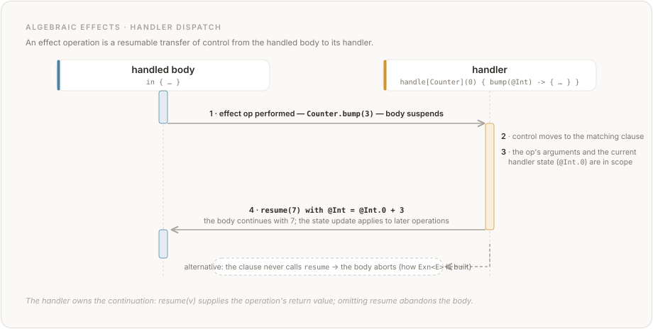

# Chapter 7: Effects

## 7.1 Overview

Vera is pure by default. Functions that interact with the outside world, mutate state, throw exceptions, or perform any operation beyond pure computation must declare these **effects** in their type signature.

The effect system is based on algebraic effects with row polymorphism, inspired by Koka. Effects are:

1. **Declared**: each effect defines a set of operations.
2. **Typed**: function signatures include an effect row listing all effects the function may perform.
3. **Handled**: effects are discharged by handlers that provide implementations for each operation.
4. **Composable**: effect rows combine naturally when functions are composed.

## 7.2 Effect Declarations

An effect is a named set of operations:

```
effect Store<T> {
  op fetch(Unit -> T);
  op stash(T -> Unit);
}
```

```
effect Fail<E> {
  op abort(E -> Never);
}
```

```
effect Logger {
  op log(String -> Unit);
}
```

```
effect Choice {
  op choose(Bool -> Bool);
}
```

Rules:

1. Effect names MUST begin with an uppercase letter.
2. Effects may be parameterised by type variables.
3. Each operation has a typed signature: parameter types and return type.
4. Operations implicitly have access to the `resume` continuation (see Section 7.5).
5. A declaration MUST NOT name a built-in effect (Section 7.7): `effect IO { ... }`, `effect Exn<E> { ... }`, `effect DB { ... }`, and every other built-in name are compile errors (`E152`). The built-in operations are in scope automatically for any function whose effect row names the effect.

## 7.3 Effect Rows

A function's effect declaration specifies an **effect row** — the sequence of effects it is written with. Row *containment* compares rows by set equality (§7.3.2), so two rows listing the same effects in different orders permit exactly the same callees; the written order is nonetheless meaningful, and resolves which effect a bare operation name belongs to (§7.4, §7.3.3).

```
effects(pure)                        -- no effects (empty row)
effects(<IO>)                        -- may perform IO
effects(<IO, State<Int>>)            -- may perform IO and use Int state
effects(<Exn<String>, IO>)           -- may throw String errors and perform IO
```

### 7.3.1 Syntax

- `pure` is a keyword denoting the empty effect row.
- `<Effect1, Effect2, ...>` is an effect row with named effects.
- `<E>` where `E` is a type variable is a polymorphic effect row.
- `<IO, E>` is an effect row containing `IO` plus whatever `E` resolves to.

### 7.3.2 Effect Row Ordering

Set equality governs effect *containment*: `<IO, State<Int>>` and `<State<Int>, IO>` permit exactly the same callees, so for the purposes of §7.8 they are the same effect row.

Containment is all that set equality governs. The order a row is **written** in is meaningful and is preserved: it resolves a bare operation name that more than one effect in the row declares (§7.4), and it selects among two instantiations of one effect (§7.3.3). The formatter therefore does not reorder a row — there is no alphabetical canonical form for effect rows, and imposing one would change what a program means.

### 7.3.3 Duplicate Effects

The same effect with different type parameters may appear multiple times:

```
effects(<State<Int>, State<String>>)
```

This means the function uses two independent state cells: one `Int` and one `String`.

The cells being independent, a form that names one names it by its type argument: `old(State<Int>)` and `new(State<Int>)` (§7.9.2) both read the `Int` cell whatever else the row declares, and their `State<String>` counterparts the `String` one. Only a *bare* operation call, which names no type argument, falls back on the written order of the row (§7.3.2).

The same effect with the same type parameters MUST NOT appear twice (it would be redundant).

## 7.4 Performing Effects

Within a function that declares an effect, operations are called like regular functions:

<!-- vera:run fn="increment" stdout="" -->
```
public fn increment(@Unit -> @Unit)
  requires(true)
  ensures(true)
  effects(<State<Int>>)
{
  let @Int = get(());
  put(@Int.0 + 1);
  ()
}
```

<!-- vera:run fn="hello" stdout="hello, world" -->
```
public fn hello(-> @Unit)
  requires(true)
  ensures(true)
  effects(<IO>)
{
  IO.print("hello, world")
}
```

Effect operations are resolved by the effect declared in the function's effect row. If `get` appears in a function with `effects(<State<Int>>)`, it refers to the `get` operation of `State<Int>`.

**Declarations first.** A bare name is resolved as an operation only when no *function declaration* of that name is in scope. A program declaring `fn get` owns every bare `get(...)` in that declaration's scope — including inside a `handle[State<T>]` body, which is not an exception — and the resolution order below never runs for it. Operation names are not reserved, so this is the ordinary shadowing rule rather than a special case, and it is a property of the call site's scope alone. The qualified spelling is unaffected: `State.get(())` names the effect, so no declaration can shadow it, and it is how a program that declares `fn get` still reaches the cell.

**Resolution order.** More than one effect in scope may declare the same operation name — the built-in `State` and `Http` both declare `get`. A bare operation name binds to the **first** effect that declares it in this order: the innermost enclosing `handle[E]` (§7.5), then each enclosing handler outwards, then the function's declared effect row **in the order the row is written**, and finally the **registered** effects in registration order — the built-ins first, then any user `effect` declaration in source order. So `effects(<State<Int>, Http>)` binds a bare `get` to `State`, `effects(<Http, State<Int>>)` binds it to `Http`, and a `handle[State<Int>]` around the call binds it to `State` whatever the row says. Every step of that list is an ordered sequence, so the binding is a property of the program text alone — never of the order an implementation happens to enumerate the row's members.

**Bare operation calls and routing (`E217`).** A bare (unqualified) operation name is only well-formed when the compiler can route it to a concrete implementation. The built-in `State` and `Exn` operations (`get`, `put`, `throw`) are always routable — they are backed by intrinsic host cells — so they may be called bare, as in `increment` above. Every other operation — those of `IO`, `DB`, `Http`, `Inference`, `Random`, and any user-declared effect — is routable bare only inside a `handle[E]` block for its effect `E` (§7.5); outside such a block it has no bare route and MUST be called qualified as `E.op(...)`, the way `hello` calls `IO.print`. Calling one of these operations bare with no enclosing handler is a compile-time error (`E217`), reported by the checker so the backend never receives an operation it cannot lower.

**Effect ordering.** Effect operations execute in program order.  The one sanctioned relaxation is `async(e)` (§9.5.4): when `e`'s effect row is commutative — its operations' completions cannot be observably reordered against any other effect in the program — an implementation MAY overlap `e`'s execution with subsequent computation, resolving at the corresponding `await`.  Effects outside that whitelist retain strict program order; the checker warns (`W002`) where this forces eager evaluation, so verified sequential semantics remain literally true for every Tier-1 claim.

### 7.4.1 Ambiguous Operations

If two effects in scope define an operation with the same name, the call is ambiguous to a reader and SHOULD be qualified. The compiler does not reject the bare form *for ambiguity*: it binds by the resolution order in §7.4, and qualifying says which effect is meant without depending on that order. The binding it picks must still be well-formed on its own terms — a bare call that resolves to an operation with no bare route is `E217` (§7.4), and one whose signature does not fit the call site is an ordinary type error — so "not rejected for ambiguity" is not "always accepted".

<!-- vera:skip-parse category="FRAGMENT" reason="effect Logger + anonymous fn body" -->
```
effect Logger {
  op put(String -> Unit);
}

fn(@Unit -> @Unit)
  requires(true)
  ensures(true)
  effects(<State<Int>, Logger>)
{
  State.put(42);            -- qualified: State<Int>'s put
  Logger.put("logged");     -- qualified: Logger's put
  ()
}
```

## 7.5 Effect Handlers

An effect handler provides implementations for an effect's operations and discharges the effect from the type:

```
handle[State<Int>](@Int = 0) {
  get(@Unit) -> { resume(@Int.0) },
  put(@Int) -> { resume(()) }
} in {
  body_expression
}
```

### 7.5.1 Handler Syntax

```
handle[EffectName<TypeArgs>](initial_state) {
  operation1(params) -> { handler_body1 },
  operation2(params) -> { handler_body2 }
} in {
  handled_body
}
```

Components:

- `[EffectName<TypeArgs>]`: the effect being handled
- `(initial_state)`: initial value for stateful effects (optional; only for effects that carry state)
- Operation clauses: one per operation in the effect, each providing an implementation as a block
- `resume(value)`: a built-in that continues execution of the handled body with a return value
- `in { ... }`: the body in which the effect is handled

The builtin parameterized effects take exactly one type argument at the handle: `handle[State]`, `handle[State<A, B>]`, and the `Exn` twins are checker errors (E337). The handler state is in scope as a `@T` slot **only inside the operation clauses** — for example `get(@Unit) -> { resume(@Int.0) }` reads the current `Int` state as `@Int.0`. Inside a clause the state slot holds the value **captured before the operation's intrinsic effect** (see §7.5.2): in a `put` clause, `@Int.0` is the state as it was *before* the store, and the put **argument** is `@Int.1` (operation parameters bind first, state last — most-recent wins). A handler **without** a state declaration binds no state slot: its clause scope holds only the operation parameters (in a stateless `put` clause, `@Int.0` is the argument). A clause declaring **fewer parameters than the operation** binds none of them — a patternless `put()` clause still stores its argument intrinsically, but the value has no name in the clause scope. Clause bodies resolve outer slot references against the **handler-declaration scope**, not the operation call site's — a binding the handled body makes before performing an operation is never visible to the clause. The **handled body reaches state only through the typed operations** `get(())` and `put(...)`; it has no state slot. A slot reference to the state type in the handled body (e.g. `@Int.0` where the only `Int` in scope would be the state) is a checker error (E130) — state access there must go through `get(())`. A `get` clause's `@Unit` operation parameter is declaration-only, like every zero-size binding (§2.2.2): reading it (`@Unit.0`) is a checker error (E182).

For the builtin `State` effect the state declaration **is** the `State<T>` cell: its declared type must structurally equal the effect's `T` after alias resolution — for refined types, predicate included — or the handle is a checker error (E336). A type alias that resolves to `T` is accepted (including a refined alias on both sides, or two textually identical refinement declarations); a declaration that widens (`@Int` on `State<Nat>`), narrows (`@Nat` on `State<Int>`), or carries a refinement predicate the effect argument does not (or a different one) is rejected — verification obligations and runtime guards key off `T`, so a divergent declaration would be documentation the toolchain contradicts. Any refinement on the cell belongs in the `State<T>` argument itself **via a named refinement alias** (`type Small = { @Nat | ... }; handle[State<Small>](@Small = ...)`) — an inline refinement literal in the `State<T>` argument position is not compilable. A user-declared effect's handler state is the handler's own accumulator and may take any type.

**Cell identity is the RESOLVED `T`, not the spelling.** `State<T>` is one effect instance per resolved `T`, so every spelling that resolves to the same type names the same cell — whether that type is scalar or composite, and whether the alias is plain or parameterized. A `handle[State<MaybeInt>]` under `type MaybeInt = Option<Int>` therefore handles a callee declaring `effects(<State<Option<Int>>>)`, and the two share one cell:

<!-- vera:run fn="main" stdout="7" -->
```vera
type MaybeInt = Option<Int>;

private fn stash(@Unit -> @Unit)
  requires(true)
  ensures(true)
  effects(<State<Option<Int>>>)
{
  put(Some(7))
}

public fn main(@Unit -> @Int)
  requires(true)
  ensures(true)
  effects(pure)
{
  handle[State<MaybeInt>](@MaybeInt = None) {
    get(@Unit) -> { resume(@MaybeInt.0) },
    put(@MaybeInt) -> { resume(()) }
  } in {
    stash(());
    option_unwrap_or(get(()), 0 - 1)
  }
}
```

`main` returns `7` — `stash` writes to the cell the handler established. The same rule governs `Exn<E>` payloads: `Exn<Msg>` under `type Msg = String` catches a `throw` from a function declaring `effects(<Exn<String>>)`. Two cells are distinct exactly when their resolved types are (`State<Option<Int>>` and `State<Option<Bool>>` are two cells; a handler for one does not handle the other). A refinement is part of that resolved type, predicate included, exactly as it is for the state declaration a handler writes: under `type Pos = { @Int | @Int.0 > 0 }` and `type Neg = { @Int | @Int.0 < 0 }`, `State<Pos>`, `State<Neg>` and `State<Int>` are **three** cells, and a function declaring `effects(<State<Pos>>)` writes the `Pos` one wherever it is called from.

Resolved-type identity governs the cell wherever the resolved type is **nameable** — every type with a resolution, which since the mangler was made total over canonical renderings includes the composite carrying a function type (`State<Handler>` under `type Handler = Option<fn(Int -> Int) effects(pure)>` is the `Option<fn(Int -> Int) effects(pure)>` cell, the same one `State<Option<fn(Int -> Int) effects(pure)>>` names). What is left outside the rule is the type expression with **no resolution to name**: one resolving to a bare function type, and one that does not resolve at all (a removed alias, an alias applied at the wrong arity). Family naming is total, so both are named by their alias-opaque **spelling** and two such spellings name two cells rather than sharing one; both are then refused, downstream and at different gates — the unresolvable one at the compilability gate before any cell is declared, the bare function type only when the function reading it is dropped, its cell having been declared in the meantime. That fallback runs in the conservative direction only: it can leave split a cell the resolution would have merged, never merge two the checker keeps apart.

### 7.5.2 Handler Semantics

When an effect operation is performed in the handled body:

1. Execution of the handled body is **suspended**.
2. Control transfers to the corresponding operation clause in the handler.
3. The handler may inspect the operation's arguments and the current state.
4. The handler calls `resume(value)` to continue the handled body, providing the return value of the operation.
5. Optionally, the handler overrides its state with `with @T = expr`.

For **`State<T>`** these steps have *intrinsic-hybrid* semantics: the operations carry their declared meaning independently of the clauses, and the clauses refine what the body observes.

- **Intrinsic effect first.** `put(x)` stores `x` into the state; `get` reads the state. This happens whether or not the clause transforms anything — the operations' declared meaning is not the clause's to redefine.
- **The clause body executes**, with the operation's parameters and the state in scope, and its `resume(value)` **is the operation's result** at the call site — a `get` clause that resumes `@Int.0 * 3` makes `get(())` return three times the stored state.
- **The state slot is captured before the intrinsic effect.** In a `put` clause, `@T.0` is the state as it was *before* the store (`@T.1` is the argument being stored).
- **`with @T = expr` overrides the intrinsic store**, evaluated in the clause scope after the body. Because `@T.0` is the pre-store capture, `with @T = @T.0` means *keep the old state* — it undoes the `put`. A clause with no `with` leaves the intrinsic effect in place, so the canonical clauses (`get(@Unit) -> { resume(@T.0) }`, `put(@T) -> { resume(()) }`) are exact identity transforms.
- **`resume` is single-shot and tail-position** in a `State` clause: the clause body's tail expression is exactly one `resume(...)` (reached through a block's trailing expression or a single-arm `match`). To branch on the resumed value, branch *inside* the argument (`resume(if c then a else b)`) — a `resume` per branch arm is not compilable (`resume` types as `Unit`, so the branch is a void block that cannot carry the op's result). A missing, repeated, non-tail, or per-arm `resume` skips the function with a diagnostic. Multi-shot resumption is a FUTURE feature (§7.5.3's `Choice` sketch).
- **Clause transforms do not cross a call boundary, and a clause never re-enters itself.** An operation performed inside a *called function* (one declaring `effects(<State<T>>)`) performs the **intrinsic** operation against the same dynamically-scoped state cell: the transforms and overrides of the handler that discharges the effect do not apply to it. Extracting a handled body's ops into a helper therefore changes what a transforming clause observes; keep transformed operations syntactically inside the `in { ... }` body. The same holds for a clause seen from inside itself — an operation written in a clause body never re-enters the clause it is written in. Which handler that operation *does* reach is the next rule.
- **A clause body belongs to the handler's DECLARATION scope, not to the body it refines.** This is one rule with two consequences. A slot reference in a clause body (or in its `with` expression) resolves against the scope where the `handle` expression is written, never against bindings the handled body made before performing the operation (§7.5.1). And a bare `get`/`put` written in a clause body is likewise an operation of the **enclosing** context — the next handler out, or the enclosing function's declared row — never of the handler whose clause it is. It is an operation *site of that enclosing context*, so if the enclosing handler declares a clause for the operation, that clause runs — exactly as it would for the same operation written directly in the enclosing handled body. With two nested handlers over **different** cell types, a bare `put` in the inner handler's clause body therefore writes the **outer** cell, through the outer handler's `put` clause where it has one; to refine the inner cell from its own clause, use `with @T = expr`, which is the clause's own state override. (That a clause cannot re-enter itself is the same rule seen from the other side, and it is what makes clause inlining terminate: each such operation resolves strictly further out.)
- **A clause-body operation cannot reach a same-family outer cell yet.** When such an operation resolves to a handler for the *same* `State<T>` — `handle[State<Int>]` nested inside `handle[State<Int>]`, or a `handle[State<T>]` written in a function that itself declares `effects(<State<T>>)` — the reference implementation cannot reach the outer cell from inside the inner handler: its state intrinsics address only the innermost cell of each family, so the operation would be routed outward while its cell stayed inward. That operation is refused at compile time (`E602`) rather than lowered to hybrid semantics; outward cell addressing is tracked as [#1233](https://github.com/aallan/vera/issues/1233). Same-family nesting is otherwise supported: it is only a clause body that performs the operation that is refused, so two handlers over the same cell type whose clause bodies perform none of their own operations compile and run normally, and so does an operation written in the inner handler's *handled body*. Nest handlers over distinct cell types, or refine the inner cell with `with @T = expr`.

The handler may also choose NOT to call `resume`, which aborts the handled body. This is how exceptions are implemented (`Exn` clauses run at the catch boundary and never resume).



### 7.5.3 Examples

**State handler:**

```
private fn run_stateful(@Unit -> @Int)
  requires(true)
  ensures(true)
  effects(pure)
{
  handle[State<Int>](@Int = 0) {
    get(@Unit) -> { resume(@Int.0) },
    put(@Int) -> { resume(()) }
  } in {
    let @Int = get(());           -- returns 0 (initial state)
    put(@Int.0 + 10);             -- state becomes 10
    let @Int = get(());           -- returns 10
    @Int.0                        -- body evaluates to 10
  }
}
```

The result is `10`. The `handle` expression's type is the type of the handled body (`Int`). The enclosing function's effects are `pure` because the handler discharges `State<Int>`.

**Exception handler:**

```
private fn parse_or_throw(@String -> @Int)
  requires(true)
  ensures(true)
  effects(<Exn<String>>)
{
  match parse_int(@String.0) {
    Ok(@Int) -> @Int.0,
    Err(@String) -> throw(@String.0)
  }
}

private fn safe_parse(@String -> @Option<Int>)
  requires(true)
  ensures(true)
  effects(pure)
{
  handle[Exn<String>] {
    throw(@String) -> { None }    -- do NOT resume; return None
  } in {
    Some(parse_or_throw(@String.0))
  }
}
```

The built-in `parse_int` is a pure function returning `Result<Int, String>` (Chapter 9); `parse_or_throw` converts its `Err` case into a `throw`. If `parse_or_throw` throws, the handler catches it and returns `None`. If parsing succeeds, the body evaluates to `Some(result)`.

Note: when the handler does not call `resume`, the handled body is abandoned. The handler body's expression (`None`) becomes the value of the entire `handle` expression.

**Choice handler (non-determinism):**

<!-- vera:skip-parse category="FUTURE" reason="handle[Choice] multi-shot resume + array_concat" -->
```
private fn all_choices(@Unit -> @Array<Bool>)
  requires(true)
  ensures(true)
  effects(pure)
{
  handle[Choice] {
    choose(@Bool) -> {
      let @Array<Bool> = resume(true);
      let @Array<Bool> = resume(false);
      array_concat(@Array<Bool>.1, @Array<Bool>.0)
    },
  } in {
    let @Bool = choose(true);
    [@Bool.0]
  }
}
```

The handler calls `resume` twice — once with `true`, once with `false` — and concatenates the results. The result is `[true, false]`.

This demonstrates that `resume` is a first-class continuation: it can be called zero, one, or multiple times.

## 7.6 Effect Polymorphism

Functions can be polymorphic over effects:

<!-- vera:skip-parse category="FRAGMENT" reason="fn(A -> B) in param position" -->
```
private forall<A, B> fn option_map(@Option<A>, fn(A -> B) effects(<E>) -> @Option<B>)
  requires(true)
  ensures(true)
  effects(<E>)
{
  match @Option<A>.0 {
    Some(@A) -> Some(apply_fn(@Fn.0, @A.0)),
    None -> None,
  }
}
```

Stored function values are applied with `apply_fn` (Section 11.10.5). The effect variable `E` is unified at each call site. If the passed function is `pure`, then `option_map` is `pure`. If it has `effects(<IO>)`, then `option_map` has `effects(<IO>)`.

### 7.6.1 Effect Row Variables

Effect row variables can appear alongside concrete effects:

<!-- vera:skip-parse category="FRAGMENT" reason="fn(Unit -> A) in param position" -->
```
private forall<A> fn with_logging(fn(Unit -> A) effects(<E>) -> @A)
  requires(true)
  ensures(true)
  effects(<IO, E>)
{
  IO.print("Starting computation");
  let @A = apply_fn(@Fn.0, ());
  IO.print("Finished computation");
  @A.0
}
```

This function always performs `IO` (for the logging), plus whatever effects `E` the argument function has.

## 7.7 Built-in Effects

A built-in effect is one the compiler registers: every effect in this section, and those documented in Chapter 9, Section 9.5. Its operations are in scope for any function whose effect row names it, and no declaration brings them there — so a user `effect <Name> { ... }` block redeclaring a built-in name is a compile error (`E152`), whatever operations the block lists. The rule is stated once here for the whole set rather than repeated per effect; `vera effects --json` enumerates the registered names, and Chapter 9, Section 9.5.1 gives the rationale. A marker effect with no operations (`Diverge`, `HttpServer`, `Async`) is covered by the same rule: having nothing to declare does not make the block legal.

**Design note.** An alternative implementation targeting memory-constrained environments may wish to introduce an `Alloc` marker effect to distinguish allocating from non-allocating functions. The reference implementation omits this because WASM's managed linear memory makes allocation-tracking uninformative at the type level — nearly every non-trivial function allocates, so the effect would carry little signal.

### 7.7.1 `IO`

The `IO` effect is built-in and provides eleven operations for interacting with the outside world:

| Operation | Signature | Description |
|-----------|-----------|-------------|
| `print` | `String -> Unit` | Write a UTF-8 string to stdout |
| `read_line` | `Unit -> String` | Read a line from stdin |
| `read_char` | `Unit -> Result<String, String>` | Read one character from stdin — cbreak mode on a Unix TTY, where Ctrl-D gives `Err("EOF")`; redirected input reads one character from the stdin stream and gives `Err("EOF")` at end of input |
| `read_file` | `String -> Result<String, String>` | Read entire file as UTF-8 |
| `write_file` | `String, String -> Result<Unit, String>` | Write string to file |
| `args` | `Unit -> Array<String>` | Get command-line arguments |
| `exit` | `Int -> Never` | Exit process with status code |
| `get_env` | `String -> Option<String>` | Look up environment variable |
| `sleep` | `Nat -> Unit` | Pause execution for N milliseconds |
| `time` | `Unit -> Nat` | Current Unix time in milliseconds |
| `stderr` | `String -> Unit` | Write a UTF-8 string to stderr |

IO operations are handled by the runtime (see Chapter 12, Section 12.4.1). `IO` is built-in — the operations are available automatically when `effects(<IO>)` is specified, and an `effect IO { ... }` declaration is a compile error (`E152`). See Chapter 9, Section 9.5.1 for detailed documentation and examples.

### 7.7.2 `Exn<E>`

Exception effect, parameterised by the thrown type.

| Operation | Signature | Description |
|-----------|-----------|-------------|
| `throw` | `E -> Never` | Abandon the computation with an error value; never resumes |

Like `IO`, `Exn<E>` is built-in — no `effect Exn<E> { ... }` declaration is needed (and one is `E152`). Functions that throw declare the thrown type in their effect row: `effects(<Exn<String>>)`.

### 7.7.3 `Diverge`

The `Diverge` effect has no operations. Declaring `effects(<Diverge>)` means the function may not terminate. Functions without `Diverge` in their effect row MUST be proven to terminate (via `decreases` clauses on recursion); a recursive function with neither is rejected with `E137` (Chapter 5, Section 5.6).

A function that declares `Diverge` needs no `decreases` clause and compiles like any other, with no termination guard. `Diverge` propagates like any effect: a function that calls one declaring `Diverge` must declare it too (`E125`), so a program whose `main` reaches an unbounded loop declares `effects(<Diverge, IO>)` on `main`. It is the row for a loop with no bound, such as a server or a read-eval loop; a loop that counts to a bound takes a measure instead.

### 7.7.4 `Random`

The `Random` effect models non-deterministic value generation. Functions that draw random values must declare `effects(<Random>)`, making the non-determinism visible in the type signature so callers can audit which functions can produce different outputs across calls.

| Operation | Signature | Description |
|-----------|-----------|-------------|
| `random_int` | `Int, Int -> Int` | Random integer in inclusive range `[low, high]` (caller ensures `low <= high`) |
| `random_float` | `Unit -> Float64` | Uniform random in `[0.0, 1.0)` |
| `random_bool` | `Unit -> Bool` | Coin flip |

Like `IO`, `Random` is built-in — no `effect Random { ... }` declaration is needed (and one is `E152`). Random results are unconstrained in Z3 (no useful axioms beyond the explicit range bound on `random_int`); contracts that depend on specific random values fall to runtime checking. Operations are host-backed (see Chapter 12, Section 12.4.5). No determinism / seeding API is offered yet — handler-based seeding via `handle[Random]` is future work.

### 7.7.5 `HttpServer`

The `HttpServer` effect has no operations — it is a marker (#305, since v0.0.193).  Declaring `effects(<HttpServer>)` marks a function as an HTTP request handler: a **total**, contract-checked function `handle(Request -> Response)` (§9.5.6).  The accept loop lives in the host `vera serve` driver, not in the program, so handlers do not need `Diverge` — termination-checked request handling is a feature, and per-request effects (`State<T>`, `Exn<E>`) compose inside the handler's row as usual.

### 7.7.6 `Async`

The `Async` effect has no operations — it is a marker. Declaring `effects(<Async>)` enables the built-in generic functions `async(expr)` and `await(future)`, making concurrency explicit and trackable in the effect row. See Chapter 9, Section 9.5.4 for the operation signatures, the `Future<T>` type, and the concurrency semantics (#841).

### 7.7.7 `DB`

The `DB` effect executes SQL against a relational database (#229, since v0.1.7). Functions that read or write the database must declare `effects(<DB>)`, making database access visible in the type signature.

| Operation | Signature | Description |
|-----------|-----------|-------------|
| `query` | `String, Array<Option<String>> -> Result<Array<Array<Option<String>>>, String>` | Runs a read (`SELECT`); the `Ok` grid is rows of cells, each cell an `Option<String>` where SQL `NULL` is `None` |
| `execute` | `String, Array<Option<String>> -> Result<Int, String>` | Runs a write (`CREATE`/`INSERT`/`UPDATE`/`DELETE`); `Ok` carries the affected-row count (SQLite reports `-1` where no count applies) |

The second argument is the **positional parameter list** — the values bound, in order, to the `?` placeholders in the SQL. Each parameter is an `Option<String>`: `Some(v)` binds a value, `None` binds SQL `NULL`. Passing data as parameters — rather than assembling it into the SQL text — is what keeps a value from being parsed as SQL, the standard defence against injection. See §9.5.7 for the row and parameter marshalling.

Like `IO`, `DB` is built-in — no `effect DB { ... }` declaration is needed (and one is `E152`). Both operations return `Result`: a failed statement (malformed SQL, a constraint violation, an unreachable database) surfaces as `Err(String)`, never a trap, so every call site must `match` the failure arm. Operations are host-backed; the connection is chosen by the `VERA_DB_URL` environment variable, defaulting to an in-memory SQLite database (`sqlite::memory:`). In v1 the effect is un-mockable — `handle[DB]` awaits the user-handleable-host-effect machinery (#372) — and targets SQLite only. The browser runtime answers every `DB` operation with `Err` (a deliberate stub, §12), and the wasi-p2 target rejects `<DB>` at compile time.

## 7.8 Effect Subtyping

A function with fewer effects can be used where more effects are expected:

```
effects(pure) <: effects(<IO>)
effects(<IO>) <: effects(<IO, State<Int>>)
```

In general, `effects(<E1>)` is a subtype of `effects(<E1, E2>)`. A function that performs no IO can safely be called in a context that allows IO.


This means:
- A `pure` function can be passed where `Fn(@A -> @B) effects(<IO>)` is expected.
- A function with `effects(<IO>)` can be passed where `effects(<IO, Exn<String>>)` is expected.

## 7.9 Effect-Contract Interaction

### 7.9.1 Pure Contracts

Contract predicates (`requires`, `ensures`, `invariant`, `assert`, `assume`) MUST be pure. They MUST NOT perform effects. This is checked by the effect checker.

### 7.9.2 State in Contracts

Since contract predicates must be pure (Section 7.9.1), they cannot call effect operations like `get()` or `put()` directly. Instead, contracts on stateful functions use `old` and `new` to refer to the state before and after the function call:

```
private fn increment_and_return(@Unit -> @Int)
  requires(true)
  ensures(@Int.result == old(State<Int>) && new(State<Int>) == old(State<Int>) + 1)
  effects(<State<Int>>)
{
  let @Int = get(());
  put(@Int.0 + 1);
  @Int.0
}
```

- `old(State<T>)` refers to the state value before the function executes
- `new(State<T>)` refers to the state value after the function executes

These are contract-only syntax forms that do not perform effects.

The argument to `old` and `new` MUST be an *effect reference* — the name of a stateful effect together with its type arguments — and not an arbitrary expression. There is no `old(<expression>)` form. Vera has no mutable variables, so a parameter slot or a let binding holds one value for the whole call and has no separate before-value to name; effect state is the only thing a call can change.

`old` and `new` MUST appear inside an `ensures` clause. A `requires` or `decreases` clause is evaluated before the body runs, so every expression in it already observes the pre-state, and the after-state that `new` names does not yet exist.

## 7.10 Effect Composition

When a function calls other functions, the effects compose via row union:

<!-- vera:skip-check category="INCOMPLETE" code="E200 E200" reason="calls bar and baz, which the example describes but does not define" -->
```
private fn foo(@Unit -> @Unit)
  requires(true)
  ensures(true)
  effects(<IO, State<Int>>)
{
  bar();    -- bar has effects(<IO>)
  baz();    -- baz has effects(<State<Int>>)
  ()
}
```

The compiler checks that every effect performed in the body is declared in the function's effect row. If `bar` performs `IO` and `baz` uses `State<Int>`, then `foo` must declare at least `effects(<IO, State<Int>>)`.

The compiler verifies this by computing the union of all effects in the body and checking that it is a subset of the declared effects.

## 7.11 Effect Handlers and Types

The type of a `handle` expression:

```
handle[Effect](state) { ops } in { body }
```

If `body` has type `T` and effects `<Effect, E>`, then the `handle` expression has type `T` (or a modified type if the handler transforms it) and effects `<E>`. The handler discharges `Effect` from the effect row.

Special case: if the handler does not always call `resume`, the return type of the `handle` expression may differ from the body's type. The handler's operation clauses must all return the same type, which becomes the type of the `handle` expression.

```
handle[Exn<String>] {
  throw(@String) -> None,          -- returns Option<Int>
} in {
  Some(risky_computation())        -- body type: Option<Int> with effects <Exn<String>>
}
-- Overall type: Option<Int> with no Exn effect
```
